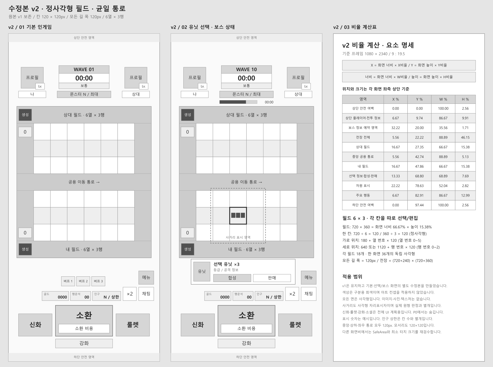
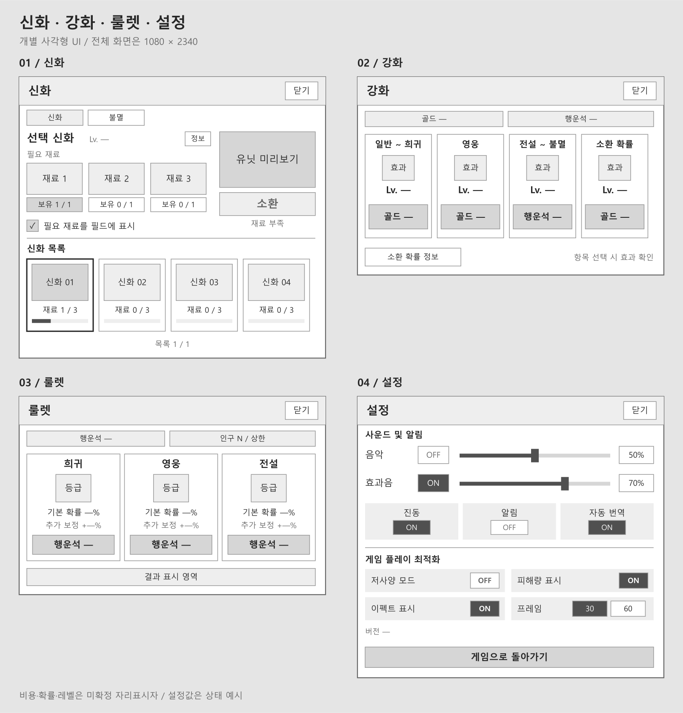
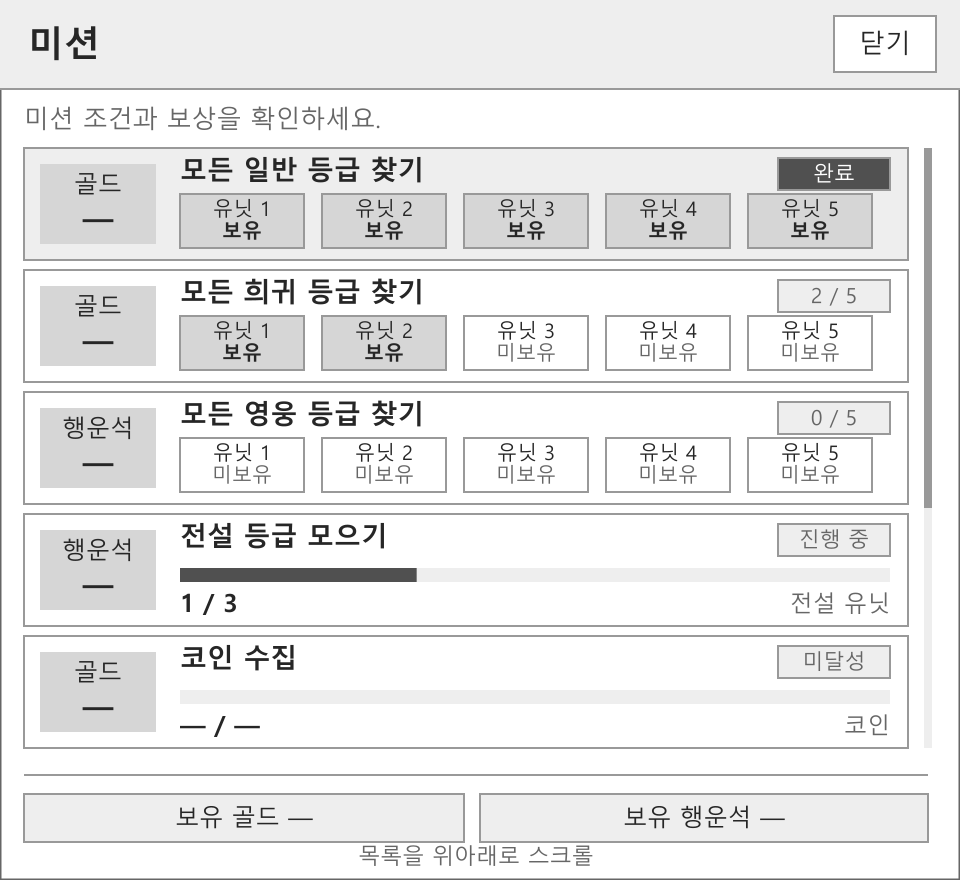
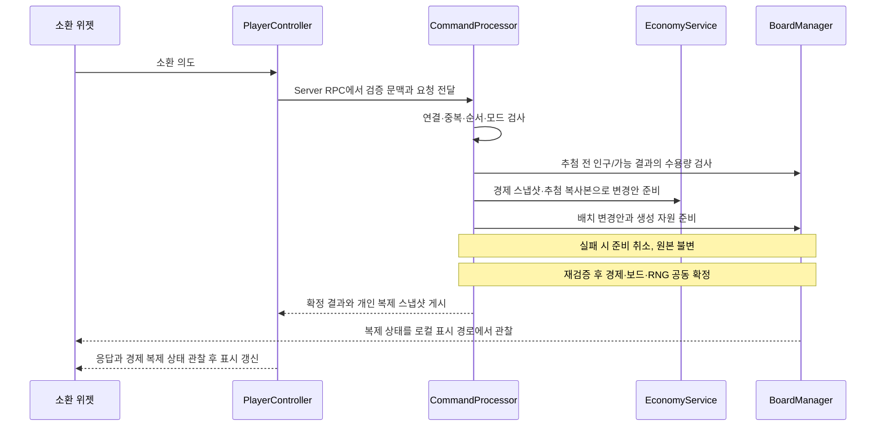

# 행운 공방 디펜스 — 전체 기획 읽기본

> 자동 생성 문서입니다. 수정은 아래 각 장의 「편집 원본」에서 하고 `node tools/build-planning.mjs`로 이 파일을 갱신하세요.

[기획 허브](README.md) · [관리 방식](WORKFLOW.md) · [개발 현황](production/BOARD.md) · [결정 기록](DECISIONS.md)

문서 체계: 0.2 · 모바일 우선 확정. 세부 시스템은 프로토타입 설계안이며 구현·밸런스 검증 완료를 뜻하지 않습니다. 개별 문서의 상태와 작업 보드가 최신 진행 상태입니다.

## 목차

- [1. 제품 목표와 원작 참고 범위](#chapter-01)
- [2. 범위와 단계별 완성 기준](#chapter-02)
- [3. 플레이 경험과 게임 흐름](#chapter-03)
- [4. 전장·카메라·배치](#chapter-04)
- [5. 시간·웨이브·승패 판정](#chapter-05)
- [6. 재화와 경제](#chapter-06)
- [7. 랜덤 소환·합성·조합](#chapter-07)
- [8. 공격·피해·상태 효과](#chapter-08)
- [9. 독자 유닛 설계](#chapter-09)
- [10. 적·사냥·던전](#chapter-10)
- [11. 협동·매칭·이탈 처리](#chapter-11)
- [12. UI·조작·튜토리얼](#chapter-12)
- [13. 미션·메타 성장·저장](#chapter-13)
- [14. 3D 아트·애니메이션·사운드](#chapter-14)
- [15. UE5 프로젝트 구조](#chapter-15)
- [16. 서버 권한·복제·명령 처리](#chapter-16)
- [17. 데이터·디버그·운영](#chapter-17)
- [18. 성능 예산·검증](#chapter-18)
- [19. 개발 일정·출시 판정](#chapter-19)
- [20. 우선 의사결정과 근거](#chapter-20)

<a id="chapter-01"></a>

편집 원본: [PRD-001 · 제품 방향과 범위](product/OVERVIEW.md)

## 1. 제품 목표와 원작 참고 범위

### 1.1 한 문장 소개

장난감 공방을 침입한 불량 장난감들로부터 지키기 위해, 두 제작자가 무작위로 나온 수호자 피규어를 합치고 전설 작품을 완성하는 협동 디펜스.

### 1.2 목표하는 재미

| 축 | 플레이어가 느낄 장면 | 구현 수단 |
|---|---|---|
| 기대 | 소환 버튼을 누르기 전의 짧은 긴장 | 등급별 실제 확률, 현재 소환 단계, 짧은 결과 연출 |
| 선택 | 당장 딜을 유지할지 상위 등급을 만들지 고민 | 3개 합성, 전설 제작 재료 표시, 보스 예고 |
| 반전 | 밀리던 전장을 상위 유닛 하나가 정리 | 광역 전설·신화 스킬, 획득 알림, 처치 수 피드백 |
| 협동 | 아군 둔화 위에 내 광역 공격이 겹침 | 공용 적 경로, 팀 상태이상, 도움 핑 |
| 수집 | 작은 피규어가 점점 특별해짐 | 실루엣, 움직임, 받침대, 도감 회전 보기 |

순간 조작 능력보다 확률 결과에 적응하는 판단을 중시한다. 수호자는 자동 공격하며, 플레이어가 직접 캐릭터를 이동 조종하거나 공격 키를 누르지 않는다.

### 1.3 원작 재현과 기존 초안의 구분

공식 스토어는 원작의 무작위 유닛 소환, 합성, 룰렛형 도전을 핵심 기능으로 소개한다. Google Play의 소개 기사에서는 협동 상황과 유닛의 확률적 변화를 설명한다. 본 기획은 이 핵심 루프를 출발점으로 사용한다. [원작 공식 스토어](https://play.google.com/store/apps/details?hl=ko&id=com.percent.aos.luckydefense), [Google Play 소개](https://play.google.com/store/apps/editorial?gl=KR&id=mc_editorialmd_launchnontp_lucky_defense_fcp)

다음 표는 원작 대조 전 작성한 프로젝트 초안이다. 공식 소개가 이 표의 확률·보장·재료 수·웨이브 수를 입증하지 않는다. DEC-021 이후에는 원작과 확인된 차이를 기능 명세·데이터·QA에 함께 반영한다.

| 참고할 구조 | 기존 프로젝트 초안(원작 대조 대기) |
|---|---|
| 무작위 소환 | 골드 소환 + 실패 보정이 있는 별조각 도전 |
| 동일 유닛 합성 | 동일 UnitId 3개 → 상위 등급에서 균등 추첨 |
| 협동 방어 | 중앙을 공유하고 각자 보드로 복귀하는 두 폐곡선과 두 배치 보드(DEC-033) |
| 강한 유닛 완성 | 재료 3종을 소비하는 신화 제작 |
| 짧은 반복 플레이 | P0 10·P1 80웨이브, 보스 조기 처치로 총 길이 변화. 전투 자원 매판 초기화 |

3D 전환은 자유 카메라나 지형 고저차를 추가하는 방식으로 확장하지 않는다. 전투 판정은 XY 평면에 두고, 피규어의 체적·애니메이션·소환 연출이 3D의 장점을 보여준다. 캐릭터명, 외형, 사운드, 텍스트, 맵 장식, UI 그래픽은 공방 테마로 새로 제작한다.

<a id="chapter-02"></a>

편집 원본: [PRD-001 · 제품 방향과 범위](product/OVERVIEW.md)

## 2. 범위와 단계별 완성 기준

### 2.1 P0: 핵심 검증 빌드

DEC-043으로 일반·희귀·영웅·전설 각4종, 총16종으로 확대했다. 기본 공격·근접/투사체·소환·같은 칸3개 합성·뭉치 드래그·판매를 검증한다. 10웨이브·일반 적1종·보스1종(진영별1, 총2개체), 개인6×3칸·인구20·공용 일반 적100·보스60초다.

시작100코인, 유료 가격20+2n, 기본 확률97.43/1.98/0.49/0.10%, 희귀/영웅 합성도 허용한다. 일반 판매는 다음 유료 가격의50% 버림, 희귀 이상은 행운석1/2/4다. 웨이브 진입/종료 기본 보상은 없다. 같은 종류 여유 뭉치는 최대 하나, 합성 결과는 여유 뭉치→첫 빈칸 순이다.

HUD·뭉치 선택의 합성/판매/사거리·현재 자원/인구·결과·짧은 안내를 제공한다. 룰렛·강화·고유 스킬·신화·사냥·던전·미션·메타·정식 튜토리얼/로비는 P1 이후다. 데이터에 행이 있어도 P0에서 발동하지 않는다.

PC 리슨 서버와 별도 클라이언트 2인 상태 일치·중복 소비 방지·승패 경계, Android 실기기 터치 완주 모두 통과해야 한다. 첫 Android 기기는 OPEN-008로 미정이며 문서 검사로 실기기 검수를 대체하지 않는다. [상세 범위와 G0~G4](design/P0_REPLAN.md).

### 2.2 P1: 전투·콘텐츠·품질 확장

보통/어려움80웨이브, 10웨이브마다 양쪽 보스2마리로 한 판16마리다. 강화4종·룰렛3종·사냥·자동/판당1회 미션·어려움 던전·설정·튜토리얼·품질을 확장한다. 고유 스킬/신화/제작 재료는 게임 컨셉 이후 확정한다.

보물·유물·펫은 P1에서 실제 획득·보유·효과·성장·중복 처리·로컬 저장까지 구현한다. 고정 보정 시험은 별도다. 목록·비용·보상표와 던전/사냥 단계 수치는 후속 콘텐츠 설계 항목이다. P2에서 계정 서버와 권한을 연결한다. 범위 확대에 따라 기존 공수/날짜는 재산정해야 한다.

### 2.3 P2: 온라인 출시 준비

전용 서버·인증·친구 방·재접속·서버 검증 저장/보상·운영·지원 기기 검수를 다룬다. 정식 로비·매칭/취소·프로필/성장·채팅/이모티콘은 서비스 범위 결정 후 세분화할 후보이며 친구 방 우선안은 유지한다. 재접속해도 경로·현재/최대 수·보스 제한 시각·결과를 그대로 복원하고 보상은 한 번만 지급한다. iOS는 후속 환경·기기 검증을 편성한다.

로비 미니게임은 최대 2종을 P2 구현 계획에 포함한다(DEC-036). 종류·최종 채택 수·규칙·보상 여부는 OPEN-010으로 관리한다. [미니게임 계획](design/COOP_META.md#lobby-minigames).

### 2.4 범위 미확정 또는 별도 평가

PvP·길드·시즌 패스·VIP/상점·결제·미니게임 외 이벤트 등은 사진에 보인다는 이유로 P0/P1 필수 범위에 넣지 않는다. OPEN-005/006에서 서비스·운영 범위를 결정한다. 오픈월드·자유 카메라·물리 기반 유닛 이동·수동 궁극기 등 기존 미채택 기능도 별도 평가 대상이다.

<a id="chapter-03"></a>

편집 원본: [PRD-001 · 제품 방향과 범위](product/OVERVIEW.md)

## 3. 플레이 경험과 게임 흐름

아래는 P1 이후의 목표 경험이다. P0에는 2.1절의 허용 기능만 적용하며 강화·고유 스킬·정식 로비/튜토리얼 구현을 P0 완료 조건에 추가하지 않는다.

### 3.1 1판 루프

```text
로비 → 연습/친구 방 선택 → 로딩·준비 → 10초 준비
 → 골드 소환 → 자동 공격 → 골드 획득
 → 배치 / 합성 / 강화 / 별조각 도전 / 신화 제작
 → 10·20·…·80웨이브 보스 → 승리 또는 패배 → 결과 → 다시 하기
```

### 3.2 시간대별 의도

| 시간 | 목표 행동 | 화면 피드백 |
|---|---|---|
| 준비 10초 | 시작 코인으로 최대 4회 소환, 공격 가능한 배치 | 추천 칸 표시, 다음 소환 가격 |
| 0~3분 | 첫 합성, 전투 강화 1단계 | 같은 유닛 3개 강조, 합성 결과 |
| 3~5분 | 첫 보스에 맞춰 딜 유지 또는 합성 | 보스 1웨이브 전 예고 |
| 5~10분 | 역할 분담, 별조각 도전, 전설 확보 | 아군 둔화/방어 약화 보유 아이콘 |
| 후반 웨이브 | 컨셉 확정 후 신화 조합, 최종 보스 대비 | 재료 추적, 보스 체력, 위험 경고 |
| 결과 | 실패 이유 이해, 다음 판 시도 | 마지막 웨이브, 패배 원인, 내가 만든 최고 등급 |

이는 목표 경험이다. 첫 전설·신화 획득 시점은 실제 테스트에서 측정하며, 초기 데이터만으로 달성됐다고 판단하지 않는다.

### 3.3 반복 플레이 동기

전투 중 선택 변화와 도감 발견, P1의 보물·유물·펫 획득/성장을 연결한다. 효과·비용·해금표는 콘텐츠 설계로 확정하며 P2에서 계정 서버 권한을 연결한다. 장식 전용 성장이라는 이전 초안은 현재 규칙이 아니다.

<a id="chapter-04"></a>

편집 원본: [SPEC-BOARD · 전장·배치·모바일 UI](design/BOARD_UI.md)

## 4. 전장·카메라·배치

DEC-043~047을 현재 동작으로 적용한다. 같은 종류의 여유 뭉치는 구역별 최대 하나이며, 인구 20과 칸당 수용량 3은 별도다. 기본 인구 26이라는 종전 해석은 대체한다.

### 4.1 좌표와 맵

**DEC-033/040의 3D 구도 기준:** 3D 전장·유닛·몬스터를 사용한다. CAP-03의 각 배치 내부 약 2.4:1, 전체 전장 약 1:1은 사진 관찰값으로 보존한다. 현재 UI는 v2의 정사각형 칸·동일 폭 통로를 사용하여 보드 2:1, 전체 전장 8:9로 구성한다. 두 배치 구역과 외곽/중앙 통로의 연결 관계 및 이 비율을 유지하면서 실제 모델·가시성·터치 영역·해상도에 맞춰 전체 크기와 카메라를 조정한다. 6열×3행은 DEC-039의 사용자 확정이며 인구 26과 칸 수는 별개다. 아래 좌표표는 6열에 맞춰 조정한 임시 월드 설계값이다. 120px를 120cm로 대입하지 않으며 새 구도에서는 월드 간격·경로·카메라·입력·QA를 함께 검수한다.

원작 대조 OBS-01의 과거 보통 모드에서 6열×3행 격자를 관찰했고, DEC-039의 사용자 지시로 우리 프로젝트의 칸 수도 6열×3행으로 확정했다. 기존 4열×3행·보드당 12칸은 대체한다. 이 결정은 사진에서 새로 칸 수를 실측했다는 뜻이 아니다.

UE 단위는 cm. 바닥 Z=0, X는 좌우, Y는 위아래다. 모든 거리 판정은 Z를 제외한 평면 거리다.

| 요소 | 기준 |
|---|---|
| 공용 경로 | 위·아래 두 순환 경로가 중앙의 (490,0)→(-490,0) 구간을 같은 방향으로 공유 |
| 경로 길이 | 임시 각 3,080cm, 중앙 공용 구간 980cm. 모서리 선형 구간 |
| 플레이어 0 보드 | 6열×3행(18칸), 중심 Y=-280 |
| 플레이어 1 보드 | 6열×3행(18칸), 중심 Y=+280 |
| 칸 중심 X | -350, -210, -70, +70, +210, +350 |
| 보드 0의 행 Y | -420, -280, -140 |
| 보드 1의 행 Y | +140, +280, +420 |
| 칸 크기 | 임시 140×140cm, 보드당 18칸, 배치 영역 840×420cm |
| 적 생성점 | Lower/플레이어 0: (490,-560), Upper/플레이어 1: (490,560). 각 경로 거리 0 |
| 이동 방향 | 출발→(490,0) 합류→(-490,0)→각 보드 바깥 모서리→자기 출발점 |

140cm는 조정 가능한 월드 시험 단위다. 칸과 길 폭을 동일하게 맞춰 보드 840×420cm, 통로 포함 전체 1120×1260cm(8:9)로 구성한다. GameRules 0.3.0에 중앙을 공유하는 두 경로를 함께 반영했다. UI의 120px를 cm로 옮긴 값이 아니며 실제 카메라/터치 검수는 후속이다.

```text
위 생성점 ● ←────────────┐
          ↓   위 보드    ↑
          ├ →→ 중앙 →→ ┤
          ↑   아래 보드  ↓
아래 생성 ● ←────────────┘
```

DEC-030: 생성 위치·중앙 합류·같은 방향 이동은 사용자 플레이테스트 피드백으로 확정했다. 좌표와 길이는 6열 보드에 맞춘 임시 설계값이며 새 구현에서 검수한다. 중앙 통과 후 각자 보드 바깥을 돌아 재합류하는 방식은 후속 DEC-033으로 사용자 확정했다. 중앙 통로에서 양쪽 유닛 모두 사거리 안의 적을 공격할 수 있다.

DEC-031: **두 참가자 화면 각각** 위쪽 생성점은 **좌측 상단**, 아래쪽 생성점은 **좌측 하단**이다. 아래쪽 생성 몬스터는 왼쪽 길을 따라 위로, 위쪽 생성 몬스터는 왼쪽 길을 따라 아래로 이동한 뒤 중앙에서 만나 **왼쪽→오른쪽**으로 합류한다. 자기 보드는 아래쪽에 유지한다. 플레이어 1(두 번째 참가자)의 180도 카메라 회전에 화면 X 반전을 추가하여 상하만 바꾼다. 월드 +X는 두 화면에서 모두 왼쪽이며 서버 경로와 CellId는 유지한다.

두 플레이어는 같은 적을 공격한다. 적의 생성 그룹은 위치를 나눌 뿐, 처치 소유권이나 보상 소유권을 만들지 않는다. 경로 한 바퀴를 돌아도 적은 사라지지 않는다. DEC-033: 위쪽 생성 그룹은 중앙 출구에서 위 보드 둘레로, 아래쪽 생성 그룹은 아래 보드 둘레로 복귀하여 같은 경로를 반복한다. 생성 시 RouteIndex를 유지하고 상대 보드의 경로로 넘어가지 않는다. 이 경로 구분은 적에 대한 공격/보상 독점 권한이 아니다.

### 4.2 카메라

DEC-033: 해상도·화면비·SafeArea가 달라지면 로컬 카메라·UI·입력 변환을 조정한다. 렌더링 해상도는 목표 기기의 성능에 맞춰 별도로 선택할 수 있다. 모든 참가자는 동일한 서버 보드 좌표·경로·전투 판정을 공유한다. 실제 월드 크기를 재설계하면 경로 길이·이동 시간·사거리·공동 공격 범위도 다시 검수한다. 사진의 픽셀 크기나 비율만 맞추는 것을 완료 조건으로 삼지 않는다.

삭제 전 P0 참고 구현은 직교 카메라를 사용했다. 당시 검증값은 Pitch=-90도, OrthoWidth=1350cm, 높이 Z=2400cm, near/far=1/10000cm다. 두 참가자의 Yaw는 90/-90도, 카메라 Y는 -180/+180cm이며 아래의 로컬 뷰 보정을 함께 적용한다. 이 값은 참고 화면의 시작값이다. 화면비·SafeArea별 가시성은 별도로 확인한다.

각 클라이언트는 자신의 보드가 아래쪽이 되도록 카메라 Yaw를 180도 차이로 설정하고, DEC-031에 따라 플레이어 1의 로컬 뷰 X축을 반전하여 좌우를 보정한다. 참고 구현의 LDLocalPlayer.GetProjectionData에서 렌더링·좌표 투영·입력 역투영에 같은 행렬을 적용한다. HUD 글자와 버튼은 반전하지 않는다. 월드 좌표와 서버 CellId는 변경하지 않는다. 화면 드래그는 월드 평면으로 역투영한 뒤 칸을 찾는다. 해상도별 네 모서리 가시성을 검사하며 카메라 위치를 한 기기 값으로 고정하지 않는다.

DEC-014에 따라 화면비·DPI·SafeArea를 반영한 실제 전장 패널 영역으로 경로와 두 보드의 구도를 맞춘다. 화면 크기나 안전 영역이 바뀌면 레이아웃과 카메라 맞춤을 갱신한다. 입력 역투영도 갱신된 뷰포트·카메라와 같은 좌표 변환을 사용한다. 고정 카메라는 플레이어가 자유롭게 움직이지 않는다는 뜻이며, 화면 크기 변화에 대응하는 자동 맞춤을 막지 않는다.

<a id="unit-stacks"></a>

### 4.3 슬롯·개체·뭉치 — DEC-044

같은 소유자·같은 종류·같은 구역의 뭉치만 묶는다. 칸 하나에 같은 종류 최대 3마리, 일반~전설 모두 동일하다. 개인 인구는 필드+던전 합산 기본 20명이다. 같은 종류에는 가득 찬 뭉치 여러 개와 여유 뭉치 최대 하나만 존재한다.

소환은 그 종류 여유 뭉치에 추가하고, 없으면 로컬 화면 왼쪽 첫 열 위→중간→아래, 이어서 오른쪽 다음 열 순으로 첫 빈칸을 쓴다. [1]→[2]→[3]→[3,1]→[3,2]→[3,3]→[3,3,1]을 유지하며 자동 합성하지 않는다.

판매는 한 마리다. 가득 찬 뭉치에서 팔았고 같은 종류 여유 뭉치가 있으면 그 여유 뭉치에서 실제 개체 하나를 가져와 판매한 뭉치를 채운다. 예: [3,1]에서 앞 칸 판매→[3], [3,2]→[3,1]. 여유 뭉치에서 판매하거나 다른 여유 뭉치가 없으면 불필요한 재배치를 하지 않는다. 빈 뭉치는 제거한다. 이동할 개체는 해당 여유 뭉치의 가장 작은 InstanceId로 선택해 결과를 고정한다.

이 보충은 기능적으로 수행한다. InstanceId·마나·공격/스킬 타이머는 유지하고 소환 이벤트를 다시 발생시키지 않는다. 판매 1회의 전체 인구 감소는 정확히 1이다. 화면 연출은 확정 상태를 보간할 수 있다. 던전으로 1마리 보낼 때도 출발 구역에 같은 불변식을 적용한다.

합성은 선택한 한 칸의 3마리를 소비한다. 결과는 같은 종류 여유 뭉치→첫 빈칸 순이며 선택 칸 우선권은 없다. 클릭/탭 시 합성·판매·사거리 UI를 표시한다. 사거리 표시는 실제 중심/반지름과 같고 모델별 작은 시각 오프셋은 판정에 영향을 주지 않는다.

### 4.4 이동·셀 순서·실패

드래그는 뭉치 전체 이동이다. 빈칸으로 이동, 다른 종류가 있는 칸과는 뭉치 전체 교환한다. 수동 1마리 분리 이동은 제공하지 않는다. 같은 종류가 있는 칸에 놓을 때도 두 뭉치의 위치를 교환하는 시험 규칙을 사용해 수량/유일한 여유 뭉치를 보존한다. 던전 1마리 보내기는 별도 명령이다.

CellId = BoardIndex×18 + Row×6 + Column, 행은 월드 Y 증가, 열은 X 증가 순이다. 화면 순서는 숫자 오름차순이 아니다. 월드 +X가 두 화면 모두 왼쪽이므로 플레이어0의 배치 순서는 17,11,5,16,10,4,…,12,6,0이고 플레이어1은 23,29,35,22,28,34,…,18,24,30이다. 이 순서는 소환·합성·던전 복귀에 공통이다.

논리 위치는 공동 확정 시 변경하고 모델은 0.15초 보간한다. 이동 후 공격/재이동 0.30초 제한은 기존 시험값이다. 남은 타이머를 초기화하지 않고 그 제한과 함께 적용한다. 다른 곳으로 이동한 개체의 로컬 범위 효과는 새 위치로 갱신한다.

소환 수용 불가는 추첨 전 차단하며 버튼 반응+생성 불가 사운드만 표시한다. RNG·가격·자원·개체는 불변이다. 전체 규칙은 [소환 명세](design/SUMMON_ECONOMY.md), 던전 칸/전체 복귀의 사전 검증은 [전투 명세](design/BATTLE.md)를 따른다.

<a id="chapter-05"></a>

편집 원본: [SPEC-BATTLE · 전투·웨이브·적·승패](design/BATTLE.md)

## 5. 시간·웨이브·승패 판정

DEC-043~047의 현재 규칙이다. P0는 10웨이브·일반 적 1종·보스 1종(양쪽 2개체)·일반~전설 16종 기본 공격을 검증한다. P1은 보통/어려움 80웨이브와 고유 콘텐츠로 확장한다. 전투 수치와 생성 간격/후속 지연은 조정 가능한 최초 시험값이다.

### 5.1 상태와 시간

Loading → Preparing → Running → Result를 사용한다. 필수 데이터 오류/서버 중단은 Aborted다. 준비 10초·로딩 제한 30초는 기존 시험 설정이며 원작 확인값이 아니다. 준비 중 소환·배치·판매는 허용하고, 강화는 P1에서만 허용한다. 온라인 메뉴는 게임 시간을 멈추지 않는다.

일반 웨이브는 20초 후 다음 웨이브로 진행한다. 양쪽 진영 각각 20마리를 최초 0초부터 1초 간격(0~19초)에 생성한다. 개별 1초 간격은 사용자 채택 시험값이며 원작의 정확한 생성 주기를 확인했다는 뜻이 아니다. 이전 일반 적은 남아 있어도 다음 웨이브를 시작한다.

10의 배수에서는 신규 일반 적 대신 진영별 보스 1마리, 총 2마리를 동시에 생성한다. 일반 웨이브의 절대 시각 수식을 보스 구간에 적용하지 않는다. 제한 시간은 생성부터 60초이고 양쪽 모두 처치해야 완료다. 완료 후 2초 대기한 뒤 다음 웨이브를 시작한다. 80웨이브 총 8회·16마리다. 최종 웨이브 완료에는 다음 웨이브용 2초를 기다리지 않는다.

### 5.2 카운터와 승패

| 조건 | 규칙 |
|---|---|
| 일반 적 한도 | 양쪽 생존 일반 적 합계 N ≥ 100이면 즉시 팀 패배. 유예 없음 |
| 제외 대상 | 웨이브 보스·사냥 골렘·던전 적은 상단 일반 적 수에 미포함 |
| 보스 패배 | 마감 시각의 유효 타격/사망 반영 후 해당 웨이브 보스가 하나라도 살아 있으면 패배 |
| 사냥 실패 | 60초 안에 못 잡으면 그 사냥만 종료, 팀 패배 아님 |
| 승리 | 최종 웨이브 생성 완료 + 최종 양쪽 보스 사망 + 잔여 일반 적 0 |
| 어려움 추가 | 위 조건에 던전 필수 목표 완료 추가. 세부 단계/보상은 P1 콘텐츠 표에서 결정 |

113/26은 보정 시험 프로필이고 기본 일반 적 한도/개인 인구는 100/20이다. 선택형 사냥은 승리를 지연시키지 않고 결과 확정 시 종료한다. 실제 배치/공격 상황에 따라 일반 적이 보스보다 늦게 죽을 수 있으므로 잔여 적 조건을 생략하지 않는다. 같은 시각에 패배와 승리 조건이 충족되면 패배를 먼저 판정하고 결과를 한 번만 확정한다.

### 5.3 경계와 처리 순서

논리 스텝은 20Hz를 시험 기준으로 쓰되 이벤트는 정밀한 서버 예정 시각을 보관한다. 프레임이 늦게 도착해도 마감 이후의 피해를 마감 이전으로 소급하지 않는다. 예정 타격 시각 ≤ 마감이면 인정, > 마감이면 불인정이다. 화면에 0초가 보이는지로 판단하지 않는다.

같은 시각은 서버 순번 명령 처리 → 이미 예정된 유효 타격 → 사망 정리/처치 보상 → 예정 생성/일반 적 상한 검사 → 보스·사냥 마감 → 승리 → 다음 웨이브 순이다. 유닛 판매가 먼저 확정되면 아직 확정되지 않은 해당 개체 공격은 취소한다. 이미 발사해 독립적으로 예약된 투사체는 공격 시점 스냅샷으로 처리한다. 생성 중 N이 한도에 도달하면 즉시 결과를 확정하며 나중 시각의 타격으로 구제하지 않는다.

중복 피해 이벤트는 대상 체력을 두 번 깎지 않고 사망 이벤트/개인별 보상 키도 한 번만 처리한다. 명령 키는 MatchId+PlayerId+ConnectionEpoch+RequestId다. 오래된 키를 캐시에서 지웠다는 이유로 새 구매로 재실행하지 않도록 수락 순번/세션 이력을 유지한다.

<a id="chapter-06"></a>

편집 원본: [SPEC-SUMMON · 소환·합성·재화](design/SUMMON_ECONOMY.md)

## 6. 재화와 경제

DEC-043~047의 사용자 결정과 채택한 추천안을 적용한다. 원작 관찰값과 우리 게임의 시험값은 구분한다. P0는 일반~전설 16종의 소환·합성·판매와 코인/행운석 정산을 구현한다. 룰렛·강화·사냥·미션·메타 시스템은 P1이다.

### 6.1 지급 기준

| 항목 | 플레이어 각자에게 지급 | 시점·조건 |
|---|---|---|
| 시작 | 100코인, 행운석 0 | 매치 초기화 1회 |
| 일반 적 | 1코인, 21웨이브부터 2코인 | 처치한 적의 생성 웨이브 기준. 누가 처치해도 양쪽 지급 |
| 웨이브 보스 1마리 | 100코인 + 행운석 2 | 개별 보스 사망 이벤트 1회 |
| 빠른 보스 1마리 | 추가 행운석 1 | 그 보스 생성부터 30초 이내(정확히 30초 포함), 양쪽 지급 |
| 사냥 골렘 1마리 | 행운석 2 | 성공 시 양쪽 지급 |
| 웨이브 진입·종료 | 지급 없음 | 기본 보상 비활성. 진입 20코인 제안을 종료 보상으로 옮기지 않음 |

양쪽 보스를 모두 빠르게 잡으면 각자 200코인+행운석 6개다. 시작 110코인 관찰은 철회되었다. 유물의 주기 수입은 P1 개별 효과로 별도 정의하며 기본 웨이브 보상을 켜는 근거로 사용하지 않는다. 재화는 개인 소유, 양도 불가, 전투 종료 시 소멸한다.

처치 보상은 MatchId+EventId+RecipientId로 중복을 막는다. 최종 처치 보상도 정산하되 그 보스를 잡기 전 구매력으로 계산하지 않는다.

### 6.2 유료 소환과 판매

현재까지 성공한 유료 소환 횟수를 n이라 하면 다음 가격은 20+2n코인이다. 상한 없음. 첫 4회는 20+22+24+26=92코인이므로 잔액 8이다. 무료 획득·합성·룰렛·판매·거절된 요청은 n을 바꾸지 않는다.

| 판매 등급 | 한 개체의 환급 |
|---|---|
| 일반 | floor(현재 다음 유료 소환 가격 × 50%) 코인 |
| 희귀 | 행운석 1 |
| 영웅 | 행운석 2 |
| 전설 | 행운석 4 |
| 신화 | 컨셉·제작 설계 때 결정, 현재 판매 비활성 |

판매 버튼 1회에 한 개체만 판다. 예: 유료 소환 4회 후 다음 가격 28, 일반 판매 14코인. 획득 당시 가격을 저장해 쓰지 않는다. 판매와 소환이 동시에 들어오면 서버 확정 순서에서 실제 판매 시점의 다음 가격을 사용한다. 일반 판매 50%는 사용자 선택이며 원작 공식으로 주장하지 않는다.

판매로 같은 종류의 여유 뭉치가 둘 생기는 순간에는 기존 여유 뭉치의 실제 개체를 판매한 뭉치로 옮긴다. [배치·보충 계약](design/BOARD_UI.md#unit-stacks)을 따른다.

### 6.3 강화 추천안 — P1 적용

L은 구매 전 현재 단계(0~9)다. 전투 시작 시 0, 최대 10, 구매 성공률 100%다. 구매 실패는 재화/상태 검증 거절이며 랜덤 강화 실패를 추가하지 않는다.

| 항목 | 다음 단계 비용 | 단계당 효과 | 10단계 누적 비용 |
|---|---|---|---|
| 일반·희귀 공격 강화 | 50+25L코인 | 해당 등급 기본 공격력 +50%, 합연산 | 1,625코인 |
| 영웅 공격 강화 | 100+50L코인 | 기본 공격력 +50%, 합연산 | 3,250코인 |
| 전설·신화 공격 강화 | 행운석 2+L | 기본 공격력 +50%, 합연산 | 행운석 65 |
| 소환 확률 강화 | 100+50L코인 | 아래 표의 다음 단계 적용 | 3,250코인 |

공격 강화 10단계의 배율은 1+0.5×10=6배다. 소유자와 등급이 일치하는 유닛에만 적용한다. 던전과 필드 모두 동일하며 영구 성장과의 순서는 전투 명세를 따른다. 이 값은 적용할 최초 시험안이고 검증된 밸런스가 아니다.

### 6.4 경제 검수

시작 잔액, 21웨이브 경계의 잔존 적 보상, 보스별 양쪽 지급, 빠른 처치 경계, 판매 시점 가격, 무료 획득의 유료 횟수 불변을 검사한다. 80웨이브 일반 적 2,880마리를 전부 잡으면 일반 처치 코인은 5,040, 시작+보스 16마리 보상까지 6,740이다. 사냥·미션·판매·메타 보정은 제외한 전체 합계이며 실전 구매력/클리어 가능성을 보장하지 않는다.

<a id="chapter-07"></a>

편집 원본: [SPEC-SUMMON · 소환·합성·재화](design/SUMMON_ECONOMY.md)

## 7. 랜덤 소환·합성·조합

### 7.1 일반 소환 확률

| 등급 | 0단계 | 5단계 | 10단계 | 단계당 변화 |
|---|---:|---:|---:|---|
| 일반 | 97.43% | 89.93% | 82.43% | -1.50%p |
| 희귀 | 1.98% | 6.98% | 11.98% | +1.00%p |
| 영웅 | 0.49% | 2.74% | 4.99% | +0.45%p |
| 전설 | 0.10% | 0.35% | 0.60% | +0.05%p |
| 신화 | 0% | 0% | 0% | 일반 소환 제외 |

단계 L의 정수 가중치는 일반 9743−150L, 희귀 198+100L, 영웅 49+45L, 전설 10+5L이다. 합계 10,000. 등급 추첨 후 해당 등급의 4종에서 균등 추첨한다. P0는 0단계 표를 그대로 사용하며 영웅/전설을 제외하거나 다른 등급에 확률을 재분배하지 않는다. 종전 연속 실패/일반 결과 보장 기능은 사용하지 않는다.

### 7.2 수용 불가 처리

서버는 추첨 전에 소유권·모드·가격·인구와 공간을 검사한다. 무작위 결과는 아직 모르므로, 빈칸이 없으면 해당 추첨에서 나올 수 있는 모든 UnitId가 기존 여유 뭉치로 수용되는 경우에만 허용한다. 한 종류라도 수용 불가이면 거절한다. 결과가 미리 정해진 무료 보상은 그 종류의 수용 가능성을 검사한다. 이 정책은 실패 결과만 재추첨해 확률이 바뀌는 것을 막는다.

거절 시 버튼 반응과 생성 불가 사운드만 재생한다. 생성·비용·유료 횟수·RNG 상태는 바뀌지 않는다. 결과가 정해지면 동일 종류 여유 뭉치, 없으면 화면 왼쪽 위부터 열 단위 위→아래 순 첫 빈칸에 배치한다. 고정 보스 유닛 보상은 P1 보상표 확정 후 별도 수용 실패 대체 규칙을 연결하며 일반 소환에 행운석 대체를 적용하지 않는다.

### 7.3 합성

선택한 한 칸의 같은 유닛 3마리를 소비해 상위 등급 1마리를 만든다. 일반→희귀→영웅→전설까지, 성공률 100%, 상위 등급 4종 균등이다. 전설 3마리로 신화를 만들지 않는다. 분산된 다른 칸의 유닛을 자동 재료로 모으지 않는다.

재료 소비 후 결과 종류의 여유 뭉치로 합류하고, 없으면 화면 기준 첫 빈칸에 생성한다. 선택 칸 우선권은 없다. 선택 칸이 실제 첫 빈칸일 때만 그 칸에 놓일 수 있다. 합성은 인구를 2 줄이며 소비·RNG·결과 배치를 하나의 트랜잭션으로 확정한다.

### 7.4 룰렛 — P1

| 선택 등급 | 비용 | 기본 성공률 | 실패 |
|---|---|---:|---|
| 희귀 | 행운석 1 | 60% | 비용 소비, 유닛 없음 |
| 영웅 | 행운석 1 | 20% | 비용 소비, 유닛 없음 |
| 전설 | 행운석 2 | 10% | 비용 소비, 유닛 없음 |

실패는 실패 표시만 한다. 보장 카운터 없음. 성공 시 해당 등급 내 균등 추첨과 같은 배치 규칙을 적용한다. 모드/인구/공간/비용 검증 거절과 정상적인 추첨 실패를 구분한다. 유물 환급은 P1 해당 효과의 별도 이벤트로 적용하며 기본 실패를 무료화하지 않는다.

### 7.5 신화·고유 콘텐츠

컨셉이 정해지면 독자 유닛의 역할·스킬·성장·제작 재료를 설계한다. 기존 이름·고유 스킬 16행·신화 4행·레시피 4행은 DeferredConcept 자료로 보존하고 활성화하지 않는다. 원작의 유닛 이름·외형·스킬 조합을 그대로 옮기지 않는다. 재료 교환 기능은 계속 보류한다.

### 7.6 공동 확정과 재시도

소환·합성·판매·이동·강화·룰렛·던전 전송은 서버 순번으로 직렬 처리한다. 요청의 소유권·보드 버전·대상 개체·비용을 현재 상태에서 다시 검증하고 공동 확정한다. 같은 요청 키/내용은 기존 결과를 재전달하고, 같은 키/다른 내용은 거절한다. 응답 유실로 새 RequestId의 구매를 자동 실행하지 않는다. 상세 계약은 [아키텍처](technical/ARCHITECTURE.md)를 따른다.

<a id="chapter-08"></a>

편집 원본: [SPEC-BATTLE · 전투·웨이브·적·승패](design/BATTLE.md)

## 8. 공격·피해·상태 효과

### 8.1 기본 공격과 범위

사거리는 유닛 중심에서 적 중심까지 XY 거리로 계산한다. 한 칸 변 길이를 1로 삼은 원의 반지름이며 근접 1.25칸, 원거리 2.5칸, 장거리 3.5칸이다. 현재 140cm 시험 격자에서는 각각 175/350/490cm다. UI 사거리 원도 동일 값을 투영한다.

P0는 근접 타격 연출과 원거리 투사체를 구분한다. 명중/피해의 권한은 서버에 두고 클라이언트 연출 충돌로 피해를 재지급하지 않는다. 기본 타깃은 사거리 안 최인접, 같은 거리면 먼저 생성된 적, 이후 EnemyId 순이다. 보스 우선 선택을 쓰면 보스 후보 안에서 같은 기준을 쓴다. 고유 스킬·마나·상태 효과는 P1에서 활성화한다.

### 8.2 피해 순서 — P1 공통 규칙

기초 공격력과 영구 성장 → 전투 강화 배율 → 전투 공격력 버프 → 공격/스킬 계수 → 대상 방어 보정 순으로 적용한다. 공격 강화는 해당 등급에 1+0.5L, 공격 버프는 서로 다른 출처의 합계로 곱한다. 최종 양수 피해는 반올림(0.5 올림)하고 중간 단계에서 반복 반올림하지 않는다. 기본 치명타는 비활성이다.

물리 피해 배율은 100/(100+유효 방어력), 방어력 하한 -50이므로 최대 2배다. 마법 피해는 마법 저항(시험 상한 75%)만 적용한다. 체력 비례 피해는 해당 스킬이 최대/현재 체력 중 무엇을 쓰는지 명시하고 별도 산출하며 공격력/치명타로 증폭하지 않는다. 방어 적용 여부·보스 피해 상한은 해당 스킬 확정 시 명시해야 하고 빈값을 무제한 피해로 해석하지 않는다.

| 효과 | 중첩·상한 |
|---|---|
| 기절 | 현재 종료와 새 종료 중 늦은 시각. 지속시간 덧셈 없음 |
| 둔화 | 서로 다른 출처 강도에 난이도 보정을 한 뒤 합산, 최대 80%. 같은 출처는 갱신 |
| 방어 감소 | 다른 출처 합산·같은 출처 갱신, 최종 방어력 -50 하한 |
| 공격/공속 버프 | 다른 개체는 합산, 같은 개체의 같은 효과는 갱신. 3마리 뭉치도 개체별 기여 |
| 공격 속도 | 기본 공격만 영향, 최대 초당 8회 |
| 마나 | 기본 최대 100, 초당 2, 유효 기본 공격 1회에 +1. 광역 대상 수만큼 획득하지 않음 |
| 쿨다운 | 공속으로 감소하지 않음. 명시적 쿨다운 감소 합산 상한 50% |
| 지속 피해 | 다른 출처 공존, 같은 출처 갱신. 만료 시각과 같은 마지막 틱 인정 후 만료 |

보통/어려움 웨이브 보스는 기절 가능하고 기절 중에도 마감은 흐른다. 어려움은 기절 지속/둔화 강도 0.5배, 체력 비례 피해 0.7배다. 던전의 체력 비례 피해 0.3배는 어려움 0.7배를 대체하며 0.21배로 중복 곱하지 않는다. 난이도별 HP/방어 곡선은 아직 실전 검증되지 않았다.

<a id="chapter-09"></a>

편집 원본: [SPEC-UNITS · 수호자·스킬 콘텐츠](design/UNITS.md)

## 9. 독자 유닛 설계

DEC-043에 따라 P0는 일반·희귀·영웅·전설 각 4종, 총 16종이다. 게임 컨셉·최종 이름·역할·스킬·성장·신화 제작 재료는 후속 결정한다. 공방/피규어 이름은 종전 가칭이며 확정 컨셉이 아니다. 원작에서는 근접/원거리·제어/지원 등 특성을 참고하고 이름·외형·특정 스킬 조합을 그대로 복제하지 않는다.

### 9.1 P0 시험 수치

사거리는 원의 반지름이다. 1.25칸은 근접, 2.5칸 원거리, 3.5칸 장거리다. 공격력/간격은 기존 초안에서 가져온 미검증 시험값이며 등급/종류 간 역할 밸런스를 확정하지 않는다. 근접은 타격, 원거리는 투사체 표현을 구분한다.

| ID | 등급 | 공격력 | 공격 간격(초) | 반지름(칸) | 표현 | 피해 |
|---|---|---:|---:|---:|---|---|
| C01 | 일반 | 15 | 1 | 1.25 | 근접 | Physical |
| C02 | 일반 | 12 | 0.8 | 3.5 | 투사체 | Physical |
| C03 | 일반 | 19 | 1.2 | 2.5 | 투사체 | Magic |
| C04 | 일반 | 10 | 0.7 | 2.5 | 투사체 | Physical |
| R01 | 희귀 | 55 | 1.1 | 1.25 | 근접 | Physical |
| R02 | 희귀 | 40 | 0.8 | 3.5 | 투사체 | Physical |
| R03 | 희귀 | 64 | 1.2 | 2.5 | 투사체 | Magic |
| R04 | 희귀 | 38 | 1 | 2.5 | 투사체 | Physical |
| E01 | 영웅 | 165 | 1 | 1.25 | 근접 | Magic |
| E02 | 영웅 | 120 | 0.75 | 3.5 | 투사체 | Physical |
| E03 | 영웅 | 215 | 1.25 | 2.5 | 투사체 | Magic |
| E04 | 영웅 | 110 | 1 | 2.5 | 투사체 | Magic |
| L01 | 전설 | 650 | 1.2 | 1.25 | 근접 | Magic |
| L02 | 전설 | 460 | 1 | 3.5 | 투사체 | Magic |
| L03 | 전설 | 480 | 0.8 | 2.5 | 투사체 | Physical |
| L04 | 전설 | 390 | 1 | 2.5 | 투사체 | Magic |

### 9.2 비활성 콘텐츠와 범위

모든 P0 SkillId는 None이다. 기존 고유 스킬 16행과 신화 M01~M04·레시피 4행은 DeferredConcept/Enabled=false 자료로 보존한다. 행이 존재한다는 이유로 로더·UI·스킬 실행기가 활성화하면 안 된다. 전설도 칸당 3마리이며 판매는 행운석 4개다. 신화는 일반 소환/일반 합성으로 얻지 않는다.

### 9.3 후속 설계·검수

컨셉 선정 → 16종 역할 차이 → 고유 스킬/성장 → 신화와 재료를 순서대로 정한다. 피해/효과 중첩의 공통 규칙은 [전투 명세](design/BATTLE.md)를 적용한다. 조합별 DPS·사거리 유효 시간·빠른/느린 운 시드·보스 처치 시간을 실측한 후 수치를 갱신한다. 정적 JSON 검사와 실제 플레이 결과는 별도로 기록한다.

<a id="chapter-10"></a>

편집 원본: [SPEC-BATTLE · 전투·웨이브·적·승패](design/BATTLE.md)

## 10. 적·사냥·던전

### 10.1 시험 데이터

일반 적 N01의 기준 HP는 round(70×1.06^(웨이브−1)), 속도 150cm/s·방어 0이다. 보스 슬롯 B01~B08의 HP는 round(6000×1.6^(슬롯−1)), 속도 100cm/s·방어 20+5×(슬롯−1), 마법 저항 10%다. B01은 P0의 단일 보스 종류이며 B02~08은 P1 수치 자리지 독자 보스 8종 확정이 아니다. 기존 N02~04 후보는 표에 남기되 현재 웨이브는 N01만 사용한다.

이 곡선과 유닛 공격력/간격은 최초 시험 자료다. 16종 각 사거리 도달, 양쪽 보스 시간, 최저/중간/최고 운 시드의 생존 시간·승률·재화 흐름을 UE에서 측정한 후 조정한다. 정적 검사 통과를 밸런스 통과로 기록하지 않는다.

### 10.2 사냥 — P1

최초 6웨이브 시작 10초 후 열리는 추천안을 적용한다. 각 플레이어당 동시 1마리, 소환 시점부터 재도전 쿨다운 90초, 도전 제한 60초다. 성공하면 다음 단계, 실패하면 같은 단계로 재시도한다. 예: 20초에 성공하면 재도전까지 70초, 60초에 실패하면 30초가 남는다. 별도 소환 조작을 요구하고 준비되었다고 자동 반복 소환하지 않는다.

단계별 HP·상한·표현은 P1 콘텐츠 표에서 확정한다. 보상은 마리당 양쪽 행운석 2개다. 일반 적 수에 포함하지 않는다.

### 10.3 어려움 던전 — P1

유닛 선택 시 던전 보내기 UI를 추가하고 한 번에 1마리를 옮긴다. 플레이어당 던전 3칸, 칸당 같은 종류 3마리, 인구는 필드+던전 합산 20이다. 진입으로 필드 뭉치가 둘 다 미충족이 되면 같은 구역의 여유 뭉치에서 기능적으로 보충한다.

복귀는 선택 칸 전체이며 전체 복귀 버튼도 제공한다. 목적지에서 동일 종류 여유 뭉치를 먼저 채우고 남은 개체를 첫 빈칸부터 배치하는 결과를 미리 계산한다. 선택 칸 복귀는 그 칸 전원, 전체 복귀는 모든 칸 전원이 들어갈 때만 한 번에 확정한다. 공간 부족이면 아무 개체도 이동하지 않는다. 개체 ID·마나·쿨다운·공격 진행을 보존하며 인구를 늘리거나 복귀로 타이머를 초기화하지 않는다.

뭉치 불변식은 필드와 던전 각각에 적용한다. 전역 패시브는 해당 소유자의 양쪽 구역에 적용하고, 범위 오라는 같은 구역 안 사거리만 적용한다. 던전 단계별 보스 HP/방어·보상·입장 해금·전용 제한 시간은 아직 수치가 주어지지 않았으므로 P1 콘텐츠 확정 항목이다.

<a id="chapter-11"></a>

편집 원본: [SPEC-COOP · 협동·접속·성장·저장](design/COOP_META.md)

## 11. 협동·매칭·이탈 처리

### 11.1 협동 규칙

공용 적 수와 승패를 공유한다. 둔화·방어 약화는 누구의 공격에도 도움이 되고, 지원 오라는 범위 내 상대 수호자에게도 적용된다. 개인 골드·보드·강화 수준은 분리한다. 아군 유닛을 강제로 합성하거나 재화를 사용하지 않는다.

기존 핑 4종(`보스 집중`, `둔화 필요`, `합성 준비`, `좋아요`)·3초 표시·2초 쿨다운·최대 3개 큐는 실험안이다. 핑을 P1 필수 기능으로 자동 추가하지 않는다. 촬영된 채팅·이모티콘·번역/알림은 [로드맵](production/ROADMAP.md#phase-plan)의 P2 서비스 후보이며 범위 확정 전이다.

### 11.2 접속 단계

P0/P1에서는 PC 개발 빌드의 리슨 서버 + 로컬 접속으로 검증한다. 호스트 종료 시 세션이 끝나며 호스트 이전은 구현하지 않는다. 연습 모드는 로컬 서버와 보조 봇으로 같은 전투 코드를 사용한다.

P2에서는 친구 방 생성 → 6자리 방 코드 → 코드 입력 → 준비 완료 → 전용 서버 배정 → 전투로 이어진다. 방 코드 만료 10분, 정원 2명, 전투 시작 후에는 원래 참가자의 재접속만 허용한다. 무작위 타인의 중도 입장은 없다. 매칭 SDK만으로 전용 게임 서버 호스팅이 자동으로 해결된다고 가정하지 않는다.

### 11.3 재접속·이탈

전용 서버에서 접속이 끊기면 기존 수호자 공격과 전투 시간은 계속 흐른다. 아래 5초/60초는 기존 실험 정책이며 P2 범위 확정 시 다시 검증한다. 재접속 스냅샷에는 RouteIndex·현재/최대 몬스터 수·보스 마감·확정 결과도 포함한다. 복귀로 경로 소속이나 보스 제한 시간을 초기화하지 않는다. 5초 뒤 해당 자리에 보조 봇을 활성화한다. 60초 동안 원래 계정의 복귀를 허용하고, 복귀하면 현재 보드·재화·소환 확률 단계·쿨다운의 전체 스냅샷을 전송한 뒤 다음 논리 스텝부터 봇을 끈다.

60초 경과 뒤에는 복귀를 거절하고 그 자리는 결과까지 봇이 맡는다. 이탈자에게는 이탈 확정 시점까지 완료한 웨이브 기준 실패 보상만 지급한다. 남은 참가자는 실제 최종 결과 보상을 받는다. 자발적 나가기는 즉시 이탈 확정으로 처리한다. 둘 다 확정 이탈하면 서버를 종료한다.

### 11.4 보조 봇

P1의 보조 봇은 인간과 같은 서버 명령을 사용한다. 1초마다 합성 가능 여부 → 인구/배치 가능하고 다음 소환 가격의 2배 이상 보유 시 소환 → 정해진 등급 강화 예산 → 룰렛 예산 순으로 판단하는 시험안을 쓴다. 아직 컨셉이 없는 신화·스킬을 자동 제작하지 않는다. 결과에 봇 참여 시간을 기록해 사람 2인 세션과 구분한다.

<a id="lobby-minigames"></a>

### 11.5 로비 미니게임 — 최대 2종

DEC-036에 따라 **로비에서 진입하는 미니게임을 최대 2종 구현할 계획**이다. 정확히 2종을 반드시 제작한다는 뜻은 아니며, 최종 채택 수와 종류를 상세 기획 때 정한다. 기존 로비 개발 흐름에 맞춰 P2 콘텐츠 작업으로 편성한다.

| 항목 | 계획 |
|---|---|
| 진입 위치 | 로비의 미니게임 선택 화면 또는 버튼 |
| 규모 | 최대 2종. 실제 채택 수·종류·명칭은 OPEN-010에서 결정 |
| 기본 흐름 | 로비 → 미니게임 선택 → 규칙/조작 안내 → 플레이 → 결과 또는 중도 종료 → 로비 복귀 |
| 상세 규칙 | 승패/점수·제한 시간·플레이 인원·입력 방식·재시작 정책을 종류별로 정의 |
| 보상·저장 | 보상 유무·종류·참가 비용·기록 저장 여부는 미정. 채택 시 서버 검증과 중복 지급 방지 기준을 함께 작성 |
| 로비 연결 | 친구 방/매칭 중 진입 가능 여부, 초대/매칭 완료와 겹칠 때 전환 우선순위는 상세 기획에서 결정 |
| 담당·일정 | A/B 세부 분담·공수는 종류와 규칙 선정 후 산정. 양쪽 구현·학습 자료에 실제 담당과 통합 지점을 기록 |
| 완료 기준 | 채택한 각 게임의 진입·플레이·결과·종료/복귀와 터치/해상도 대응 검사. 보상/저장을 채택하면 중복·중단 후 복원 정책도 검수 |

상위 작업은 [TASK-MINIGAME-01](BACKLOG_QA.md#TASK-MINIGAME-01)이다. 촬영본의 모든 이벤트 게임을 재현한다는 뜻으로 확대하지 않는다. P0/P1의 전투 완료 조건은 그대로 유지한다.

<a id="chapter-12"></a>

편집 원본: [SPEC-BOARD · 전장·배치·모바일 UI](design/BOARD_UI.md)

## 12. UI·조작·튜토리얼

P0 UI는 16종 기본 공격·일반→희귀→영웅→전설 합성·판매·소환·드래그·자원·결과와 짧은 안내를 제공한다. 룰렛·강화·고유 스킬·신화·사냥·미션·던전 버튼은 P1에서 활성화한다. 테스트 진입/결과 복귀는 터치로 가능해야 한다.

### 12.1 화면 목록

| 화면 | 주요 정보·행동 | 진입/종료 |
|---|---|---|
| 로비 | 플레이, 친구 방, 도감, 설정, 계정 레벨 | 실행 시 / 모드 선택 |
| 대기실 | 두 참가자, 연결 상태, 준비, 나가기 | 방 입장 / 전투 로딩 |
| 전투 HUD | 웨이브, 시간, 적 수, 보스 HP, 내 자원, 핵심 버튼 | 전투 / 결과 |
| 유닛 상세 | 개체·스택, 현재 DPS 참고, 스킬, 합성·판매·이동·잠금 | 칸 선택 / 닫기 |
| 제작 패널 | 신화 4종, 재료 충족, 추적, 제작 결과 | 제작 버튼 / 닫기 |
| 도전 패널 | 등급별 실제 성공률, 비용, 실행·실패 | 별조각 버튼 / 닫기 |
| 결과 | 성공/실패 원인, 최고 웨이브, 처치·피해·기여, 보상 | 판정 / 로비 |
| 도감 | 발견 유닛, 3D 회전, 역할, 레시피 | 로비 / 닫기 |
| 설정 | 소리, 30/60FPS, VFX 양, 숫자, 진동 | 로비·전투 / 닫기 |

<a id="ingame-ui-v2"></a>

### 12.2 세로 HUD 배치 — 현재 디자인 v2

DEC-040으로 **1080×2340(9:19.5)**을 현재 UI 설계 기준 프레임으로 채택한다. 종전 1080×1920과 상단/전장/선택/행동의 12/62/10/16% 배치 가이드는 대체한다. DEC-014의 세로 고정·다양한 세로 화면비·SafeArea·터치 우선은 유지하며 실제 렌더링 해상도를 1080×2340으로 강제하지 않는다.

[현재 Figma v2](https://www.figma.com/design/w50Z6dSdg76QxF3ilaRpqB?node-id=15-2) · [보존 원본 v1](https://www.figma.com/design/w50Z6dSdg76QxF3ilaRpqB?node-id=2-2) · [편집 가능한 도형 SVG](design/assets/ingame-ui-v2/editable.svg) · [좌표·비율 JSON](design/assets/ingame-ui-v2/layout-spec.json)



와이어프레임은 개별 사각형·텍스트·그룹으로 구성한다. 이미지 한 장을 UI로 사용하지 않는다. 회색은 영역 구분용이며 아트 컨셉·최종 색상·아이콘·텍스처를 지정하지 않는다. 기본 화면과 선택/보스 화면은 같은 전장·HUD·행동 배치를 공유한다.

#### 12.2.1 기준 좌표와 주요 영역

다음 값의 단위는 UI 설계 px다. 원점은 화면 왼쪽 위, X는 오른쪽, Y는 아래쪽이다. 비율은 전체 프레임 대비 `X/1080, Y/2340, W/1080, H/2340`으로 계산한다. 표의 높이 비율은 각 영역 자체의 높이이며 중첩 영역·여백을 포함하므로 합계 100%를 만드는 분할표가 아니다.

| 영역 | X | Y | 너비 W | 높이 H | 화면 너비 / 높이 비율 |
|---|---:|---:|---:|---:|---|
| 상단 안전 여백 | 0 | 0 | 1080 | 60 | 100% / 2.56% |
| 상단 프로필·전투 HUD | 72 | 228 | 936 | 232 | 86.67% / 9.91% |
| 보스 정보 예약 영역 | 348 | 468 | 384 | 40 | 35.56% / 1.71% |
| 전장 전체 | 60 | 520 | 960 | 1080 | 88.89% / 46.15% |
| 상대 필드 | 180 | 640 | 720 | 360 | 66.67% / 15.38% |
| 중앙 공용 통로 | 60 | 1000 | 960 | 120 | 88.89% / 5.13% |
| 내 필드 | 180 | 1120 | 720 | 360 | 66.67% / 15.38% |
| 선택 정보·합성·판매 | 144 | 1610 | 744 | 180 | 68.89% / 7.69% |
| 자원 표시 | 240 | 1840 | 562 | 66 | 52.04% / 2.82% |
| 주요 행동 | 72 | 1940 | 936 | 304 | 86.67% / 12.99% |
| 하단 안전 여백 | 0 | 2280 | 1080 | 60 | 100% / 2.56% |

60px 상하 여백은 기준 도안의 예약 공간이다. 실제 기기의 노치/시스템 인셋을 60px로 고정하는 값이 아니다.

#### 12.2.2 정사각형 필드와 동일 폭 통로

필드는 각각 6열×3행, 칸 하나는 **120×120px**, 칸 간 별도 간격은 0이다. 각 필드 18칸, 화면당 36칸을 각각 편집 가능하게 유지한다. 화면 배치용 열 `c=0~5`, 행 `r=0~2`에 대해 `X=180+120c`, 상대 필드 `Y=640+120r`, 내 필드 `Y=1120+120r`이다. 이 행/열은 화면 순서이며 서버 CellId의 월드 축 순서와 혼동하지 않는다.

| 통로 구간 | X | Y | 너비 W | 높이 H | 길의 폭 |
|---|---:|---:|---:|---:|---:|
| 상단 | 60 | 520 | 960 | 120 | 120 |
| 위 왼쪽 | 60 | 640 | 120 | 360 | 120 |
| 위 오른쪽 | 900 | 640 | 120 | 360 | 120 |
| 중앙 공용 | 60 | 1000 | 960 | 120 | 120 |
| 아래 왼쪽 | 60 | 1120 | 120 | 360 | 120 |
| 아래 오른쪽 | 900 | 1120 | 120 | 360 | 120 |
| 하단 | 60 | 1480 | 960 | 120 | 120 |

모든 통로의 폭은 칸 한 변과 같은 120px다. 모서리도 120×120px이며 상단/중앙/하단 가로 구간이 모서리를 포함한다. 통로 7개와 필드 2개는 면적 중복·빈틈 없이 전장 전체를 채운다. 칸 한 변을 `s`로 두면 보드 `6s×3s`, 전장 `(6s+2s)×(6s+3s)=8s×9s`다. 여기서 통로 폭은 길의 두 경계 사이 거리이며 경로 중심선의 길이나 전체 가로 길이를 뜻하지 않는다.

생성점·이동 방향·중앙 합류·각자 보드 복귀는 4.1절의 DEC-030/031/033을 유지한다. 사각형 길의 도안이 서버 경로 규칙을 바꾸지 않는다.

#### 12.2.3 개별 HUD·선택·행동 요소

| 요소 | X, Y | 너비×높이 | 상태·용도 |
|---|---|---|---|
| 내 / 상대 프로필 | 90,240 / 830,240 | 각각 160×150 | 상단 양쪽 |
| 내 / 상대 레벨 | 194,354 / 934,354 | 각각 64×44 | 프로필 위 배지 |
| 내 / 상대 이름 | 72,410 / 812,410 | 각각 196×48 | 프로필 아래 |
| 웨이브 | 360,228 | 360×56 | 중앙 상단 |
| 웨이브 시간 | 360,284 | 360×68 | 웨이브 아래 |
| 모드 | 360,352 | 360×42 | 시간 아래 |
| 몬스터 현재/최대 수 | 348,410 | 384×48 | 서버의 N / M 표시 |
| 보스 HP 배경 | 348,476 | 268×24 | 보스 상태에서 표시; 오른쪽에 제한 시간 |
| 선택 유닛 초상 | 162,1630 | 118×138 | 선택 패널 안 |
| 합성 / 판매 | 304,1718 / 588,1718 | 각각 268×54 | 선택 상태; 실행 가능 여부 별도 |
| 버프 슬롯 1~3 | 378,1734 / 486,1734 / 594,1734 | 각각 96×68 | 기본 화면 자리표시자 |
| 메뉴 | 930,1694 | 108×96 | 우측 보조 기능 |
| 배속 / 채팅 | 818,1810 / 930,1810 | 96×96 / 108×96 | 전체 기능 배치용 |
| 골드 / 행운석 / 인구 | 240,1840 / 442,1840 / 600,1840 | 190×66 / 146×66 / 202×66 | 서로 독립된 표시값 |
| 소환 | 336,1940 | 408×220 | 하단 중앙 주요 행동 |
| 소환 비용 | 358,2074 | 364×64 | 소환 버튼 내부 |
| 신화 / 룰렛 | 72,2000 / 768,2000 | 각각 240×160 | 소환 좌우의 후속 기능 |
| 강화 | 336,2180 | 408×64 | 소환 아래의 후속 기능 |

선택 예시의 칸은 `(420,1240,120,120)`, 사거리 사각형은 `(284,1104,392,392)`다. 사거리 사각형은 영역 자리표시자이며 실제 게임은 4.3/12.3절의 전투 값에 따른 원형 표시를 사용한다. 392px·예시 유닛 3마리·WAVE 10·00:00·HP 채움 길이는 배치 설명용 상태이며 사거리·시간·체력 수치를 확정하지 않는다. 실제 인구20·가격20+2n·일반 적100은 DEC-043~045를 따르며 도안의 상태 숫자를 복사하지 않는다.

P0에는 소환·선택·합성·판매·전투 정보와 필요한 메뉴/결과 복귀를 적용한다. 신화·룰렛·강화·배속·채팅 등 후속 또는 미확인 기능은 해당 단계의 범위가 확인되기 전 숨긴다. 전체 도안에 버튼이 있다는 이유로 P0 기능 범위를 늘리지 않는다.

#### 12.2.4 화면비·SafeArea 대응과 검수

다른 화면에서는 실제 뷰포트·DPI·SafeArea를 기준으로 HUD 앵커와 영역 간 여백을 다시 배치한다. 전장에 배정한 표시 공간이 `A×B`라면 공통 배율 `k=min(A/960,B/1080)`으로 전장을 맞추고 칸과 통로 폭 모두 `120k`를 사용한다. 전장 X/Y를 서로 다른 배율로 늘려 직사각형 칸이나 서로 다른 길 폭을 만들지 않는다. 정규화 좌표표를 다른 화면비에 가로/세로 독립 확대하는 방식은 전장에 적용하지 않는다.

핵심 정보와 조작 UI는 UMG Safe Zone 안에 배치하고 노치·시스템 표시 영역을 피한다. 하단 행동은 안전 영역 하단 기준으로 배치한다. 버튼·글자는 전장 배율에 일괄 종속하지 않으며 실제 터치 크기·가독성을 별도로 유지한다. 남는 공간은 여백·영역 간격에 사용하고, 공간이 부족하면 여백을 줄이고 전장 카메라 맞춤을 갱신한다. [Epic Safe Zones](https://dev.epicgames.com/documentation/unreal-engine/umg-safe-zones-in-unreal-engine?lang=en-US), [DPI Scaling](https://dev.epicgames.com/documentation/en-us/unreal-engine/dpi-scaling-in-unreal-engine)을 참조한다.

기본 HUD에서 통로 네 모서리·두 보드·핵심 정보·행동 버튼을 보여 준다. 선택 패널은 기준 도안에서 전장 아래에 배치하며 적 수와 보스 제한 시간을 유지한다. 후속 상세 패널은 최대 안전 영역 높이의 40% 안에서 전장 일부를 가릴 수 있으나 경고·핵심 조작·닫기를 보존한다. 전설 획득 팝업은 입력을 막지 않는다.

QA-VIS-02/03에서 1080×2340 기준 도안 대조와 다른 세로 화면비의 정사각형·동일 폭·표시/터치 일치를 함께 검사한다. v2 로컬 도형·픽셀 검수와 Figma 업로드는 [RUN-20260917-01](production/TEST_RUNS.md)에 기록했다. 실제 UMG·3D 카메라·UE/Android 검수는 후속이다.

<a id="ingame-ui-panels"></a>

#### 12.2.5 현재 패널 디자인 — 신화·강화·룰렛·설정

**DEC-041 사용자 확인으로 4개 패널의 현재 UI 디자인을 채택했다.** 인게임 v2 위에 여는 신화·강화·룰렛·설정의 배치·요소·비율은 이 절을 원본으로 사용한다. [Figma 개별 도형](https://www.figma.com/design/w50Z6dSdg76QxF3ilaRpqB?node-id=22-2) · [전체 화면 SVG](design/assets/ingame-ui-panels-v1/editable.svg) · [요소별 좌표/비율 JSON](design/assets/ingame-ui-panels-v1/layout-spec.json). 기존 v1/v2와 패널 제작 원본은 보존한다.



| 화면 | 패널 X,Y / W×H (UI px) | 구성과 근거 |
|---|---|---|
| [신화 화면](design/assets/ingame-ui-panels-v1/01-mythic.png) | 60,1376 / 960×880 | 선택 유닛·필요 재료/보유·소환/부족 상태·필드 재료 표시·정보·신화/불멸 탭·목록. CAP-04 |
| [강화 화면](design/assets/ingame-ui-panels-v1/02-upgrade.png) | 60,1636 / 960×620 | 일반/희귀·영웅·전설/신화·소환 확률 4그룹(원본 도안 문구는 보존), 레벨·비용·정보. CAP-06 |
| [룰렛 화면](design/assets/ingame-ui-panels-v1/03-roulette.png) | 60,1636 / 960×620 | 희귀/영웅/전설 3선택, 기본 확률/추가 보정 분리, 비용·보유 행운석·인구·결과. CAP-05/16 |
| [설정 화면](design/assets/ingame-ui-panels-v1/04-settings.png) | 60,900 / 960×880 | 음악/효과음 토글·볼륨, 진동·알림·자동 번역, 저사양·피해량·이펙트, 30/60FPS·복귀. CAP-13 및 기존 12.1절 |

모든 패널은 사각형·텍스트로 만들고 상단 전투 정보/보스 예약 영역을 가리지 않는다. 안전 영역 높이 2220px의 40%(888px) 이내이며 신화·설정은 전장 일부를 의도적으로 가린다. 기본 프레임 1080×2340과 칸/통로 120px는 유지한다.

비용·레벨·확률은 `—` 자리표시자다. 재료 3칸·신화 카드 4개와 설정 토글/볼륨/FPS는 화면 상태 예시이며 콘텐츠 수·기본값 확정이 아니다. 30/60FPS는 기존 기획 옵션이고 촬영본 관찰과 구분한다. 불멸 탭·알림·자동 번역의 배치는 현재 도안에 포함하되 실제 기능의 채택·규칙·구현 단계는 기존 계획을 따른다. P0 범위는 유지한다. 도안 제작은 RUN-20260917-03, 이번 사용자 확인과 문서 적용은 [RUN-20260917-04](production/TEST_RUNS.md)에 기록한다.

| 패널 | 진입·표시 연결 | 개발·검수 기준 |
|---|---|---|
| 신화 | 하단 신화 버튼 → 목록/탭 → 선택 유닛·재료·소환 상태 | 재료 보유량과 부족 표시를 함께 갱신. 필드 재료 표시와 재료 잠금을 구분. 비용/레시피·소비 결과는 확인된 서버 데이터 사용 |
| 강화 | 하단 강화 버튼 → 4개 강화 항목 → 레벨·효과/확률 정보·구매 비용 | 등급 그룹 3종과 소환 확률을 별도 항목으로 유지. 비용/효과/상한은 데이터로 연결하고 이전 공격 훈련/장치 가속 초안으로 화면을 대체하지 않음 |
| 룰렛 | 하단 룰렛 버튼 → 희귀/영웅/전설 선택 → 결과 영역 | 기본 확률·추가 보정·행운석 비용을 각각 표시. 성공/실패·재화 부족·요청 대기 상태 검수. 도안으로 합산/보장 공식을 추정하지 않음 |
| 설정 | 전투 메뉴의 설정 → 옵션 → 닫기/게임으로 돌아가기 | 음향/표시 설정과 실제 옵션 일치, 적용·재실행 후 유지 검사. 기본값은 별도 데이터. 후속 단계 옵션은 해당 단계에서 연결 |

패널별 닫기 버튼, 상단 적 수·보스 시간 보존, UI 터치의 뒤 전장 전달 방지를 공통 수용 기준으로 사용한다. 좌표/비율 JSON의 개별 사각형·텍스트를 대응 위젯으로 만들며 PNG를 한 장의 조작 UI로 사용하지 않는다. 화면비가 달라지면 12.2.4절의 전장 공통 배율과 SafeArea/최소 터치 크기를 유지하고 패널 내부를 재배치한다.

신화·강화·룰렛은 P1의 TASK-UI-02, 설정은 TASK-UX-01/SAVE-01에 연결한다. QA-VIS-02·QA-MOB-03/04와 각 경제/명령 QA의 확인된 규칙을 적용한다. 문서상 UI 채택과 실제 UMG·게임 실행 통과는 별도로 기록한다.

<a id="mission-ui"></a>

#### 12.2.6 현재 미션 UI 디자인

**DEC-042로 미션 화면을 현재 UI 디자인 기준에 반영했다.** 기존 v2 전장 위에 여는 패널의 배치·요소·치수는 이 절을 원본으로 사용한다. [Figma 편집 도형](https://www.figma.com/design/w50Z6dSdg76QxF3ilaRpqB?node-id=28-2) · [전체 화면 PNG](design/assets/ingame-ui-mission-v1/mission-screen.png) · [전체 화면 SVG](design/assets/ingame-ui-mission-v1/mission-screen.svg) · [요소별 좌표·비율 JSON](design/assets/ingame-ui-mission-v1/layout-spec.json).



- 기준 프레임 1080×2340, 패널 `(X=60,Y=900,W=960,H=880)` UI px. 12.2.5절과 같은 기본도형 표현·닫기·상단 정보 보존·안전 영역 높이 40% 이내 기준을 따른다. 기존 정사각형 칸과 통로 폭은 유지한다.
- CAP-11/12를 근거로 전투 메뉴 → 미션 진입을 연결한다. 일반/희귀/영웅 수집, 전설 수량, 코인 수집의 5개 행과 세로 스크롤 표시를 배치했다. 보상은 왼쪽, 조건·유닛 보유/진행바는 중앙, 완료/진행 상태는 오른쪽에 둔다.
- 목록 행은 `(84,1048+122i,884,112)`, `i=0~4`다. 완료·일부 수집·미달성의 표시 예시를 보여 주며 보상 수량/코인 목표는 `—`로 둔다.
- 도안의 유닛 5칸/예시 진척은 보존한다. 실제 수집 목표는 활성 명단 기준(현재 각 등급 4종), 전설 현재 보유 3마리다. DEC-046에 따라 현재 보유/누적 조건을 구분하고 자동 지급·판당 1회·완료 고정을 적용한다. 수령 버튼은 추가하지 않는다.

| 구분 | 화면 표시 | 개발·검수 연결 |
|---|---|---|
| 진입·종료 | 전투 메뉴 → 미션, 우측 상단 닫기 | 터치로 열기/닫기 가능, 상단 적 수·보스 시간 유지, 뒤 전장으로 입력 전달 방지 |
| 수집형 | 일반/희귀/영웅 조건, 유닛별 보유/미보유, 진행 수량·완료 배지 | 실제 미션 데이터의 대상 목록·진척·완료 상태를 함께 표시. 예시 5칸을 콘텐츠 수로 하드코딩하지 않음 |
| 수량형 | 현재 전설3마리 등 확정 조건, 현재/목표 수량, 진행바·진행/미달성 상태 | 표시 수량과 진행바가 같은 상태를 참조. 현재 보유/누적은 DEC-046을 따름. 도안의 코인 수집 예시는 활성 미션에 없음 |
| 보상 | 행 왼쪽 보상 종류·수량, 하단 보유 골드/행운석 | 미션 보상과 현재 보유 재화를 구분. 완료 배지를 지급 완료로 해석하거나 패널 열기/닫기로 지급하지 않음 |
| 스크롤·화면비 | 세로 목록 스크롤, 개별 사각형·텍스트 | 항목을 끝까지 확인하고 닫기/전투 정보 유지. SafeArea·최소 터치 크기와 40% 패널 기준에 맞춰 재배치 |

기존 P1 TASK-UI-02의 화면 기준과 QA-VIS-02·QA-MOB-04에 연결한다. 경제/보상은 DEC-046의 자동 지급·판당 1회 계약으로 TASK-ECON-02와 함께 검수한다. 기존 도안 파일은 보존하고 실제 텍스트·진척은 규칙 데이터에 연결한다.

제작·로컬 구조/시각 검수·Figma 업로드는 RUN-20260917-05, 이번 문서 적용은 [RUN-20260917-06](production/TEST_RUNS.md)에 기록한다. 기존 도안과 4개 패널·원본 v1/v2를 보존하며 실제 UMG·게임 검수 결과는 별도로 관리한다.

### 12.3 입력

**뭉치 선택 UI:** 클릭/탭으로 자기 뭉치를 선택하면 합성·판매 버튼과 사거리 원을 함께 표시한다. 화면 예시는 [사용자 사진](production/evidence/archived/RUN-20260916-08/stack-selection.jpg)이다. 버튼의 표시와 실행 가능 여부는 구분하고 재료 부족·모드 제한 등은 비활성/사유로 표시한다. P0 일반→희귀→영웅→전설 합성을 허용한다. 다른 뭉치를 선택하면 대상과 사거리를 갱신하고, 선택 해제/대상 소멸 시 이전 UI를 정리한다. 판매는 한 마리·일반 다음 가격50%·희귀 이상 행운석1/2/4를 실제 데이터로 표시한다.

DEC-014에 따라 로비부터 결과 복귀까지 모든 핵심 기능을 터치만으로 완료할 수 있어야 한다. 마우스 오버로만 보이는 정보는 탭 상세로 제공하고, PC 단축키는 화면에 있는 동작의 개발 보조 입력으로 둔다. 터치와 PC 입력은 같은 게임 명령·거절 사유를 사용한다.

| 행동 | 터치 | PC 개발 입력 |
|---|---|---|
| 선택 | 짧게 탭 | 좌클릭 |
| 이동 | 0.25초 누른 뒤 드래그 | 좌클릭 드래그 |
| 개별 이동 | 수동 분리 이동 없음 | 던전 1마리 보내기는 P1 별도 UI |
| 소환 | 소환 버튼 | Space |
| 합성 | 선택 패널 합성 | F |
| 패널 닫기 | 빈 공간/닫기 | Esc |
| 목표 우선순위 | 상세 토글 | 상세 토글 |
| 도움 핑 | 핑 버튼 후 항목 | 핑 버튼 |

핫키는 전투 컨텍스트에서만 작동한다. UI에서 텍스트 입력 중에는 Space/F를 명령으로 전달하지 않는다. 드래그 임계값은 12 논리 px, 임계값을 넘기면 탭을 취소한다. 핵심 버튼 최소 터치 영역은 48dp 수준을 목표로 실기기에서 검사한다.

Enhanced Input으로 전투·메뉴 컨텍스트를 나누고, 터치/마우스 선택 위치는 공통 선택 함수에 연결한다. 입력 컨텍스트와 액션 데이터 에셋의 역할은 Epic 문서를 따른다. [Enhanced Input](https://dev.epicgames.com/documentation/en-us/unreal-engine/enhanced-input-in-unreal-engine)

DPI 적용 후 표시 위치와 터치 위치가 일치하는지 확인한다. 버튼·패널에서 처리한 터치를 뒤의 전장 선택·이동으로 중복 전달하지 않는다. 화면 이탈로 드래그를 취소하는 기존 QA-MOB-01 규칙과 터치만으로 핵심 기능을 완료하는 QA-MOB-04를 함께 검증한다. 마우스로 터치를 흉내 낸 결과는 실기기 터치 검증과 별도로 기록한다.

검증은 9:16, 9:19.5, 9:20과 세로 태블릿 비율(예: 3:4)에서 수행한다. 노치·하단 시스템 영역 유무, 기본 HUD·상세 패널·제작/도전·결과 화면, 두 플레이어 카메라 관점을 확인한다. 이는 검증 조합이며 특정 기기 지원을 보장하는 목록은 아니다. 실제 뷰포트 크기·SafeArea·DPI·기기/OS와 화면 캡처, 터치 완료 결과를 남긴다. 현재 설정·위젯·카메라 적용과 실기기 검증은 NotRun이다.

### 12.4 상태별 문구

| 상황 | 문구·처리 |
|---|---|
| 골드 부족 | 부족 표시·버튼 반응·실패 사운드, 소환/비용/RNG 변화 없음 |
| 빈 칸 없음 | `새 종류가 들어갈 빈 칸이 필요합니다.` |
| 재료 부족 | 부족한 재료만 회색, `R02 1개 필요`처럼 표시 |
| 잠금 재료(기존 자체 제안) | DEC-021: 재료 추적과 잠금의 연결 보류. 원작 확인 전 안내 문구·소비 거절 구현 미확정 |
| 요청 처리 중 | 버튼에 짧은 진행 표시. 중복 클릭은 새 요청을 만들지 않음 |
| 응답 미확인 | 같은 세대·요청 번호·내용으로 재확인, Pending/타임아웃만으로 실패·환불 표시하지 않음 |
| 요청 기록 만료 | `처리 기록을 확인할 수 없습니다. 현재 상태를 확인한 뒤 다시 선택해 주세요.` 상태 동기화 전 변경 입력 차단 |
| 요청 내용 충돌 | 해당 재전송 거절·클라이언트 오류 기록, 원래 처리 중 요청이나 결과는 유지 |
| 오래된 보드 | `배치가 바뀌었습니다. 다시 선택해 주세요.`와 최신 상태 적용 |
| 몬스터 수 표시 | 상단에 서버의 팀 생존 수 N / 최대 허용 수 M 표시. 한도 접근 경고 문턱은 별도 UI 설계값 |
| 몬스터 수 한도 도달 | DEC-034: N ≥ M이면 즉시 서버 패배 결과 표시. 3초 유예 게이지 없음 |
| 보스 제한 시간 | 10배수 웨이브 보스의 서버 BossDeadline 기준 남은 시간 표시. 시간초과 시 미처치 패배. 경고 시작 초수는 별도 UI 설계값 |
| 연결 끊김 | `재연결 중… 전투는 계속 진행됩니다.` |

상세 잠금·표적 토글은 화면 조작 형태다. DEC-020에 따라 서버에는 개체 ID와 DesiredLocked=true/false 또는 DesiredPriority=Nearest/BossFirst를 전달하며 현재 서버 값을 뒤집으라는 명령을 보내지 않는다. 보드 버전 검사를 통과한 뒤 이미 같은 값이면 NoChange로 응답한다. UI의 선택·미리보기는 서버 확정 상태와 구분한다.

상태 갱신 뒤 다시 선택하는 과정은 새 사용자 의도다. 이전 요청을 새 번호로 자동 실행하지 않는다. 응답의 생성·소비 목록으로 복제된 개체를 다시 추가·삭제하지 않으며 오래된 Revision 응답이 최신 보드·경제 표시를 되돌리지 않게 한다. 캐시 응답의 EventId도 연출을 한 번만 재생한다. 상세 기준은 [명령 계약](technical/ARCHITECTURE.md) 16.2절을 따른다.

### 12.5 튜토리얼

첫 진입에서 연습 튜토리얼 3웨이브를 제공한다. 실제 확률과 별도의 `Tutorial` 모드로 명확히 구분하고 유닛 지급 순서를 고정한다. 온라인 전투에서 첫 결과를 몰래 강제하지 않는다.

| 순서 | 학습 | 성공 조건 |
|---|---|---|
| 1 | 소환 | C01 3개를 지급하는 튜토리얼 버튼 3회 |
| 2 | 합성 | 3개가 R01 1개로 바뀜 |
| 3 | 배치 | 표시한 칸으로 R01 이동 |
| 4 | 강화 | 제공 코인으로 일반/희귀 공격 강화1단계 구매 |
| 5 | 협동 | 봇의 둔화와 함께 적 처치, 공용 카운터 설명 |
| 6 | 다음 목표 | 신화 제작 패널을 열어 재료 구조 확인 |

3웨이브 종료 뒤 도감 발견만 기록하고 일반 매치 보상을 주지 않는다. 튜토리얼은 중단·다시 보기·건너뛰기를 허용한다. 가이드 완료 상태는 프로필에 저장한다.

<a id="chapter-13"></a>

편집 원본: [SPEC-COOP · 협동·접속·성장·저장](design/COOP_META.md)

## 13. 미션·메타 성장·저장

### 13.1 미션 — P1 채택안

현재 보유는 필드+던전을 합산한다. 종류 수집은 해당 등급 활성 명단 전체(현재 각 4종), 전설 3마리는 종류와 무관한 개체 수다. 누적 집계는 해당 플레이어의 이번 판 이벤트를 센다. 팀 처치만 공용이다.

| 조건 | 집계 | 개인 보상 |
|---|---|---|
| 일반 전 종류 | 현재 보유 | 100코인 |
| 희귀 전 종류 | 현재 보유 | 100코인 |
| 영웅 전 종류 | 현재 보유 | 행운석 1 |
| 전설 3마리 | 현재 보유 | 행운석 2 |
| 팀 일반 적 40마리 처치 | 팀 누적, 양쪽 지급 | 100코인 |
| 개체 5마리 판매 | 개인 누적 | 50코인 |
| 룰렛 20회 | 비용을 쓴 정상 시도 누적, 실패 포함 | 행운석 1 |
| 강화 2회 | 성공 구매 누적 | 50코인 |

매 명령/전투 이벤트가 완전히 확정된 뒤 조건을 평가한다. 완료는 고정하고 자동 지급, 미션별 판당 1회이며 새 판에서 초기화한다. 소유량이 나중에 줄어도 완료/지급을 되돌리거나 반복하지 않는다. 중간 배치 상태로 달성 처리하지 않는다. MatchId+MissionId+PlayerId로 중복 지급을 막는다. 현재 도안은 [미션 UI](design/BOARD_UI.md#mission-ui)를 쓴다.

### 13.2 보물·유물·펫 — P1 실제 시스템

고정 보정 시험에 한정하던 범위를 실제 획득·보유·효과 적용·성장·중복 처리·저장으로 확장한다. P0는 획득 시스템 없이 100/20 기본과 113/26 보정 픽스처만 검사한다.

| 항목 | P1 작성/구현 계약 |
|---|---|
| 공통 콘텐츠 정의 | 안정된 ContentId, 종류, 해금 조건, 효과 ID/수치, 적용 범위, 단계별 비용/효과, 중복 처리 정책 |
| 획득 | 보상표의 콘텐츠 ID·수량·획득 이벤트 키. 출처/수량 표가 없는 임의 지급 경로는 활성화하지 않음 |
| 장착/보유 효과 | 콘텐츠별로 장착 필요 또는 보유 즉시 효과를 명시. 적용 시점·슬롯·동종 중첩 정책 포함 |
| 강화 | 현재 단계·최대 단계·소비 재료·비용표·효과를 원자적으로 갱신 |
| 중복 | 콘텐츠별 중복 수량 누적 또는 지정 재료 변환. 전환율은 콘텐츠 표에서 고정하며 재접속으로 재변환하지 않음 |
| 전투 반영 | 매치 시작 시 RulesVersion과 성장 스냅샷 고정. 상한/확률/수입/전투 효과를 해당 계산 경로에 적용 |
| 저장 | 버전 있는 로컬 SaveGame에 보유·수량·단계·장착·지급 이력 저장. 이전 버전 이행과 손상 복구 검사 |
| P2 연결 | 서버 소유 계정 데이터·보상 검증으로 이전. 로컬 저장을 온라인 보상의 신뢰 근거로 사용하지 않음 |

P1 포함과 구현 범위를 확정한 것이며 콘텐츠명·개수·획득처별 지급량·장착 슬롯 수·강화 비용·중복 환산율까지 수치가 정해진 것은 아니다. 컨셉과 함께 콘텐츠 표를 작성할 후속 항목으로 남긴다. 보물을 임의로 P0에 다시 포함하지 않는다.

### 13.3 저장·결과

SaveVersion, ProfileId, RulesVersion, Settings, TutorialStep, DiscoveredUnitIds와 Treasure/Relic/Pet 보유·성장·장착 상태, 처리한 지급 키를 저장한다. 파일 저장은 임시 파일 완성 후 교체하고 실패 시 이전 정상본을 유지하는 구현안으로 검수한다. 진행 중 온라인 매치는 로컬 파일로 복구하지 않으며 P2 재접속은 살아 있는 서버 상태를 따른다.

전투 자원과 계정 보상을 분리한다. 보통/어려움 80웨이브·P0 10웨이브의 승패/완료 웨이브를 기록한다. 기존 레벨1~20·경험치/장식 해금 공식은 미채택 레거시 시험안으로 남기고 P1 보물/유물/펫 획득량으로 전용하지 않는다. 결과 지급은 MatchId+ProfileId(온라인은 AccountId) 단위로 중복을 막는다.

<a id="chapter-14"></a>

편집 원본: [ART-001 · 3D 아트·연출·사운드](art/ART_DIRECTION.md)

## 14. 3D 아트·애니메이션·사운드

**DEC-043 현재 상태:** 공방 테마·이름·아래 외형 방향은 임시 제안이다. 최종 컨셉 후 독자 유닛/스킬/성장을 확정한다. P0는 근접 타격과 원거리 투사체를 구분하는 임시 에셋으로16종을 검증한다.

### 14.1 아트 방향

키워드는 목재 공방, 금속 태엽, 도자기 피규어, 따뜻한 바탕과 선명한 스킬색이다. 캐릭터는 2.5~3등신, 큰 머리·무기·어깨로 역할을 구분한다. 탑다운에서 얼굴 디테일보다 실루엣·무기 궤적·받침대 등급 표시가 읽혀야 한다.

등급은 일반 회색, 희귀 청록, 영웅 보라, 전설 금색, 신화 분홍빛 흰색을 기본으로 한다. 색만으로 구분하지 않고 받침대 문양과 로마 숫자 대신 1~5개의 작은 돌기를 함께 쓴다. 등급이 높아져도 모델이 타일 밖 2칸을 가리지 않게 한다.

DEC-013의 Mobile Forward·사전 계산 조명 중심 방향을 따른다. 고정 배경의 조명은 베이크하고 이동 유닛의 밝기와 바닥 그림자는 모바일 화면에서 따로 확인한다. 기본 공격마다 광원을 추가하지 않는 기존 기술 제작 기준을 따르며, 머티리얼·VFX는 모바일 렌더링에서 경고와 실루엣이 읽히도록 제작한다. 설정 적용과 조명 빌드는 아직 수행하지 않았다. [렌더링 기준](technical/ARCHITECTURE.md)

### 14.2 에셋 선정·연동 계약

DEC-038에 따라 아트는 기존 에셋을 사용한다. 보유/구매/무료 에셋의 선정·임포트·리타깃·머티리얼 통일·LOD·애니메이션/소켓·모바일 검수에 공수를 배정한다. 아래 기준은 자체 모델 제작 지시가 아니라 도입 에셋의 적합성·수정 기준이다. 스타일은 확보한 팩 안에서 색·조명·받침대·UI를 맞추며 모든 원작 외형의 신규 제작을 전제하지 않는다.

A는 수호자·적·보스·전투 연출, B는 맵·보드·UI·소환/합성 연출을 맡는다. [개발 계획서](production/DEVELOPMENT_PLAN.md)에 후보 선정 9/18·대표 샘플 검수 9/25·목록 고정 10/16·품질 검수 11/13을 배정했다. 실제 팩·예산·출처·사용 범위는 OPEN-004에 남긴다.

| 항목 | 제작 기준·초기 예산 |
|---|---|
| 수호자 메시 | LOD0 4k~8k triangles, 신화 최대 12k, LOD1 약 50%, LOD2 약 25% |
| 일반 적 메시 | LOD0 1k~2k triangles, 군집 표현 우선 |
| 보스 메시 | 6k~12k triangles, 체력바 시인성 확보 |
| 머티리얼 | 수호자당 1개 우선, 신화 최대 2개, 마스터 머티리얼 공유 |
| 텍스처 | 일반·희귀 512~1k, 상위 1k, 공유 아틀라스 사용. 수치는 타깃 기기에서 조정 |
| 스켈레톤 | 인간형 1개 공유, 소형 정령 1개, 거인 1개를 우선. 보스 재활용 검토 |
| 스케일·축 | 1uu=1cm, +X 전방, +Z 위, 발 중앙 피벗 |
| 소켓 | Weapon, Muzzle, Head, RootFX 공통 이름 |
| 충돌 | 유닛 복잡 메시 충돌 없음, 타일 전용 선택 프록시 사용 |
| 루트모션 | 전투 수호자·경로 적 모두 사용하지 않음 |

총 20개 수호자 이름이 20종의 완전 신규 리깅을 요구하지 않게 한다. 같은 역할 계열 C01/R01/E01 등은 골격·일부 애니메이션을 공유하고, 상위 단계에서 외형과 VFX를 차별화한다. 선정 시 에셋의 정면·측면·실제 카메라 각도를 비교하고 실루엣·모바일 가림을 검수 기준으로 삼는다.

### 14.3 애니메이션과 연출

| 상태 | 길이 가이드 | 처리 |
|---|---:|---|
| Idle | 2~3초 반복 | 작은 움직임, 동기화되지 않게 위상 분산 |
| Attack | 0.4~1.0초 | 간격에 맞춰 속도 변경, 피해와 분리 |
| Skill | 0.5~1.2초 | 기본 공격을 논리적으로 멈추지 않는 상체/이펙트 중심 |
| Spawn | 0.35초 | 솟아오르기, 논리 개체는 즉시 존재 |
| Merge | 0.45초 | 재료 광점 합류, 조작 계속 가능 |
| Mythic | 최대 1.2초 | 짧은 확대된 VFX, 카메라 줌·전체 화면 가림 없음 |
| Enemy Move | 반복 | 실제 속도로 재생 속도 보정 |
| Enemy Death | 0.25초 | 논리 목록에서 즉시 제거, 시각 잔상 후 풀 반환 |

모든 전투 액터를 SkeletalMesh만으로 고정하지 않는다. 작은 일반 적에서 CPU 애니메이션 비용이 높으면 공용 애니메이션, 업데이트 빈도 조정, 더 단순한 시각 표현을 순차 검토한다. 개발 시작부터 VAT·Mass 전환을 필수로 만들지는 않는다.

### 14.4 VFX·사운드

VFX 우선순위는 보스·과밀 경고 > 내 신화 스킬 > 협동 상태 > 기본 타격이다. 동시 저우선 VFX는 40개를 목표 상한으로 두고 초과하면 오래된 저우선 효과부터 생성을 생략한다. 논리 피해는 생략하지 않는다. 불투명/마스크 표현을 우선하며, 넓은 반투명 겹침을 줄인다.

필수 사운드는 UI 확인/실패, 소환 등급 5종, 합성, 제작, 판매, 강화, 도전 실패, 기본 공격 4계열, 적 사망 3변주, 보스 등장·경고·사망, 승리/패배, 로비·전투 BGM이다. 같은 기본 공격 사운드는 0.08초 내 반복을 합치고 동시 발음 상한을 둔다. 신화 연출마다 장시간 음성을 추가하지 않는다.

### 14.5 아트 납품 목록

일정 산정용 콘텐츠 상한 후보는 수호자 20 외형·적 4 외형·보스 3 외형·맵 1세트다. 타일/받침대·유닛 아이콘·공용 행동·등급/스킬 VFX는 채택 목록에 맞춰 기존 에셋을 재사용한다. 실제 수량은 P0 결과로 10/16에 고정하며 신규 모델 20종을 제작한다는 의미가 아니다. 파일별 출처·사용 범위·수정 여부·게임 내 연결 ID를 에셋 목록에 기록한다.

<a id="chapter-15"></a>

편집 원본: [TECH-001 · UE5 구현·데이터·성능](technical/ARCHITECTURE.md)

## 15. UE5 프로젝트 구조

### 15.1 프로젝트 설정 방향

DEC-008에 따라 현재 `Mobile_defense_clone.uproject`와 C++ 모듈 `Mobile_defense_clone`을 유지하고 디펜스 전용 구조를 추가한다. 기존 TopDown·Strategy·TwinStick 템플릿은 초기 참고용으로 보존하고 사용 여부와 참조를 확인하며 정리한다. TASK-CORE-01은 현재 프로젝트의 기반 확인과 빌드 경로 검증으로 시작한다.

설치 환경과 프로젝트 시작 절차의 원본은 [개발 환경과 프로젝트 시작 안내](technical/DEVELOPMENT_SETUP.md)다. 엔진 후보·고정 조건은 DEC-009, Windows 개발 도구의 공식 권장 기반 조합은 DEC-010, Android 도구의 검증 조합은 DEC-011을 따른다. 설치 확인과 기준 선택, PC·Android 빌드 성공을 구분한다.

DEC-012의 [PowerShell 빌드·실행 절차](technical/BUILD_RUN.md)에 프로젝트 파일 생성, Editor·PC·Android 빌드 명령과 산출물·로그·검증 조건을 둔다. 실제 실행과 엔진 기준 고정은 해당 실행 증거로 확인한다.

기본 이동 캐릭터가 필요하지 않은 디펜스 전장에는 별도의 CameraPawn을 사용한다. 콘텐츠 제작은 Blueprint로, 소환·전투·재화·웨이브·네트워크 검증은 C++로 둔다. 핵심 규칙을 Level Blueprint에 넣지 않는다.

초기 플러그인은 Enhanced Input, Niagara, 프로젝트에서 쓰는 온라인 연결 모듈만 사용한다. GAS는 이 규모에서 필수가 아니며, 스킬 실행기와 상태 컴포넌트로 시작한다. 복잡한 조합형 능력 요구가 늘면 별도 검토한다.

### 15.2 클래스 책임

C++·Blueprint 작성 방식은 [코드 작성 규약](technical/CODING_STANDARD.md), 새 클래스·파일·에셋 이름과 배치는 [이름·폴더·데이터 규칙](technical/NAMING_AND_STRUCTURE.md)을 따른다. 아래 표는 기능 책임의 원본이며, 포맷 설치·검사는 [코드 스타일 안내](technical/CODE_STYLE.md)에 둔다.

DEC-027의 개발 역할은 A 전투·웨이브 / B 경제·보드다. 클래스·에셋 편집 주담당과 두 사람의 C++·Blueprint·UI·복제·빌드 범위는 [2인 개발 역할](production/TEAM_ROLES.md)에 둔다. 인력 배분은 아래 런타임 권한·상태 소유·공동 확정 계약을 바꾸지 않는다. 같은 담당자가 EconomyService와 BoardManager를 작성해도 두 상태를 함께 바꾸는 처리는 CommandProcessor를 통한다.

| 클래스·에셋 | 책임 | 권한 |
|---|---|---|
| ALDGameMode : AGameModeBase | 매치 상태, 참가자 등록, 승패 확정, 결과 생성 | 서버만 |
| ALDGameState : AGameStateBase | WaveIndex, Phase, WaveEndTime, ActiveEnemyCount, Result, 보스 요약 | 서버 작성·모두 복제 |
| ALDPlayerState : APlayerState | PlayerIndex, 표시 이름, 공개 자원 요약, 연결/봇 상태 | 서버 작성·모두 복제 |
| ALDPlayerController | 입력·서버 명령 RPC 진입, 확정된 개인 경제 상태의 복제 창구, 로컬 UI 연결 | 서버+소유 클라이언트 |
| ALDCameraPawn | 카메라 프레이밍, 화면 좌표 변환 | 로컬 표시 |
| ALDBoardManager | 타일·개체 배치 상태, 원자적 배치 트랜잭션, 보드 버전 | 서버 작성·모두 복제 |
| ALDWaveDirector | 웨이브 데이터 해석, 스폰 예약, 마감 처리 | 서버만 |
| ULDBattleSubsystem : UWorldSubsystem | 전투 참가자 등록·스텝 진행·결과 반영. 피해·효과·표적 계산은 별도 함수/값 타입으로 분리 | 서버 로직; 클라이언트 표시 데이터는 복제 액터 사용 |
| ALDUnitActor | InstanceId, UnitId, CellId와 시각 상태 | 서버 생성·모두 복제 |
| ALDEnemyActor | EnemyId, HP, 경로 상태, 효과 요약 | 서버 생성·모두 복제 |
| ULDCommandProcessor | 명령 검증·참가자별 직렬 처리·중복 결과 관리, 경제·보드 변경의 공동 확정 | GameMode 소유 서버 객체, RPC 없음 |
| ULDEconomyService | 참가자별 재화·소환 횟수·강화·소환 확률 단계·경제 Revision과 추첨 스트림 보관, 명시적 입력으로 비용·변경안 계산 | GameMode 소유 서버 객체, RPC 없음 |
| ULDResultSaveService | 로컬 결과 중복 방지 또는 계정 서비스 연동 | 모드별 구현 |
| WBP_HUD 등 | 상태 표시, 명령 의도 전송 | 로컬만 |

UWorldSubsystem/UObject 서비스가 자동 복제된다고 가정하지 않는다. 복제할 상태는 GameState·PlayerController·BoardManager·전투 액터에 게시한다. 개인 경제 원본은 EconomyService에 두고 PlayerController의 소유자용 복제 값과 PlayerState의 공개 요약은 그 원본에서 만든다. GameMode는 서버에만 존재하고 공유 상태는 GameState로 전달하는 UE 구조를 따른다. [Game Mode and Game State](https://dev.epicgames.com/documentation/en-us/unreal-engine/game-mode-and-game-state-in-unreal-engine)

### 15.3 폴더

```text
Content/LD/
  Core/            BP_GameMode, BP_GameState, BP_PlayerController
  Maps/            L_Boot, L_Lobby, L_Workshop, L_TestCombat
  Data/            DataTables, DA_GameRules, DA_UnitVisuals
  Units/           Base, Common, Rare, Epic, Legendary, Mythic
  Enemies/         Base, Normal, Boss
  Board/           Tiles, Spline, Decorations
  UI/              Lobby, Battle, Panels, Result, Common
  Input/           IA_*, IMC_Battle, IMC_Menu
  Art/             Meshes, Materials, Textures, Animations
  FX/              Niagara, Decals
  Audio/           SFX, Music, Mix
  Tests/           TestMaps, FunctionalTests
Source/Mobile_defense_clone/
  Core/  Battle/  Board/  Economy/  Network/  Data/  Save/
```

위 구조는 기존 프로젝트에 추가할 디펜스 전용 구성이며 아직 구현 완료를 뜻하지 않는다. 기존 런타임 모듈과 Game/Editor 타깃 이름은 `Mobile_defense_clone`을 유지한다. 표의 `ALD*`·`ULD*` 클래스 접두사는 디펜스 코드의 이름 규칙으로 사용하며 별도의 `LuckyWorkshop` 모듈 생성이나 이름 변경을 요구하지 않는다.

프로젝트 저장소는 코드·설정·콘텐츠 원본을 버전 관리하고, Binaries·Intermediate·Saved·DerivedDataCache는 생성물로 분리한다. 큰 바이너리는 팀에서 사용하는 LFS 또는 Perforce 정책을 첫날 정한다.

### 15.4 Blueprint 구현 순서

1. `BP_Board`에서 DEC-039의 플레이어당 6열×3행 18칸(전체 36칸) 위치와 중앙을 공유하는 두 닫힌 Spline을 노출한다. CellId는 Rows·Columns 기반 단일 함수로 생성·검증한다.
2. `BP_EnemyBase`는 EnemyActor의 데이터·시각만 연결한다.
3. `BP_UnitBase`는 UnitId에 맞는 Visual DataAsset을 읽는다.
4. `WBP_SummonButton.OnClicked`는 PC의 요청 함수만 호출한다.
5. PC가 전달한 명령을 CommandProcessor가 확정한 뒤 보드와 자원 RepNotify가 로컬 표시 상태를 갱신한다.
6. 획득 이벤트는 EventId를 포함해 VFX를 1회만 재생한다.
7. UnitVisual DataAsset으로 메시·AnimBP·VFX·아이콘을 교체한다.

단순 UI 이벤트는 Event Dispatcher로 연결하고, 매 프레임 바인딩으로 전체 DataTable을 검색하지 않는다. 개발 편의를 위한 임시 Blueprint 계산도 서버 권한 함수 안에 두어 멀티플레이로 바꾸면서 규칙을 다시 작성하지 않게 한다.

<a id="implementation-rules"></a>

### 15.5 구현 설계 규약

이 절은 서식과 별도로 작성·리뷰에 적용한다. 첫 적용 대상은 필요한 원작 규칙을 확인한 P0 기능이다. 기존 TopDown·Strategy·TwinStick 템플릿은 참고용이며 새 디펜스 코드가 해당 Controller를 상속하거나 직접 참조하여 게임 규칙을 확장하지 않는다. 템플릿 변경이 꼭 필요하면 사용 맵·Blueprint 자식·참조와 이행 범위를 PR에 기록한다.

#### ARCH-01 · 책임과 분리 기준

- Controller는 입력을 의도로 바꾸고 명령을 전달한다. 가격·소환 확률·배치 가능 여부·피해량을 직접 계산하지 않는다. 로컬 선택과 카메라 조작은 서버의 배치 상태와 구분한다.
- CommandProcessor는 16.2의 명령 처리 순서와 여러 상태의 공동 확정을 조정한다. 가격 공식·표적 탐색·저장 형식은 각 기능에 위임한다. 참가자별 중복 결과와 처리 중 명령도 여기서 관리한다.
- EconomyService는 경제 원본과 계산을, BoardManager는 배치 원본과 유효성 검사를 맡는다. 서로의 상태를 직접 수정하거나 서로를 호출하지 않는다. 두 기능을 함께 바꾸는 처리는 CommandProcessor를 통한다.
- BattleSubsystem은 전투 스텝을 진행한다. 피해 공식·표적 선택·효과 계산은 명시적 입력과 결과가 있는 함수/값 타입으로 분리한다. 계산 함수 안에서 위젯·Controller·전역 조회·에셋 로딩을 호출하지 않는다.
- 위젯은 표시·입력·로컬 연출을 담당한다. 화면용 데이터 조합이 복잡해지면 로컬 표시 객체로 분리하고, 단순 표시에는 바로 조회·이벤트를 사용한다.

줄 수를 기준으로 무조건 나누지 않는다. 한 클래스가 화면·규칙·저장 등 서로 다른 변경 이유를 가지거나, 같은 규칙이 여러 곳에 중복되거나, 계산을 검증하는 데 무관한 화면/월드가 필요해지면 분리한다. 실제 교체 지점에만 interface를 도입하며, 초기 단일 런타임 모듈을 유지한다. 사용할 곳이 없는 Manager·기본 클래스·빈 폴더를 미리 만들지 않는다.

#### ARCH-02 · 허용 의존 관계와 연결

| 호출하는 역할 | 허용하는 의존·호출 | 금지하는 결합 |
|---|---|---|
| 위젯·로컬 표시 객체 | 로컬 조회 상태, Controller의 명령 진입점, 표시용 데이터 | EconomyService·BoardManager 원본 변경, 서버 GameMode 조회로 화면 갱신 |
| Controller의 입력/RPC 경로 | 요청 계약, 서버 CommandProcessor의 제출 API, 로컬 카메라·선택 처리 | 경제·전투 계산, 명령별 트랜잭션 직접 구현 |
| CommandProcessor | EconomyService·BoardManager의 명시적 조회/준비/확정 API, 읽기 전용 데이터 | 구체적 위젯·HUD·입력 장치 접근 |
| EconomyService·BoardManager | 값 타입·읽기 전용 규칙 데이터·각자 소유 상태 | 서로 직접 호출, Controller·CommandProcessor·위젯 구체 타입 참조 |
| BattleSubsystem·WaveDirector | 필요한 액터의 전투 API·읽기 전용 데이터, 결과 알림 | 위젯 호출, 개인 재화 직접 변경 |
| 순수 계산·데이터 계약 | 명시적으로 받은 값·규칙·추첨 입력 | GetWorld/GetSubsystem으로 의존성 탐색, 런타임 상태 변경·I/O |

GameMode는 서버 객체를 생성·연결하고 참가자 등록 시 Controller에 명령 제출 대상을 연결한다. 로컬 화면의 생성·구독 연결은 소유 클라이언트의 Controller 초기화 경로가 맡는다. 이 생성·연결 코드만 필요한 양쪽 구체 타입을 알고, 하위 기능이 상위 호출자를 다시 찾지 않게 한다. 헤더 순환 include는 전방 선언만으로 설계가 해결됐다고 판단하지 않는다.

상태·전투 결과 알림은 소유 기능의 타입이 정해진 delegate로 내보낸다. 구독 연결부가 이를 받아 복제 창구를 갱신하거나 새 처리를 요청한다. delegate를 사용하는 코드도 위 표의 책임을 지킨다. 모든 기능을 묶는 전역 이벤트 버스는 도입하지 않는다. World/Subsystem 조회는 생성·연결 또는 엔진 진입 경계에서 수행하고, 내부 계산에서는 전달받은 의존성을 사용한다.

#### ARCH-03 · 상태 원본과 변경 경로

| 상태 | 권한 있는 원본 보관 위치 | 변경 경로 | 조회·복제·파생 값 |
|---|---|---|---|
| 매치 Phase·웨이브·결과 | 서버 GameState | GameMode가 WaveDirector/전투 결과를 받아 전이 | 클라이언트 GameState 복제본 |
| 재화·소환 횟수·강화·소환 확률 단계·EconomyRevision·참가자별 RNG | 서버 EconomyService | CommandProcessor가 승인한 변경안을 경제 API로 확정 | PC의 개인 복제 스냅샷, PlayerState 공개 요약. RNG는 복제하지 않음 |
| 유닛 존재·칸·소유·BoardRevision | 서버 BoardManager | CommandProcessor의 배치 트랜잭션 | BoardManager 복제본, UnitActor의 ID·표시 정보 |
| 적 HP·효과·경로 상태 | 서버 EnemyActor | BattleSubsystem의 전투 처리 API | 복제된 액터 상태와 클라이언트 보간 값 |
| 처리 중 명령·캐시·연결 세대 | 서버 CommandProcessor | 16.2의 접수·확정·연결 변경 처리 | 요청 키/결과 응답. 클라이언트가 세대를 발급하지 않음 |
| 명령 번호·미확정 요청의 키/내용 | 로컬 Controller의 연결 범위 요청 추적부 | 요청 제출·응답·세대 변경, 16.2의 동시 변경 요청 1개 제한 | UI의 대기 표시. 위젯 재생성으로 초기화하지 않음 |
| 선택·드래그·열린 창 | 로컬 Controller 또는 그 소유 표시/입력 객체 중 기능별 한 곳 | 로컬 입력·상태 변경 처리 | 위젯 표시. 게임 재화·배치의 권한 있는 원본이 아님 |
| 밸런스·콘텐츠 정의 | 로드한 규칙 데이터 | 매치 시작 시 버전과 함께 고정 | 런타임은 읽기 전용 사용, 세이브·플레이 상태와 분리 |

원본 상태는 private으로 유지하고 조회는 const 접근 또는 값 스냅샷을 제공한다. 외부가 수정할 수 있는 컨테이너 참조나 범용 SetGold/SetBoard를 공개하지 않는다. 네트워크·QA·자동 보상도 정해진 변경 경로를 사용한다. 전투 보상은 서버 내부 명령으로 같은 참가자 처리 순서에 들어가며, 클라이언트가 요청할 수 있는 보상 RPC를 추가하지 않는다. 같은 처치/보상을 두 번 적용하지 않을 식별 기준을 구현 시 함께 둔다.

조회 함수는 상태·RNG를 진행시키지 않는다. 매치 Phase나 요청 처리 단계처럼 상호 배타적인 상태는 enum과 전이 함수로 표현하고 허용 전이를 한곳에서 검사한다. 독립적인 속성은 bool을 사용할 수 있지만, 여러 bool 조합으로 불가능한 진행 상태를 만들지 않는다. 실제 전이 조건은 기능 명세와 16.2를 따른다.

스냅샷·UI 캐시는 원본에서 다시 만들 수 있어야 한다. PC 재생성이나 재접속 시 복제 스냅샷에서 서버 경제 원본을 역으로 복원하지 않는다. UnitActor의 칸 정보도 BoardManager 확정값에서 파생하며 별도 배치 원본으로 쓰지 않는다. HP·보드·매치 상태를 바꾸는 타이머와 자동 처리도 담당 기능의 동일 API를 거친다.

#### ARCH-04 · 요청·확정·알림의 순서

동작을 시키는 명령과 완료된 사실을 알리는 이벤트를 구분한다. 명령은 결과/실패 이유를 돌려주고, 상태 변경 이벤트는 확정 후 발생시킨다. 이벤트 수신 중 같은 트랜잭션을 재진입하여 상태를 수정하지 않는다. 추가 명령은 현재 처리가 끝난 뒤 큐에 넣는다. 서로 다른 참가자도 공유 상태를 만지는 구간은 서버 게임 스레드에서 겹치지 않게 처리한다.

경제·보드·RNG를 함께 바꾸는 명령은 준비 → 재검증 → 공동 확정 → 복제 스냅샷/응답/알림 게시 순서로 처리한다. 준비 중에는 원본 RNG 복사본과 임시 변경안을 쓰고, 실패하면 원본 재화·배치·RNG·Revision을 모두 유지한다. 거절 응답 캐시는 16.2에 따라 별도로 기록할 수 있다.

공동 확정 구간에는 latent/await·에셋 로딩·외부 I/O·Blueprint 이벤트·외부 delegate 호출을 넣지 않는다. 액터 생성 등 실패할 수 있는 작업은 먼저 준비하며, 준비된 액터는 전투 등록·충돌·복제·연출에 참여하지 않아야 한다. 준비 취소 시 정리하고, 액터의 초기화/종료 콜백에서도 보상·알림을 발생시키지 않는다. 마지막 재검증 뒤 확정은 미리 검증한 값 대입/등록으로 끝나게 구성한다. 실패 가능 단계를 남겨야 한다면 노출 전 전체 복구 절차와 실패 주입 테스트를 함께 구현한다. 성공 이벤트는 준비 완료만으로 보내지 않는다.

여러 액터의 복제는 클라이언트에서 한 번에 도착하지 않는다. 성공 응답으로 골드를 다시 차감하거나 유닛을 직접 생성하지 않는다. 소환 표시의 확정 완료는 해당 응답의 BoardRevision과 EconomyRevision 이상을 각각 관찰한 뒤 판단한다. 실패·재전송·응답 유실·오래된 결과 처리는 16.2의 기존 계약을 따른다.

#### ARCH-05 · 생성·종료와 비동기 작업

| 대상 | 생성·연결 주체와 수명 | 종료·재연결 규칙 |
|---|---|---|
| CommandProcessor·EconomyService | GameMode가 NewObject로 생성하고 UPROPERTY 참조로 보관. 매치 범위 | 데이터·보드·명령 연결 완료 후 접수 시작. 종료 시 접수 중지·준비 작업 취소·구독 해제. 새 매치는 상태 초기화 |
| BoardManager·WaveDirector·게임 액터 | 서버 매치 초기화/스폰 경로. World 범위 | EndPlay에서 예약·등록·타이머 해제. 풀 재사용은 16.5 기준 적용 |
| BattleSubsystem | 엔진의 World 수명에 연결. 서버 권한일 때 전투 진행 | 초기화 전 호출 거절, 종료 시 스텝·액터 등록·delegate 정리 |
| 로컬 UI·선택·입력 객체 | 소유 클라이언트 Controller가 생성/연결. 로컬 플레이어·화면/매치 범위를 각각 지정 | 제거 시 구독 해제·입력 모드 복구. 재생성 시 현재 복제 상태와 Controller의 미확정 요청으로 표시 재구성 |
| 결과 저장 작업 | 결과 확정 후 저장 담당 객체. 저장 방식은 SPEC-COOP의 모드별 계약 | 매치 객체보다 오래 살면 결과 값의 복사본과 결과 ID 사용. 종료된 World/Actor를 장기 참조하지 않음 |

NewObject의 Outer 지정만으로 GC 수명 보관을 대신하지 않는다. 재접속으로 같은 매치의 Controller가 바뀌면 참가자 식별자로 기존 경제 원본에 연결하고 새 스냅샷을 게시한다. 연결 세대는 16.2에 따라 바꾸되 재화를 초기화하지 않는다. World 이동을 넘는 보존이 필요해지면 보존 객체와 이전 절차를 별도로 설계하고 기존 UObject/Actor 참조를 그대로 넘기지 않는다.

비동기 완료는 약한 소유자 참조와 매치/요청 또는 대상 세대를 함께 확인한 뒤 게임 스레드에서 반영한다. 종료된 화면/매치 객체를 대상으로 하는 콜백은 무효화한다. UI가 닫혀도 이미 제출한 서버 명령이 취소·환불되었다고 간주하지 않는다. Controller가 요청을 계속 추적하며, 재연결 시에는 16.2에 따라 새 초기 동기화가 끝날 때까지 변경 입력을 막고 이전 요청을 자동 재실행하지 않는다. 중복 구독을 막고 등록한 delegate handle과 타이머의 해제 책임을 등록 지점에 함께 둔다. 구독 해제만으로 이미 큐에 들어간 완료 작업까지 취소됐다고 가정하지 않는다.

<a id="summon-example"></a>

### 15.6 첫 기능 적용 예시 · 소환

이 예시는 DEC-020의 기술 계약을 코드 책임에 연결한다. 비용·확률·수용량 검사는 DEC-043~046과 경제 명세를 따른다. 예시를 근거로 수치를 고정하거나 P0에 새 조작을 추가하지 않는다. 클래스는 해당 기능 구현 시 만들며 이번 문서 변경에서 생성하지 않는다.



화살표는 실행/데이터 흐름이며 구체 클래스의 include 관계가 아니다. Econ·Board가 PC/UI를 직접 찾는 구현은 ARCH-02 위반이다. PC 스냅샷 게시와 화면 갱신은 초기화 때 연결한 수신 경로에서 수행한다.

구현 시 CommandProcessor의 소환 처리 함수가 변경안 전체를 보유한다. EconomyService는 비용·차감·소환 확률 단계·RNG의 다음 값을 계산하고, BoardManager는 배치·개체 생성 준비와 다음 보드 값을 계산한다. 둘 중 하나라도 준비에 실패하면 준비물을 정리하고 거절 결과만 남긴다. 위젯은 실패 이유와 재시도 가능 상태를 표시한다. 확정 후의 알림 순서와 같은 RequestId 재전송은 ARCH-04 및 16.2를 따른다.

<a id="implementation-review"></a>

### 15.7 ARCH-06 · 첫 구현의 검수와 규약 보완

변경한 기능의 원본 상태, 변경 담당, 호출 경계, 실패/종료 경로를 [개발 작업 양식](TEMPLATES.md)에 짧게 적고 [PR 양식](../.github/pull_request_template.md)에 연결한다. 단순 서식·문구 변경은 설계 항목을 생략할 수 있다. 기존 설계를 따르면 해당 절과 실제 코드 경로만 적고 중복 문서를 만들지 않는다.

| 검증 위치 | 소환 구현 시 확인할 사례 | 기대 결과 |
|---|---|---|
| 월드 없는 계산 테스트 | 확인된 비용/확률 입력, 재화 부족·허용 범위 경계 | 같은 입력과 RNG 복사본에 같은 결과, 원본 불변, 명시적 실패 이유 |
| 서버 명령 통합 테스트 | 같은 키·같은 내용 재전송, 같은 키·다른 내용 | 소비·배치·RNG 진행 1회, 원래 결과 재사용 또는 RequestIdConflict |
| 서버 실패 주입 테스트 | 경제 준비 후 배치/액터 준비 실패, 최종 재검증 실패 | 재화·보드·RNG·Revision 모두 불변, 임시 자원/예약/전투 등록 누수 없음, 성공 알림 없음 |
| 서버 처리 순서 테스트 | 소환과 자동 처치 보상이 같은 참가자를 변경 | 직렬 순서대로 각각 한 번 반영, 잔액/Revision 덮어쓰기 없음 |
| PC 2인 실행 검수 | 상대 소유 요청, 응답보다 늦거나 역순인 상태 복제 | 권한 위반 거절, 양쪽 최종 보드 일치, 오래된 응답이 최신 상태를 되돌리지 않음 |
| UI·수명 실행 검수 | 대기 중 UI 재생성·Controller 재연결·매치 종료, 늦은 콜백 | 중복 구독/소환/연출 없음, 원본에서 표시 복구, 종료 객체 접근 없음 |

이 표는 앞으로 구현할 검증 기준이며 현재 테스트 통과 기록이 아니다. 비용·데이터 계약은 계산 테스트로, UObject/복제/종료 동작은 UE 통합·PIE/패키지 검수로 나누고 Android 터치 검수는 기존 P0 완료 조건을 따른다.

첫 기능 리뷰에서 Controller·CommandProcessor·Subsystem에 계산이 다시 모이지 않았는지, 다른 기능 내부 상태를 직접 변경하지 않는지, 실패·종료 시 상태가 남지 않는지 확인한다. 정한 경계로 구현이 어려웠다면 이유·변경한 경계·검증을 기록하고 이 원본을 함께 보완한다. 현재 CI는 이 의존 관계나 Blueprint 의미를 자동 판정하지 않으며, 위 검수와 핵심 동작 테스트를 포맷 검사로 대체하지 않는다.

<a id="chapter-16"></a>

편집 원본: [TECH-001 · UE5 구현·데이터·성능](technical/ARCHITECTURE.md)

## 16. 서버 권한·복제·명령 처리

### 16.1 서버가 결정하는 것

RNG·소환 결과·재화·합성 소비·스킬 발동·HP·사망·웨이브·승패·보상은 서버가 결정한다. 클라이언트는 선택 강조·드래그 미리보기·카메라·소리·VFX를 처리한다. 확정 전 결과 모델이나 재화를 예측 확정하지 않는다. UE의 서버 권한 구조와 초기부터 멀티플레이를 고려하는 권고를 따른다. [Networking Overview](https://dev.epicgames.com/documentation/en-us/unreal-engine/networking-overview-for-unreal-engine)

### 16.2 명령 계약

DEC-043~047로 이동은 Stack만 허용하고 Single은 제거한다. Lock/Target/Swap 예약 기능은 명시적으로 활성화하기 전까지 비활성이다. 신화/제작은 컨셉 대기이며 아래 예약 필드만으로 구현을 확정하지 않는다.

DEC-020에 따라 공통 요청 정보와 명령별 payload를 분리한다. 아래는 구현할 논리 계약이며 실제 RPC/직렬화 코드를 생성한 것은 아니다. 명령 타입과 일치하는 payload 하나만 허용하고 필수값 누락·다른 타입의 필드·알 수 없는 enum은 거절한다.

```text
FLDCommand
  ConnectionEpoch: uint64        // 서버가 부여한 현재 연결 세대
  RequestId: uint32              // 세대 내 1부터 증가, 재시도에는 같은 번호
  CommandType: enum              // Summon, Merge, Sell, Upgrade, Move, DungeonEnter, DungeonReturnCell, DungeonReturnAll; Craft/Swap/Lock/Target reserved
  ExpectedBoardRevision: int32   // Upgrade는 -1, 나머지는 현재 자기 보드 버전
  Payload: CommandType별 구조    // 아래 표의 필수 항목만

FLDCommandResult
  ConnectionEpoch: uint64        // 응답 대상 요청의 세대, 새 세대 발급과 구분
  RequestId: uint32
  ResultCode: enum
  NewBoardRevision: int32        // 이 응답을 확정한 시점의 자기 보드 버전
  EconomyRevision: int32         // 이 응답을 확정한 시점의 개인 경제 버전
  CreatedInstanceIds: uint64[]
  MovedInstanceIds: uint64[]     // 판매 보충·던전 전송 등 기존 개체 이동
  RemovedInstanceIds: uint64[]
  EventId: uint64                // 재전달 시 동일, 연출 없으면 0
```

#### 명령별 필수 정보

| 명령 | Payload | 서버가 확인·결정할 내용 |
|---|---|---|
| Summon | Source: enum Gold/Star, RouletteGrade: None/Rare/Epic/Legendary | Gold는 RouletteGrade=None. Star는 P1 등급별 표 선택. 추첨 전 인구·가능한 모든 결과의 수용량 검사, 비용·확률·결과·배치 서버 결정 |
| Merge | SelectedInstanceId: uint64, ConsumedInstanceIds: uint64[3] | 같은 소유자/UnitId/선택 칸의 서로 다른 3개인지 검사. 결과는 동종 여유 뭉치→화면 첫 빈칸, 선택 칸 우선권 없음 |
| Craft | RecipeId: FName, ConsumedInstanceIds: uint64[3] | 컨셉/레시피 확정 전 비활성. 활성화 시 재료와 결과 배치 계약을 함께 작성 |
| Sell | InstanceId: uint64 | 1개체 판매·시점별 가격 환급. 다른 여유 뭉치에서 실제 개체 보충까지 하나의 확정 |
| Swap | InstanceId: uint64, TargetUnitId: FName | 미채택 예약 명령, FeatureDisabled. 뭉치 위치 교환은 Move에서 처리 |
| DungeonEnter | InstanceId: uint64 | P1 어려움만, 1마리 전송·출발 뭉치 보충·인구 보존·던전 수용량 검사 |
| DungeonReturnCell | DungeonCellId: int32 | 한 칸 전원이 필드에 배치되는지 사전 검사 후 전원 복귀 |
| DungeonReturnAll | 비어 있는 구조체 | 모든 던전 개체 사전 검사·안정된 칸/개체 순서로 전원 복귀. 부분 성공 없음 |
| Upgrade | UpgradeId: FName | 허용된 강화 항목·현재 레벨·비용·상한 검사 후 한 단계 구매. 목표 레벨·가격을 클라이언트가 지정하지 않음. P1 |
| Move | MoveMode: enum Stack, SourceInstanceId: uint64, DestinationCellId: int32 | 출발 칸 뭉치 전체 이동·점유 칸과 교환. Single 거절, 자기 필드 범위와 보드 버전 검증 |
| Lock | InstanceId: uint64, DesiredLocked: bool | 해당 1개체의 원하는 잠금 상태 설정. 잠긴 개체에도 소유자의 해제 요청 허용 |
| Target | InstanceId: uint64, DesiredPriority: enum Nearest/BossFirst | 해당 1개체의 원하는 표적 우선순위 설정. 실제 적 ID·피해는 클라이언트가 결정하지 않음 |

InstanceId는 0이 아닌 서버 발급 논리 ID다. 합성·제작 목록은 정확히 3개이며 중복을 제거해 받아들이지 않는다. 목록 순서는 의미가 없고 서버는 RequestId 내용 비교 시 오름차순으로 정규화한다. 합성의 기준은 목록 첫 원소가 아니라 SelectedInstanceId다. 소비 대상이 바뀌면 다른 개체로 자동 대체하지 않고 거절·재선택한다. 데이터 ID는 UTF-8 기준 최대 64바이트, 공통 필드와 payload의 직렬화 크기는 전송 헤더를 제외하고 최대 1,024바이트를 초기 상한으로 사용한다. 디코딩 시 길이를 먼저 제한하고 FName은 해당 명령의 서버 허용 데이터 목록에서만 해석한다. 소환/합성의 새 유닛은 최대1개, 합성 소비는3개다. 던전 복귀의 이동 목록은 최대9개(3칸×3), 생성/소비 목록에 중복 기입하지 않는다.

클라이언트는 플레이어 소유 PlayerController의 Server RPC로 보낸다. 소유권이 없는 BoardManager에 직접 서버 RPC를 호출하지 않는다. 발신자·플레이어 인덱스·현재 MatchId는 서버의 연결·참가자 문맥에서 얻는다. ConnectionEpoch는 그 문맥과 일치하는지 검사하는 값이며 클라이언트가 새 세대를 발급하지 않는다. 가격·RNG·결과 유닛·소유권을 payload로 지정할 수 없다.

던전 왕복·판매 보충은 새 개체 생성이 아닌 기존 InstanceId 이전이며 타이머/마나를 보존한다. 모든 변경은 현재 상태에서 직렬 재검증한다. 명령 결과의 위치 변경 목록으로 여러 개체를 표현하고 입장/복귀 전체가 실패하면 보드·RNG·자원을 유지한다.

#### 처리 순서·버전

| 검증 순서 | 검사 |
|---|---|
| 1 | 연결·참가자·ConnectionEpoch 일치, payload 크기·타입·필수값·목록 길이 검사 |
| 2 | 요청 키와 정규화한 내용 비교. 캐시/처리 중 요청은 재실행 없이 응답, 오래된 번호는 거절 |
| 3 | 새 요청을 참가자별 직렬 처리에 등록. 명령 수 제한과 Preparing/Running·모드별 기능 허용 검사 |
| 4 | Upgrade 외에는 ExpectedBoardRevision 일치 검사. 각 DataId·CellId의 허용 범위 검사 |
| 5 | 정확한 개체의 존재·소유·명령별 잠금/예약 상태, 목적지 수용 가능 여부 검사 |
| 6 | 골드·별조각·강화 레벨·구매/교환 한도 검사 |
| 7 | 가상 적용으로 변경 후 보드 유효성 확인. 거절 시 게임 상태·RNG 변화 없음 |
| 8 | 자원·개체·RNG·변경된 Revision과 확정 응답을 함께 반영한 뒤 결과 전송 |

보드의 배치·구성·Locked·TargetPriority가 바뀐 트랜잭션은 자기 BoardRevision을 한 번 증가시킨다. 경제 상태가 바뀌면 EconomyRevision도 한 번 증가시킨다. 변경이 없는 거절·중복 응답·이미 같은 값인 Lock/Target은 버전을 증가시키거나 새 EventId를 만들지 않는다. 잠금·우선순위 요청도 버전 검사를 먼저 통과해야 한다. Upgrade는 보드 버전 비교를 하지 않고 서버의 현재 경제 상태로 구매 가능 여부를 검사한다. 자동 처치 보상으로 경제 버전이 바뀌는 것만으로 보드 명령을 거절하지 않는다.

#### 중복·응답 유실

개인별 동시 변경 요청은 클라이언트에서 1개로 제한하고 서버도 참가자별 명령 적용을 직렬화한다. 서버는 초당 8명령·순간 버스트 12명령의 기존 제한을 유지하며 재확인 트래픽에도 전송 제한을 적용한다. 핑은 별도 제한이다. 재전송은 같은 연결 세대·번호·내용을 보존하고 중복 클릭으로 새 요청을 생성하지 않는다.

요청 키는 서버 문맥의 `(MatchId, 참가자, ConnectionEpoch, RequestId)`다. 내용 비교에는 CommandType·ExpectedBoardRevision·명령별 모든 필수값을 포함한다. 최근 **확정 결과 256개**는 성공·거절 모두 내용과 응답을 캐시한다. 처리 중 요청은 별도로 보관하며 확정 전에 기록을 퇴출하지 않는다. 같은 키·같은 내용이 처리 중이면 Pending, 완료됐으면 원래 응답을 반환한다. 같은 키·다른 내용은 RequestIdConflict로 거절하고 원래 요청·응답을 보존한다. 결과 캐시 조회는 현재 Phase·보드 버전 검사보다 먼저이므로 성공 뒤 Result 전환이나 보드 변경이 있어도 원래 결과를 재전달한다.

캐시에서 빠진 요청의 실행을 막기 위해 세대별 HighestAdmittedRequestId를 별도로 보관한다. 유효한 형식의 새 번호를 등록할 때 최댓값을 갱신하고, 등록 후의 RateLimited·게임 규칙 거절도 확정 결과로 남긴다. 캐시·처리 중 목록에 없고 최댓값 이하인 번호는 RequestExpired로 거절한다. 이 거절은 과거 실행 여부가 미확인이라는 뜻이며 다시 실행하지 않는다. 새 번호는 최댓값보다 커야 한다. uint32를 순환 재사용하지 않고 소진 전 처리 중 요청을 정리한 뒤 서버가 새 세대를 발급한다.

응답이 불명확할 때 클라이언트는 같은 요청만 재확인한다. RequestExpired이면 응답 시점의 보드·경제 Revision 이상인 복제 상태를 각각 받은 후 사용자가 다시 선택하도록 안내한다. ConnectionEpoch가 바뀐 경우에도 이전 요청을 새 번호로 자동 재실행하지 않는다. 새 연결의 초기 상태 동기화가 끝나기 전에는 새 변경 입력을 막는다. 별도 결과 조회 명령은 추가하지 않고 기존 상태 복제를 사용한다. Pending이나 타임아웃을 실패·환불로 단정하지 않는다. 서버 재시작 등으로 캐시·번호 상한을 잃으면 동일 세대를 계속 사용하지 않는다. 이 계약은 프로세스 장애를 넘는 영속 명령 복구를 제공하지 않는다.

캐시 응답의 Revision·생성/소비 목록은 과거 결과 식별용이다. UI는 더 오래된 응답으로 최신 복제 상태를 덮어쓰거나 유닛을 다시 생성/제거하지 않는다. EventId는 매치 내에서 중복 재생을 막는다. 새 거절에는 생성/소비 목록을 비우고 EventId=0을 사용한다.

#### 결과 코드와 UI 대응

| 코드 | 의미·대응 |
|---|---|
| Success / NoChange | 정상 확정 / 원하는 Lock·Target 값과 이미 동일. 복제 상태를 반영하고 요청 종료 |
| Pending | 동일 요청 처리 중. 새 명령을 만들지 않고 대기 |
| RequestIdConflict | 같은 번호에 다른 내용. 실행·원래 캐시 변경 없이 거절, 클라이언트 요청 생성 오류 기록 |
| RequestExpired / InvalidEpoch | 기록이 없는 오래된 번호 / 연결 세대 불일치. 최신 상태 반영 후 재선택 |
| InvalidPayload / InvalidData / InvalidCell | 구조·필수값·enum 또는 데이터/칸 범위 오류. 요청 구성 오류 기록 |
| PhaseNotAllowed / FeatureDisabled | 현재 매치 단계 또는 P0/P1 모드에서 불허 |
| StaleBoard | 보드 버전 불일치. 최신 보드 반영 후 다시 선택 |
| MissingInstance / NotOwner / Locked / Busy | 개체 없음·소유권·소비 잠금·예약/이동 제한에 따른 거절 |
| NoSpace / InsufficientResource / LimitReached | 배치 공간·재화·구매/교환 상한 사유 표시 |
| RateLimited | 등록된 요청은 실행하지 않음. 대기 후 사용자 새 입력만 새 번호로 처리 |

별조각 도전의 추첨 실패는 명령 거절이 아니다. 비용·카운터를 정상 반영한 Success이며 생성 목록이 비어 있을 수 있다. 결과 연출로 실패를 표시하더라도 비용을 환불하거나 같은 요청을 새 추첨으로 처리하지 않는다.

### 16.3 복제 데이터

| 대상 | 빈도 목표 | 데이터 |
|---|---|---|
| 매치 상태 | 변경 시, 시간은 종료 시각만 | Phase, WaveIndex, WaveEndTime, 결과 |
| 공용 적 수·보스 HP | 5~10Hz 또는 의미 있는 변화 | 카운트, 두 보스 체력 |
| 보드 | 변경 시 | 슬롯의 InstanceIds, UnitId, 개체별 Locked·TargetPriority, BoardRevision |
| 개인 자원 | 변경 시 소유자 | Gold, Stars, 업그레이드, 소환 확률 단계, EconomyRevision |
| 아군 자원 요약 | 2Hz | Gold, Stars, 역할 태그 |
| 적 이동 | 초기 10Hz 기준 | 경로 거리, 속도, 서버 시각, 이동 상태 |
| 공격 연출 | 묶음 또는 낮은 빈도의 비신뢰 이벤트 | EventId, 공격자, 표적, VFX 종류 |

신뢰 RPC는 구매처럼 낮은 빈도의 명령과 응답에 사용한다. 모든 일반 공격을 Reliable Multicast로 보내지 않는다. 영속 상태가 진실이며 연출 패킷이 누락돼도 HP·유닛·승패는 맞아야 한다. 복제 도착 순서를 가정하지 않고 Revision을 비교하며, 연출 대상 액터가 아직 없으면 짧게 보류하거나 생략한다.

### 16.4 적 이동 동기화

서버가 이동 상태를 20Hz로 계산하고 클라이언트는 받은 경로 거리·시각·속도로 보간 표시한다. 일시 둔화·스턴·속도 변경은 새 기준점을 복제한다. 일반 위치 ReplicateMovement와 자체 경로 보간을 동시에 사용하여 두 체계가 위치를 덮어쓰지 않게 한다.

경로를 여러 바퀴 돌 수 있으므로 적마다 RouteIndex(0=Lower, 1=Upper)와 누적 이동 거리를 유지하고, 표시 위치만 `distance mod Routes[RouteIndex].LengthCm`으로 변환한다. DEC-030의 두 경로는 중앙 구간을 같은 방향으로 지난다. 6열 보드에 맞춘 현재 임시 길이는 각각 3,080cm이며 길이 L의 L-10→10 구간은 누적 거리 기준으로 보간한다. DEC-031의 좌우 보정은 로컬 뷰에 적용하며 서버 경로·논리 위치·CellId를 바꾸지 않는다.

### 16.5 액터 풀링

첫 구현에서는 서버 권한 Spawn/Destroy로 정확성을 검증한다. 모바일 성능에서 생성 스파이크가 확인되면 적 최대 128개 및 VFX 풀을 도입한다. 풀링 시 HP, 효과, 타이머, TargetId, SpawnSerial, NetDormancy, 가시성, 충돌, GenerationId를 재초기화한다. 재사용된 액터에 이전 세대의 연출/피해 이벤트가 도착하면 버린다.

### 16.6 전용 서버 전환

리슨 서버는 제작 검증에 쓰고, 온라인 프로필 보상과 안정적 재접속이 필요한 P2에서 전용 서버로 전환한다. Epic의 전용 서버 튜토리얼은 엔진 소스 빌드와 C++ 멀티플레이 프로젝트를 요구하므로 이 준비를 P2 일정에 포함한다. [Dedicated Server 설정](https://dev.epicgames.com/documentation/en-us/unreal-engine/setting-up-dedicated-servers-in-unreal-engine)

전용 서버는 배틀 상태만 유지한다. 계정 서비스·방 관리·서버 프로세스 배정·결과 저장은 별도 책임이다. 서비스 선택과 실제 운영 비용은 CCU 목표와 배포 지역이 정해진 뒤 산정한다. 이 문서에는 확인하지 않은 고정 서버 요금을 넣지 않는다.

<a id="chapter-17"></a>

편집 원본: [TECH-001 · UE5 구현·데이터·성능](technical/ARCHITECTURE.md)

## 17. 데이터·디버그·운영

### 17.1 데이터 원본

`data/DT_Units.json`, `DT_Skills.json`, `DT_Recipes.json`, `DT_EnemyTypes.json`, `DT_Waves.json`, `DT_SpawnProfiles.json`, `DT_SummonProfiles.json`, `DT_Upgrades.json`을 동봉한다. 행 이름은 Name이며, 문자열 ID는 FName으로 읽는다. 타입과 단위는 DATA_SCHEMA 문서가 정의한다.

DataTable을 가져오기 전에 대응 Row Struct가 필요하고 필드 이름을 맞춰야 한다. 기본 데이터 가져오기 방식은 Epic의 Data Driven Gameplay 문서를 참고한다. 시각 에셋은 별도 DataAsset에 연결하여 밸런스 표가 무거운 에셋을 직접 로딩하지 않게 한다. [Data Driven Gameplay](https://dev.epicgames.com/documentation/en-us/unreal-engine/data-driven-gameplay-elements-in-unreal-engine)

### 17.2 재현성·버전

각 매치는 MatchId, BuildVersion, RulesVersion, DataHash, 서버 전용 MatchSeed를 기록한다. 플레이어별로 골드 소환·합성·별조각 도전 RNG 스트림을 분리해 상대의 입력 순서나 VFX·스폰 순서가 개인 추첨 결과를 바꾸지 않게 한다. 실서비스 추첨 결과는 서버에서 로그를 남기고 시드를 클라이언트에 배포하지 않는다.

동일 seed만으로 전체 3D 전투가 비트 단위로 재현된다고 약속하지 않는다. 재현 테스트에는 입력 명령 순서·서버 스텝·버전·스냅샷을 함께 사용한다. 테스트 시드는 Development 빌드에서만 직접 입력할 수 있다.

### 17.3 필수 디버그 화면

현재 웨이브, 적 수, 서버 스텝 시간, 골드·별조각, 소환 횟수, 소환 확률 단계, 유닛 수, 보드 버전, 선택 대상, 적 상태이상, 추첨 로그를 한 화면에서 확인한다. QA 명령은 특정 웨이브 진입, 자원 지급, 유닛 지급, 적 99/100/101개, 보스 HP 1, 패킷 지연 시나리오를 포함한다. Shipping에서 명령 진입점을 제거한다.

### 17.4 분석 이벤트

| 이벤트 | 필수 필드 |
|---|---|
| MatchStart | MatchId, BuildVersion, Mode, DeviceProfile, BotPresent |
| SummonResolved | PlayerIndex, Source, OutcomeTier, UnitId, PityBefore/After, Cost |
| MergeResolved | 입력 UnitId/3개, OutputId, Wave, Time |
| CraftResolved | RecipeId, Wave, Time |
| UpgradePurchased | UpgradeId, NewLevel, Wave |
| WaveEnded | Wave, AliveCount, TeamDamageByType, PlayerGold |
| MatchEnded | Result, Reason, CompletedWaves, Duration, 보스 잔여HP, BotSeconds |
| PerformanceSample | GameThreadMs, RenderThreadMs, GPUms, Memory, DeviceProfile |

로그는 디버깅에 필요한 최소 계정 식별자를 사용하고, 채팅 내용이나 장치의 불필요한 개인정보를 수집하지 않는다. 분석 이벤트가 실패해도 전투를 막지 않는다. 보상 기록은 일반 분석 로그와 별도의 신뢰 가능한 저장 경로로 처리한다.

### 17.5 초기 플레이 테스트 지표

튜토리얼을 완료한 신규 플레이어의 첫 일반 모드 승률 목표는 40~60%, 숙련된 고정 듀오는 70~90%로 가정한다. 아직 측정된 수치가 아니다. 신규 20팀 이상·숙련 10팀 이상의 반복 세션을 우선 모으고 표본이 작다는 점을 기록한다.

첫 합성 시간, 10웨이브 보스 실패율, 전설·신화 최초 시각, 재료 교환 사용률, 가득 찬 보드 체류 시간, 두 플레이어 피해 비중, 이탈 원인을 함께 본다. 높은 피해량만으로 지원 유닛의 기여를 평가하지 않는다. 평균 외에 최악·최선 시드와 하위 10% 결과를 따로 확인한다.

<a id="chapter-18"></a>

편집 원본: [TECH-001 · UE5 구현·데이터·성능](technical/ARCHITECTURE.md)

## 18. 성능 예산·검증

### 18.1 모바일 렌더링 기준

DEC-013에 따라 **Mobile Forward와 사전 계산한 조명 중심의 단순 라이팅**을 모바일 렌더링 기준으로 확정한다. 작은 고정 전장의 배경 조명을 베이크하고 실시간 광원·그림자 비용을 제한하는 제작 방향이다. 기존 Lumen·Nanite·Virtual Shadow Maps 비활성 제작안을 유지하며, 모바일 머티리얼과 일반 메시·LOD로 표현한다.

Directional Light 1개와 단순 환경광을 중심으로 구성한다. 정적 배경의 조명은 베이크하고 움직이는 수호자·적의 밝기와 바닥 그림자는 별도로 확인한다. 캐릭터 바닥 그림자 또는 제한된 동적 그림자를 사용하며, 기본 공격마다 Point Light를 생성하지 않는 기존 제작 기준을 유지한다. 베이크 조명만으로 움직이는 액터의 조명·그림자가 완성됐다고 판단하지 않는다.

Epic은 사전 계산 조명을 사용하는 프로젝트에 Mobile Forward를 권장하며, 복잡한 동적 조명에는 Mobile Deferred가 유리할 수 있다고 설명한다. 이번 선택은 현재 전장·조명 설계에 따른 판단이며 모든 기기에서 Forward가 더 빠르다는 의미는 아니다. 동적 광원 중심으로 아트 방향이 바뀌거나 기기 실측에서 병목이 확인되면 같은 장면·기기 조건으로 비교하고 결정을 갱신한다. [Epic 모바일 렌더링 비교](https://dev.epicgames.com/documentation/en-us/unreal-engine/mobile-rendering-and-shading-modes-for-unreal-engine)

현재 프로젝트는 `r.Mobile.ShadingPath=1`, `r.AllowStaticLighting=False`이므로 결정된 방향을 적용하기 위한 설정·맵 작업이 남아 있다. 적용할 키·현재값·후속 검증은 [개발 환경 안내](technical/DEVELOPMENT_SETUP.md)에 기록한다. `r.ForwardShading`은 데스크톱 렌더러 설정이므로 Mobile Forward 선택과 구분한다. 이 결정 반영에서 Config·맵·머티리얼을 변경하거나 조명을 베이크하지 않았다. DEC-018로 초기 OpenGL ES 3.2·Mobile HDR On·MSAA 2x를 확정했으며 실제 적용·표시·기기 성능 검증은 남아 있다.

### 18.2 초기 예산

| 항목 | 목표·상한 |
|---|---|
| 일반 모바일 | 30FPS, 장시간 p95 프레임 33.3ms 이내 목표 |
| 상위 모바일 | 선택 60FPS, p95 16.7ms 이내 목표 |
| 서버 논리 | 20Hz, 스텝 50ms; 전투 처리 p95 10ms 이내 목표 |
| 테스트 액터 | 수호자 72 + 적 128 + 핵심 VFX 동시 부하 |
| GPU/스레드 | 30FPS 목표에서 각 병목 경로 p95 약 25ms 이하, 여유 포함 |
| 메모리 | 모바일 총 프로세스 1.2GB 이내를 첫 측정 목표로 설정 |
| Draw Call | 모바일 전투 화면 약 200 이하부터 시작, 실측 후 프로파일별 조정 |
| 네트워크 | 클라이언트당 평균 다운로드 40KB/s 이하를 초기 목표로 측정 |
| 로딩 | 전장 첫 로딩 10초 이하 목표, 캐시된 재진입 5초 이하 |

이 값들은 보증치가 아니다. 최소 지원 기기는 첫 실기기 빌드 결과를 바탕으로 확정한다. 기준 기기 제안은 Galaxy A54급 Android 6GB, 상위 비교 기기는 Galaxy S23급, iOS 후속은 iPhone 12급으로 둔다. 구매 권고나 성능 보장 의미는 없다.

### 18.3 측정 방법

에디터 FPS가 아닌 패키징한 Development 빌드에서 Unreal Insights, stat unit, stat gpu, 메모리·네트워크 프로파일을 기록한다. GPU와 게임 스레드 시간을 단순 합산해 프레임 시간으로 오해하지 않고 병목 경로를 판단한다.

최악 부하 장면에서 20분 연속 실행하고 평균·p95·최대 프레임, 메모리 증감, 열로 인한 성능 저하를 기록한다. 낮은 VFX 모드에서도 경고·상태·피해 판정이 동일해야 한다. 풀링·LOD·VFX 절감은 한 번에 한 항목씩 적용해 효과를 측정한다.

### 18.4 핵심 기능 검수

확률 합계·레시피 ID·데이터 타입 같은 정적 검증과 실제 UE 플레이 검증을 구분한다. 동봉 스크립트는 정적 데이터 및 경제 계산만 검사한다. 전투 밸런스, 모델 애니메이션, 서버 동기화, 모바일 성능 검증은 프로젝트 구현 후 수행해야 한다.

실행해야 할 상세 사례는 BACKLOG_QA에 제공한다. 특히 동일 개체 동시 합성, 가득 찬 보드 소환, 보장 직전 실패, 99↔100 적 수 경계, 보스 마감 시각 타격, 경로 한 바퀴 보간, 재접속 보상 중복을 필수로 둔다.

<a id="chapter-19"></a>

편집 원본: [PLAN-001 · 마일스톤·일정·완료 기준](production/ROADMAP.md)

## 19. 개발 일정·출시 판정

DEC-043~047의 P0 16종·P1 80웨이브/메타 확장과 최신 규칙을 함께 적용한다. 현재 행동은 [진행 상황](production/PROJECT_STATUS.md), 구현 상태와 문서 차이는 [단계 반영 점검](production/PHASE_ALIGNMENT.md)을 따른다. 각 단계의 규칙 원본은 [P0 재기획](design/P0_REPLAN.md)과 기능 명세다. DEC-035로 기존 P0 구현을 삭제했으며 아래 계획에 따라 새로 작성한다. [초기화 내역](production/P0_RESET.md).

<a id="phase-plan"></a>

### 19.1 단계별 범위와 진입 조건

| 단계 | 포함할 내용 | 완료·다음 단계 진입 조건 |
|---|---|---|
| P0 — 핵심 검증 | 3D 맵 1개, 중앙을 공유하는 두 순환 경로, 자기 보드 복귀, 해상도·터치 대응, 일반~전설 각4종 총16종 기본 공격·소환·배치·합성·판매, 동일 유닛 자동 추가·최대 3 뭉치·선택 시 합성/판매/사거리 표시, 10웨이브·보스1종, N ≥ M 즉시 패배·보스 시간초과, 현재/최대 수·남은 시간·결과 UI | 아래 G0~G4 통과. PC 패키징 2인과 실제 Android 터치 완주 모두 필요. 참고·실제 학습의 증거를 별도로 기록 |
| P1 — 전투·콘텐츠·품질 확장 | 보통/어려움80웨이브·강화/룰렛·사냥·미션·어려움 던전, 컨셉 확정 후 스킬/신화, 보물·유물·펫 실제 획득/성장/효과/중복/로컬 저장·품질 | P0 통과 후 콘텐츠 표 확정과 실제 기능/기기/밸런스 검수. 기존30웨이브/20종/4레시피 수량 가정과 공수 재산정 |
| P2 — 서비스·출시 | 전용 서버·인증·친구 방·재접속·서버 검증 저장/보상·운영·지원 기기 검수, 로비 미니게임 최대 2종. 정식 매칭·계정 성장·소셜은 아래 후보 범위 결정 후 구체화 | P1 핵심 검수와 서비스 범위·역할·운영 조건 준비 후 독립 서비스 연결 병행. P1 전체 및 P2 완료는 각 잔여 검수까지 필요. 외부 2인 접속·재접속·보상 단일 지급과 기존 전투 회귀. iOS는 후속 환경·기기 검증 |

P0 10웨이브는 축약 검증이다. 보스1종은 양쪽2개체, 제한60초다. 일반 적 상한100·개인 인구20·보스/골렘 카운터 제외·잔여 일반 적 처치까지 승리 조건을 검사한다. 113/26은 별도 보정 시험이다.

<a id="p0-gates"></a>

### 19.2 P0 순서·담당·검수

| 통과 지점 | A / B 병렬 작업 | 상위 작업 | 합격 증거 |
|---|---|---|---|
| G0 공통 계약 | 각 브랜치에서 공통 기반 구현. A 매치/데이터/생성 경로, B 보드/명령/HUD 입력. 현재/최대 수·보스 제한 시각·단일 결과 계약 대조 | TASK-CORE-01, TASK-DATA-01, TASK-NET-01 | 최소 타입·초기화·준비 실패·소유권 검수. 새 데이터·로더·즉시 판정·복제·표시 계약. 기존 P0 구현은 DEC-035로 삭제 |
| G1 3D 전장 | A 두 그룹 이동/공동 공격, B 보드/두 경로/카메라/입력. 크기·비율은 3D 가시성과 터치에 맞춰 조정 | TASK-MAP-01, TASK-COMBAT-01의 경로 부분 | 두 참가자 모두 자기 아래·왼쪽 생성·중앙 같은 방향. 각각 2바퀴 자기 보드 복귀, EnemyId/RouteIndex 유지, 모든 확정 셀 선택. 사진 치수 일치로 대체하지 않음 |
| G2 핵심 루프 | A 유닛/공격/처치, B 소환/이동/합성/판매/보상 | TASK-COMBAT-01, TASK-ECON-01, TASK-BOARD-01 | DEC-037의 [3]→[3,1]과 선택 UI, 기존 개체 타이머 유지·원자적 소비·실패 불변·중복 없음. 상대가 미완성이면 Stub 범위를 명시하고 실제 연결 후 재검수 |
| G3 PC 한 판 | A 웨이브/보스/종료, B HUD/명령 종료/PC 검수 주관 | TASK-WAVE-01, TASK-UI-01, TASK-TEST-01 | N=M-1/M/M+1, 도달 즉시 단일 패배·후속 처치로 취소 없음. 10웨이브 보스·시간초과, 두 화면 현재/최대 수·남은 시간·결과 일치. 별도 프로세스 2인·지연/중복 검수 |
| G4 모바일 | A Android 빌드/기기 기록 주관, B 터치/보드/UI 지원 | TASK-MOB-01 및 위 통합 작업 | 실제 기기·OS·도구·APK·해상도/SafeArea·터치 완주·초기 성능 기록. 첫 Android 도구/기본 패키징 준비는 G0부터 병행 |

G0/G1과 첫 소환은 중간 통과 지점이며 상위 TASK 전체 완료를 뜻하지 않는다. 각자 공통 기반을 작성한 뒤 통합 시 한 실행 원본으로 정리한다. A 전체 완성을 B의 착수 조건으로 두지 않는다. 참고 통합 SHA와 실제 학습 통합 SHA는 서로 대체하지 않는다.

### 19.3 촬영 기능의 확장 단계와 작업 연결

다음 표는 기존 재기획의 기능 지도를 작업에 연결한 것이다. **후보**는 상세 범위·조작·수치·담당을 준비한 뒤 상위 작업을 세분화한다. 이번 점검으로 추가 후보를 모두 Must로 승격하거나 완료 처리하지 않는다. 정식 로비와 개발용 진입 화면, 계정 저장과 전투 계산용 고정 프로필을 구분한다.

| 기능 묶음 | 단계·현재 범위 | 연결할 상위 작업·경계 |
|---|---|---|
| 스킬·상위 등급·룰렛·신화·강화 | P1 기존 확장. 관찰한 규칙부터 구체화 | TASK-DATA-02 / TASK-COMBAT-02 / TASK-ECON-02 / TASK-UI-02 |
| 불멸·신화 즉시 소환·등급별/소환 확률 강화 | P1 촬영 확장 후보 | TASK-DATA-02 / TASK-ECON-02 / TASK-UI-02. 재료 소비·확률/강화 계산과 표시 연결 |
| 어려움 던전 | P1 확정: 한마리 입장·3칸/칸당3·칸/전체 복귀 | TASK-WAVE-02 / TASK-ECON-02 / TASK-UI-02 / TASK-DATA-02. 인구 합산·복귀 원자성·지원 범위 검수 |
| 선택형 사냥 | P1 확정: 60초 제한·소환부터90초 재도전 | TASK-WAVE-02의 별도 도전 상태 / TASK-ECON-02 보상 / TASK-UI-02 진입·시간. 정기 보스의 패배 규칙을 그대로 적용하지 않음 |
| 미션·통계·버프·이벤트 피드 | 미션은 P1 확정: 자동 지급·판당1회 | TASK-DATA-02 조건 / TASK-ECON-02 보상 / TASK-COMBAT-02 집계 이벤트 / TASK-UI-02 표시. 현재 보유/누적 분리·완료 고정·중복 지급 검수 |
| 2배속 | P1 후보 | TASK-WAVE-02 서버 시간 / TASK-UI-02 표시. 보스 마감·공격·스폰·결과 경계 회귀 |
| 튜토리얼·설정·로컬 저장·아트/품질 | P1 기존 작업 | TASK-UX-01 / TASK-SAVE-01 / ART·FX·AUDIO·PERF·BAL·QA 작업. 작은 개발 진입 화면을 정식 매칭 완료로 표시하지 않음 |
| 보물·유물·펫 / 계정 서비스 | 실제 획득·효과·성장·중복·로컬 저장은 P1, 계정 서버 연결은 P2 | TASK-DATA-02 / TASK-ECON-02 / TASK-UI-02 / TASK-SAVE-01, P2 TASK-ACCOUNT-01. 콘텐츠 표와 세이브 이행 검수 |
| 정식 로비·친구 초대·매칭/취소 | P2 서비스 후보, 친구 방은 기존 우선안 | TASK-ROOM-01 / TASK-ACCOUNT-01 / TASK-SERVER-01. 정원·취소·이동/연결 경계 |
| 채팅·이모티콘·키보드·번역/알림 | P2 후보 | TASK-ROOM-01 / TASK-ACCOUNT-01 / TASK-RELEASE-01 연결 검토. 세부 작업·담당·개인정보/운영 조건은 서비스 범위 편성 때 결정 |
| 로비 미니게임 | P2 구현 계획, 최대 2종(DEC-036). 종류·규칙·최종 수량은 OPEN-010 | TASK-MINIGAME-01 / TASK-ROOM-01 로비 진입·복귀. 보상 채택 시 TASK-ACCOUNT-01 저장/중복 지급 검수. [상세 계획](design/COOP_META.md#lobby-minigames) |
| 상점·VIP·패스·미니게임 외 이벤트 | 범위 미확정, P0/P1 필수 아님 | OPEN-005/006. 사진에 보인다는 이유로 결제/운영 구현을 추가하지 않음 |

P1/P2에서도 DEC-033의 각자 보드 순환·해상도 독립 판정과 DEC-034의 즉시 패배·10배수 보스·시간초과를 회귀한다. 계정 보정으로 M이 바뀌면 판정과 HUD가 같은 값을 사용해야 한다. 재접속·UI 재생성·서버 이동으로 보스 제한 시간·RouteIndex·결과를 초기화하지 않는다.

### 19.4 일정·완료 판단

**DEC-048/049 현재 일정:** 2026-09-21(월) 시작,12/22 완료 목표 유지. 가용 예산은 재계산했으며16종·80웨이브·메타 실제 시스템의 필요 공수는 실제 진행과 상세 콘텐츠 표로 재추정한다. 아래 날짜는 목표이며 납기 보장이 아니다.

DEC-038로 **아트 에셋 사용·A/B 병행·주 5일·2026-12-22 P2 완료 목표**를 반영했다. 달력 일정·공수·주별 산출물의 원본은 [개발 계획서](production/DEVELOPMENT_PLAN.md)이다. 시작일은9/21로 사용자 확정했다. 하루8시간은 산정 가정이며 실제 가용 시간에 따라 조정한다.

| 목표 | 마감 |
|---|---|
| P0 G0~G4 통과 | 10/16 |
| P1 콘텐츠 초안·목록/수량/효과 확정 | 10/9·10/16 |
| 서버 기본 빌드/실행·인증 방식 확정 | 10/23 |
| 실제 전용 서버 외부2인 최소 전투 | 11/6 |
| P1 핵심 기능·저장·주요 검수 | 11/13 |
| P1 잔여 연출/안내·전체 통과 및 실제 계정/친구 방 연결 | 11/20 |
| P2 기능 동결 | 12/4 |
| P2 최종 통합 QA·인수 후보 | 12/11 |
| 수정 여유·최종 완료 | 12/22 |

현재 팀은 학습 목적의 2명이며 A 전투·웨이브 / B 경제·보드 역할을 유지한다(DEC-027). 두 사람 모두 C++·Blueprint·UI·네트워크·검수를 수행한다. 실제 담당자·일일 가용 시간은 OPEN-001, 사용할 에셋의 목록·예산은 OPEN-004로 관리한다.

종전 1~2주 P0·3~8주 P1·별도 4~8주 P2 추정은 위 날짜 계획으로 대체한다. 총 평일67일/인에서 휴무예비5일과 마지막 수정여유7일을 분리하고 본작업55일/인을 배정했다. P0는9/21~10/16의20평일 중 휴무예비4일을 뺀16일/인이다. 시작 변경으로3일/인이 줄었으며 실제 필요 공수가 줄었다는 의미는 아니다. 10/2 통합 결과로 재검토한다. 미니게임은 소형 최대 2종을 위한 A/B 각 2인일 슬롯을 포함하되 10/23 사양 확정 후 재산정한다. P1 수량 후보·서비스 방식·일일 가용 시간이 가정을 벗어나면 계획을 갱신한다.

DEC-049로 P2 작업 각2일을11/2~11/6에 앞당기고, 같은 양의 P1 추가 연출/안내 정리를11/16~11/20으로 교환한다. P1 배정19일(17+2, 기존 서비스 준비 포함)·P2 배정15일(2+13)·최종 QA5일·수정7일은 유지한다. P1 핵심 검수가 통과하면 독립 P2 서비스 연결을 병행할 수 있으나 P1 전체 완료는11/20 잔여 검수까지 필요하다. 작은 기능은 수시 병합, 수요일 중간 통합·금요일 공동 실행, main PR의 검수와 단계 완료를 구분한다.

P0 핵심 기획 결정은 정리됐고 실제 구현·PC 통합·밸런스·Android 검수가 남아 있다. P0 완료는 PC 2인·모바일 실제 증거와 정상/실패 경계로 판정한다. 5판 반복은 시드·승패·관찰을 남기며 전승 조건이 아니다. P1은 실제 채택한 기능의 검수와 열·메모리·가림·터치·백그라운드 복귀를 확인한다. P2 공개 출시는 외부 접속·재접속·서버 검증 보상·운영·지원 기기 조건을 별도로 통과해야 한다.

일정 축소 시 장식·추가 연출부터 조정하되 일관된 상태·소비/결과 단일 확정·실패 원인 표시·모바일 판독성을 유지한다. 기기 미정이나 문서 검사만으로 마일스톤을 완료 처리하지 않는다.

<a id="chapter-20"></a>

편집 원본: [DEC-LOG · 의사결정과 가정](DECISIONS.md)

## 20. 우선 의사결정과 근거

### 20.1 현재 작업 기준

가장 최근의 사용자 결정 DEC-043~047을 적용한다. P0 일반~전설16종·10웨이브, P1 보통/어려움80웨이브·보물/유물/펫 실제 시스템이다. 상세 수치와 미확정 콘텐츠는 [P0 재기획](design/P0_REPLAN.md)에서 구분한다. 이전 결정표는 당시 이력이며 새 결정과 충돌하는 수치/조작은 대체되었다. 원작 관찰·사용자 선택·우리 시험값을 서로 구분한다.

UE5·3D·모바일/터치·두 보드/중앙 경로·서버 권한과 PC/Android 완료 조건은 유지한다. 구현/실기기 검수 결과는 문서 채택과 별개다.

### 20.2 결정 기록

기록일은 2026-09-11이다. 기존 사용자 지시는 원래 대화의 문구를 근거로 남기며, 이번에 다시 승인받은 것처럼 표시하지 않는다. Confirmed는 사용자 확정, Working은 현재 프로토타입에서 사용할 설계 가정, Proposed는 아직 작업 기준으로 선택하지 않은 안, Superseded는 새 결정으로 대체된 기록이다.

| ID | 상태 | 선택 | 근거 | 영향·재검토 조건 |
|---|---|---|---|---|
| DEC-001 | Confirmed | UE5, 3D 에셋, 원작을 참고한 디펜스 | 최초 사용자 요청의 엔진·에셋·게임 방향 | PRD-001, ART-001, TECH-001의 제약 |
| DEC-002 | Confirmed | 모바일 우선 | 사용자 메시지 `모바일 우선` | UI·성능·완료 기준을 모바일 실기기로 판단 |
| DEC-003 | Working | 세로9:16, 터치, Android→iOS 검증 | 원작 경험과 현재 Windows 개발 환경을 고려한 초기 설계 | 화면·입력 부분은 DEC-014의 확정 기준으로 대체. Android→iOS 검증 순서는 Working 유지 |
| DEC-004 | Working | 2인 협동, 공용 경로, 30웨이브, P0는10웨이브 | 초기 핵심 루프 제안 | P0 중간 범위는 DEC-019로 대체. 나머지 게임 규칙은 DEC-021에 따라 원작 확인 전 초안으로만 보존 80웨이브 기준은 DEC-043으로 대체. |
| DEC-005 | Working | 20종 수호자·4개 신화 레시피·현재 확률/경제 | 초기 데이터와 QA 정의 | DEC-021에 따라 원작 확인 전 초안으로만 보존. 자체 밸런스 실험만으로 원작 규칙으로 확정하지 않음 현재 확률/경제와 비활성 고유 콘텐츠는 DEC-043/045로 대체. |
| DEC-006 | Working | C++ 핵심 로직+Blueprint 콘텐츠, 리슨 검증→전용 서버 | 초기 UE 구현 구조 | 팀 역량·호스팅 요구 확정 시 재검토 |
| DEC-007 | Working | Git 기반 기능 명세+기획 허브+작업/QA 연결 | 현업 방식으로 관리하고 싶다는 요청에 적용한 운영안 | 외부 위키·이슈 도구 도입 시 원본 위치를 이관 |
| DEC-008 | Confirmed | 기존 Mobile_defense_clone 프로젝트·모듈 유지, 모듈 내부 디펜스 코드와 Content/LD/ 추가, 템플릿 초기 보존 | 현재 프로젝트를 유지하며 전용 구조를 추가하자는 제안에 사용자가 `반영` 지시 | TECH-001, TECH-SETUP, PRD-001, TASK-CORE-01. 도구 버전·모바일 설정은 후속 결정 |
| DEC-009 | Confirmed | UE 5.8.2를 개발 기준 후보로 삼고 PC·Android 빌드 검증이 모두 통과하면 개발 버전으로 고정 | 현재 설치된 UE 5.8.2 후보·검증 후 고정 제안에 사용자가 `반영` 지시 | TECH-SETUP, PRD-001, TASK-CORE-01, TASK-MOB-01. 후보 선택·절차 확정이며 빌드 통과·최종 고정은 검증 대기 |
| DEC-010 | Confirmed | Windows 권장 기준: VS 2026 18.10.0 Stable, MSVC 14.50 계열 최신 패치(실제 버전 14.50.35723 이상), Windows SDK 10.0.26100.0, .NET SDK 10.0 | 사용자가 현재 설치값보다 추천 버전을 요청하고 공식 권장에 따른 조합 제안에 `반영` 지시 | TECH-SETUP, TECH-001, PRD-001, TASK-CORE-01. 설치·빌드 적용·성공 패치 기록은 남음. DEC-009의 엔진 검증 조건 유지 |
| DEC-011 | Confirmed | Android 검증 기준: Android Studio Koala 2024.1.2 Patch 1, SDK Platform API 36, Build Tools 36.0.0, NDK r27c(27.2.12479018), OpenJDK 21.0.3 | 공식 안내와 설치 엔진의 SDK 메타데이터 차이를 설명한 조합 제안에 사용자가 `반영` 지시 | TECH-SETUP, TECH-001, PRD-001, TASK-MOB-01. SDK·Build Tools·NDK는 UE 5.8.2 메타데이터 기준. 설치·설정·패키징 검증은 남음. DEC-009 유지 |
| DEC-012 | Confirmed | PowerShell 공통 명령으로 환경 확인, 프로젝트 파일 생성, Editor 빌드·실행, PC/Android Development 패키징·실행, 결과 기록을 문서화. 에디터 메뉴는 보조 안내 | 실행 순서·산출물·로그·성공 기준을 정리하는 제안에 사용자가 `진행` 지시 | TECH-BUILD, TECH-SETUP, TASK-CORE-01/TASK-MOB-01. 실제 설치·설정·빌드 실행은 미완료. Android 모바일 설정은 후속 결정이며 DEC-009의 엔진 고정 조건 유지 |
| DEC-013 | Confirmed | 모바일 렌더링은 Mobile Forward와 사전 계산 조명 중심의 단순 라이팅 | 작은 고정 전장·베이크 조명 중심의 추천 방향을 문서 기준으로 확정하자는 제안에 사용자가 `진행` 지시 | TECH-001, TECH-SETUP, TECH-BUILD, ART-001, PRD-001, TASK-MOB-01. 현재 Deferred·정적 조명 비허용 설정의 적용 작업과 베이크·기기 검증은 남음. 동적 조명 중심으로 제작 방향이 바뀌거나 실측 병목이 확인되면 재검토 |
| DEC-014 | Confirmed | 세로 고정, 1080×1920은 당시 UI 설계 기준, 다양한 세로 화면비·SafeArea 대응, 터치만으로 모든 핵심 기능 완료. PC 입력은 개발 보조 | 화면·입력 기준을 문서에 반영하는 제안에 사용자가 `진행` 지시 | SPEC-BOARD, PRD-001, TECH-SETUP, TECH-BUILD, TASK-MAP-01/TASK-UI-01/TASK-MOB-01. DEC-003의 화면·입력 부분 대체. 2026-09-17 DEC-040이 설계 기준 프레임을 1080×2340으로 대체하며 세로·SafeArea·터치 원칙은 유지. 설정·카메라·위젯 구현과 기기 검증은 남음 |
| DEC-015 | Confirmed | 초기 Android 실기기 검증은 Development APK에 게임 데이터를 포함하여 APK 하나로 설치 | 초기 검증용 데이터 포함 APK 제안에 사용자가 `진행` 지시 | TECH-SETUP, TECH-BUILD, TASK-MOB-01. 설정·패키징·설치 검증은 남음. APK 크기·전송·설치에 실제 문제가 생기면 재검토. 스토어 배포 형식·출시 서명은 별도 결정 |
| DEC-016 | Confirmed | 초기 Android 빌드는 ARM64(arm64-v8a) 단일 ABI 구성 | CPU 지원 범위를 ARM64 단일 구성으로 문서에 반영하자는 제안에 사용자가 `진행.` 지시 | TECH-SETUP, TECH-BUILD, TASK-MOB-01. ARM64 활성·x86_64 비활성 설정과 APK 실제 ABI 검증은 남음. 기기·최소 OS·그래픽 API·텍스처 형식은 별도 결정 |
| DEC-017 | Confirmed | 초기 Android 텍스처 쿠킹 대상은 ETC2 단일 구성 | 검증 기기 미정 상태에서 ETC2를 초기 형식으로 반영하자는 제안에 사용자가 `진행` 지시 | TECH-SETUP, TECH-BUILD, TASK-MOB-01. -cookflavor=ETC2 명시와 실제 쿠킹·표시 검증은 남음. 기기 선정 후 화질·메모리·패키지 크기로 재검토 가능. 그래픽 API 선택은 별도 결정 |
| DEC-018 | Confirmed | 초기 Android는 OpenGL ES 3.2(Vulkan 비활성), Mobile HDR On, MSAA 2x, 최소 Android 8.0/API 26, Target SDK 36, 개발 패키지 com.luckyworkshop.defense.prototype 및 표시 이름 행운공방 디펜스 (개발) | 관련 선택을 한 번에 제시해 달라는 사용자 요청에 따라 추천안 5개와 앞서 동의한 OpenGL ES 3.2를 묶어 제시했고 사용자가 `진행` 지시 | TECH-SETUP, TECH-BUILD, TECH-001, TASK-MOB-01. 설정 적용·최종 APK 정보·실제 RHI/HDR/MSAA 검증은 남음. 최소 SDK는 성능 보장과 구분. 출시 앱 식별자·서명 및 기기 실측 후 재검토는 별도 |
| DEC-019 | Confirmed | P0는 일반 4종+희귀 4종·10웨이브·보스 1종, 기본 공격·능력치 차이와 짧은 조작 안내. 공격 훈련·장치 가속·희귀 고유 스킬·정식 튜토리얼은 P1. 미구현 버튼 숨김. PC 2인 상태 일치·중복 소비 방지·승패 경계 및 Android 실기기 터치 완주를 P0 통과 필수 조건으로 적용 | P0 범위 추천안 5개를 함께 제시한 뒤 사용자가 `진행` 지시 | PRD-001, PLAN-001, 기능 명세·데이터 적용 안내·백로그/QA·작업 보드. 첫 10일 계획과 P1 작업 범위 정합화. OPEN-008 기기 미정 동안 P0 최종 통과 보류. 구현·실행·작업 상태 변경은 하지 않음 P0 8종 제한은 DEC-043의 16종으로 대체, PC/Android 통과 조건 유지. |
| DEC-020 | Confirmed | 공통 요청+명령별 payload, Summon의 Gold/Star 구분, 합성 선택 ID와 정확한 소비 3개 분리, Move의 Stack/Single·기준 개체·목적지, Lock/Target의 원하는 최종값, 동일 요청 재확인·기록 만료 시 상태 갱신 후 사용자 재선택 | 명령 계약 추천안 6개를 함께 제시한 뒤 사용자가 `진행` 지시 | TECH-001의 16.2가 원본. 캐시 퇴출 후 번호 재실행 방지·내용 충돌·늦은 응답 처리 유지. DEC-021이 기능 존재·조작에 대한 해석보다 우선하며 보드 동작은 원작 관찰로 확정 Single·선택칸 우선·예약 경제 규칙은 DEC-044/045로 대체. |
| DEC-021 | Confirmed | 게임 규칙·조작은 원작의 실제 동작을 확인해 재현. 예외 회피용 기능 삭제·자체 편의 기능 추가 제안 철회 | 사용자 지시 `우리 게임은 운빨존많겜을 모방하는게임이잖아. 똑같이 만들면 된다` 및 `계속 진행해줘` | 원작 대조 기록을 우선 적용. DEC-004/005의 게임 수치 가정은 원작 확인 전 구현 기준으로 확정하지 않음. DEC-020의 서버 권한·중복 처리 계약은 유지하되 Single/Lock/Target/Swap의 기능 존재·조작은 원작 대조에 따라 재검토. UE5·3D·모바일·개발 환경·DEC-019 P0 중간 검증 범위 유지 |

DEC-022는 아래 기준을 추가한다.

| ID | 상태 | 선택 | 근거 | 영향·재검토 조건 |
|---|---|---|---|---|
| DEC-022 | Confirmed | 원작 대조 대상은 Android 2.0.11 · 보통 모드 | 현재 Android 보통 모드를 추천하고 진행 순서를 설명한 뒤 사용자가 `진행` 지시. 2026-09-11 공식 스토어 상세 정보에서 표시 버전 2.0.11 확인 | 모드 선택은 사용자 지시, 버전 번호는 공식 표시 관찰 근거. 과거 영상과 해당 버전의 동작 일치·직접 조작은 OPEN-009로 유지. 후속 버전은 자동 반영하지 않으며 P0 중간 검증 범위 유지 |

2026-09-14 운영 보완 결정:

| ID | 상태 | 선택 | 근거 | 영향·재검토 조건 |
|---|---|---|---|---|
| DEC-023 | Confirmed | 문서 최신성 정리, 메타데이터·완료 증거 검사 확대, CI 설정, 담당/검증일 관리, 증거 보관, 로컬 Git 기준 커밋 | 보완점 7개를 설명한 뒤 사용자가 `진행` 지시 | 운영 문서·검사 도구·Git 추적 범위. 기존 게임 규칙·개발 작업 상태·플랫폼 검증 결과 유지. 원격 push와 필수 검사 설정은 미수행 |
| DEC-024 | Confirmed | main에 PR·documentation 필수 검사·최신 기준 반영·관리자 적용·강제 push/삭제 금지·대화 해소 적용. 필수 승인 0명 | 사용자가 현업에서 사용하는 해당 설정이면 진행하고 코드 규약 문서 존재 여부를 파악하도록 지시 | 실제 GitHub 보호 설정은 RUN-20260914-03. 리뷰 담당자 배정 시 승인 수 재검토. 코드 작성 규약 신설·게임 구현·main 병합을 이 결정의 완료 주장에 포함하지 않음 |
| DEC-025 | Confirmed | C++·Blueprint 규약, 클래스·폴더·데이터 규칙, .editorconfig·.clang-format과 코드 스타일 자동 검사 도입 | 사용자가 해당 항목들을 명시하여 `작성` 지시 | Epic 기준을 프로젝트에 맞게 문서화. clang-format 20.1.8, 새/수정 C++ 검사 및 기존 템플릿 48개 경로·내용 해시 기준 보존. 기존 필수 CI에 연결. Blueprint·권한·빌드 검수는 별도이며 데이터 계약·게임 상태는 유지 |
| DEC-026 | Confirmed | 구현 설계 규약: 책임·허용 의존·상태 원본·공동 확정·생성/종료·검수 기준을 아키텍처에 보완하고 코드 규약·작업/PR에 연결. 원작 확인 후 첫 기능 적용·보완 | 사용자가 코드 규약을 클라이언트 코드의 규칙·설계로 명확히 하고, 최소 규약 정리와 첫 기능 적용 순서를 설명받은 뒤 `진행` 지시 | TECH-001 15.2/15.5~15.7, TECH-CODING, TECH-NAMING, DOC-TEMPLATES, DOC-WORKFLOW. CommandProcessor가 경제·보드 변경을 조정하고 EconomyService 원본에서 개인 복제 스냅샷을 게시. DEC-020/021의 권한·명령·원작 조건 유지. 이번 변경은 문서·검수 양식이며 클래스 생성·게임 테스트 구현·UE 실행·데이터 수치·작업 상태 변경은 포함하지 않음 |

2026-09-15 팀 역할 결정:

| ID | 상태 | 선택 | 근거 | 영향·재검토 조건 |
|---|---|---|---|---|
| DEC-027 | Confirmed | 학습 목적의 2인 개발. 기존안인 A 전투·웨이브 / B 경제·보드 채택. 각자 C++·Blueprint·UI·네트워크·검수 수행, Android 빌드는 A·PC 2인 검수는 B 주관 | 사용자가 두 사람 모두 학습을 목표로 한다고 명시하고 개발 원활성·학습 분배 비교 후 `기존안을 기준으로 문서 반영해줘.` 지시 | [역할·협업 기준](production/TEAM_ROLES.md), 작업 보드의 계획 역할, 로드맵·관리 방식·진행 현황에 반영. A/B의 실제 팀원·가용 시간은 OPEN-001로 유지. B의 연결 책임·양쪽 실제 공수를 주간 점검하고 미착수 독립 작업 재배정. 기존 게임 규칙·클래스 권한 계약·개발 작업 상태·실행 결과·원격 보호 설정은 유지 |

| ID | 상태 | 선택 | 근거 | 영향·재검토 조건 |
|---|---|---|---|---|
| DEC-028 | Confirmed | Codex가 A/B 역할별 참고 구현을 만든 뒤 통합하고, 실제 개발자 A/B는 별도 개발 브랜치에서 재현·통합. P0 이후에도 반복. 제거 가능한 학습 문서 영역 분리 | 사용자가 역할별 참고 완성본으로 학습할 의도와 별도 실제 개발 브랜치를 확인하고, P0 이후 같은 구조 및 향후 제거 가능성을 명시 | `learning/`에 학습 목차·수업 양식·기준점·제거 안내를 둔다. 정식 설계·게임 규칙·제품 실행 증거는 기존 원본에 유지. 후속 참고 단계는 참고 통합 SHA, 실제 단계는 개발자가 만든 통합 SHA에서 시작. 이번 변경은 문서 구조이며 실제 브랜치·코드·완성본 생성이나 P1/P2 미배정 작업 확정은 아님 |

2026-09-16 전장 경로와 화면 방향 결정:

| ID | 상태 | 선택 | 근거 | 영향·재검토 조건 |
|---|---|---|---|---|
| DEC-030 | Confirmed | 위 플레이어는 좌측 상단, 아래 플레이어는 좌측 하단에서 적 생성. 두 그룹은 중앙 길에 같은 방향으로 합류하여 협동 공격 가능 | 사용자의 참고 구현 플레이테스트와 `같은 방향으로 합류한다` 확인 | [전장 경로](design/BOARD_UI.md)와 GameRules SchemaVersion=2/RulesVersion=0.2.0 적용. 당시 플레이어 0으로 한정했던 좌우 해석은 DEC-031로 대체됐다. 현재 두 참가자 화면 모두 좌측 생성이다. 2700cm 치수는 프로토타입 설계값. 각자 보드 복귀 규칙은 후속 DEC-033으로 확정. 원작 전체 규칙 확인은 OPEN-009 유지 |
| DEC-031 | Confirmed | 모든 참가자 화면에서 위·아래 생성점은 왼쪽. 자기 보드는 아래에 유지하고 중앙은 왼쪽→오른쪽 | 사용자가 좌측 하단 요구를 재확인하며 우측 생성 오류 수정 요청 | DEC-030의 플레이어 0 한정 좌우 해석을 대체. 상대 뷰의 X축을 보정하고 렌더링·투영·터치 역투영을 같은 변환으로 검사. 서버 경로·데이터 0.2.0·CellId 유지 |

2026-09-16 사용자 촬영본 기반 재기획:

| ID | 상태 | 선택 | 근거 | 영향·재검토 조건 |
|---|---|---|---|---|
| DEC-032 | Confirmed | 제공된 원본/설명 18쌍을 분석하여 기획을 다시 정리. 이번 직접 화면 대조는 CAP-13의 2.0.12·보통 모드를 기준으로 하고 기존 프로토타입 수치와 분리 | 사용자가 촬영본·설명본 폴더를 지정하고 분석하여 기획을 확실하게 하도록 요청. 버전·화면은 자료에서 관찰 | DEC-022의 현재 화면 대조 버전만 대체하고 이전 조사 이력 보존. [분석](product/CAPTURE_ANALYSIS_20260916.md), [재기획](design/P0_REPLAN.md). 당시 6×3·조작 경계·기본 수치·P0 확대는 미확인/제안으로 유지했으며 칸 수는 후속 DEC-039로 확정. DEC-019/027/028/030/031 및 Android 도구 목표 유지. 코드·데이터 변경/게임 검수 완료를 뜻하지 않음 |

2026-09-16 3D·크기와 순환 경로 명확화:

| ID | 상태 | 선택 | 근거 | 영향·재검토 조건 |
|---|---|---|---|---|
| DEC-033 | Confirmed | UE5 3D 유지. 사진/기존 구현의 치수·비율을 고정하지 않고 해상도·3D 가시성·터치에 맞춰 조정. 몬스터는 중앙 공용 구간 이후 각자의 생성 보드 둘레로 돌아 반복 순환 | 사용자가 3D를 재확인하고 해상도 조정 가능성을 명시. `내 몬스터는 공동 공격 구간 이후 다시 내 보드를 중심으로 돈다`고 확정 | DEC-032 재기획 중 순환 복귀 미확인·2.4:1/1:1 고정 구도 목표 해석을 대체. 사진 관찰값은 보존. 생성/합류 방향 DEC-030/031 유지. 로컬 해상도 대응과 공통 월드 치수 변경을 구분하고 RouteIndex 유지·각자 복귀·두 바퀴·입력 정합 검수. 문서 반영이며 게임 실행 결과 아님 |

2026-09-16 몬스터 수 한도와 정기 보스 패배 조건:

| ID | 상태 | 선택 | 근거 | 영향·재검토 조건 |
|---|---|---|---|---|
| DEC-034 | Confirmed | 상단 현재/최대 몬스터 수에서 최대 수 도달 시 즉시 팀 게임 오버. 보스는 10웨이브마다 출현하고 제한 시간 내 미처치 시 패배 | 사용자가 사진 상단의 최대 몬스터 표시·도달 패배·10웨이브 보스·시간 내 미처치 패배를 명시 | 기존 100마리/3초 지속·해제 초안을 폐기하고 N ≥ M으로 판정. 최대 수의 기본값/보정·보스 제한 초수·수량·카운터 집계 대상은 미정. 113과 사냥 01:00을 일괄 기본값으로 확정하지 않음. [전투 명세](design/BATTLE.md), [P0 재기획](design/P0_REPLAN.md). 코드/JSON 적용·게임 검수는 후속 |

DEC-007은 초기 문서 구성 때 선택한 관리 방식이다. 사용자가 Git 또는 특정 외부 서비스를 따로 지정했다고 해석하지 않는다. Notion/Confluence 등으로 옮길 경우 허브와 연결을 유지하고 편집 원본을 한 곳으로 정한다.

2026-09-16 P0 구현 초기화:

| ID | 상태 | 선택 | 근거 | 영향·재검토 조건 |
|---|---|---|---|---|
| DEC-035 | Confirmed | 기존 P0 참고 구현·A/B 구현 브랜치·P0 학습 작업을 제거하고 변경된 기획으로 새로 시작 | 사용자가 현재 P0 구현·A/B 구현·A/B 학습 등 P0까지 구현한 것의 삭제를 명시 | 이전 부분 수정/재사용 권고를 대체. 기획·촬영본·기본 프로젝트·개발 환경·향후 역할/학습 방식은 유지. [초기화 내역](production/P0_RESET.md). 새 P0 기능·수업은 미착수이며 과거 실행을 완료로 승계하지 않음 |

2026-09-16 로비 미니게임 범위 추가:

| ID | 상태 | 선택 | 근거 | 영향·재검토 조건 |
|---|---|---|---|---|
| DEC-036 | Confirmed | 로비 미니게임을 최대 2종 구현할 계획에 포함 | 사용자: `로비에 미니 게임도 많으면 2개를 구현할 계획이다. 계획서 반영해줘` | 상한 2종과 구현 의도는 사용자 요구. 개발 단계는 기존 로비 계획에 맞춰 P2로 편성. 종류·정확한 수량·규칙·보상/저장·세부 담당과 일정은 OPEN-010. P0 초기화와 전투 범위 유지. [미니게임 계획](design/COOP_META.md#lobby-minigames) |

2026-09-16 유닛 뭉치·소환·선택 UI 확정:

| ID | 상태 | 선택 | 근거 | 영향·재검토 조건 |
|---|---|---|---|---|
| DEC-037 | Confirmed | 뭉치 클릭/탭 시 합성·판매·사거리 UI. 동일 종류 소환은 자기 필드의 기존 여유 뭉치에 추가, 최대 3마리이며 모두 찼으면 새 뭉치 생성 | 사용자 설명과 추가 사진 `KakaoTalk_20260916_142545892_02.jpg` | 기존 전설/신화 1개 예외·빈칸 필수 일괄 거절 초안은 현재 확정 기준에서 제외. 복수 여유 뭉치 우선순위·배치 불가 정책·이동/합성/판매 세부는 미정. [보드 명세](design/BOARD_UI.md#unit-stacks), [사진 판독](product/CAPTURE_ANALYSIS_20260916.md#stack-selection-confirmation). P0 새 구현/검수는 후속 남은 뭉치/배치/판매 경계는 DEC-044로 확정. |

2026-09-16 에셋 사용과 P2 목표 일정:

| ID | 상태 | 선택 | 근거 | 영향·재검토 조건 |
|---|---|---|---|---|
| DEC-038 | Confirmed | 아트는 에셋 사용, A/B 병행 개발·주 5일·12월 22일 P2 완료를 목표로 일정 작성 | 사용자가 해당 전제와 완료 목표를 명시 | [개발 계획서](production/DEVELOPMENT_PLAN.md). 현재 연도 2026·9/16 시작·하루8시간은 산정 가정. P0 재구현부터 포함하고 휴무/수정 여유 분리. 주별 날짜·공수·P1 수량 후보·미니게임 사양·세부 역할은 계획 제안이며 사용자 확정 게임 규칙으로 승격하지 않음. 아트 신규 제작 추정과 종전 기간 추정을 대체. 실제 작업 상태/검수 결과 유지 시작 가정은 DEC-048의2026-09-21로 대체. |

2026-09-16 필드 칸 수 확정:

| ID | 상태 | 선택 | 근거 | 영향·재검토 조건 |
|---|---|---|---|---|
| DEC-039 | Confirmed | 플레이어당 세로 3칸·가로 6칸, 18칸. 두 명 전체 36칸 | 사용자 지시 `세로 3칸, 가로 6칸으로 변경한다` | 기존 4×3·12칸과 6×3 확인 대기를 대체. 보드·CellId·생성기/JSON·입력/화면 QA를 함께 갱신. 칸당 같은 유닛 최대 3은 DEC-037을 따르며 인구 상한과 분리. 물리 치수는 임시값, 새 UE 구현·실행 검수는 후속 |

2026-09-17 현재 인게임 UI v2 채택:

| ID | 상태 | 선택 | 근거 | 영향·재검토 조건 |
|---|---|---|---|---|
| DEC-040 | Confirmed | 원본 v1을 보존하고 Figma v2를 현재 UI 배치 기준으로 채택. 1080×2340 프레임, 6열×3행의 각 칸 120×120px, 모든 몬스터 통로 폭 120px. 필드 720×360px·전체 전장 960×1080px, 개별 사각형/텍스트 구성 | 사용자가 정사각형 칸·동일 폭 길 수정본을 요청한 뒤 `좋다 현재 디자인을 문서에 반영해줘`라고 지시 | [현재 도안·요소별 명세](design/BOARD_UI.md#ingame-ui-v2). DEC-014의 1080×1920 설계 프레임과 이전 HUD 높이 가이드만 대체. DEC-033의 해상도 대응 안에서도 정사각형·균일 폭 비율 유지. px를 cm로 대입하지 않으며 월드 치수·카메라·입력은 후속 검수. 기본도형은 와이어프레임 표현이며 아트 컨셉·게임 수치·P0 기능 확대·구현 완료를 확정하지 않음 |

2026-09-17 신화·강화·룰렛·설정 UI 채택:

| ID | 상태 | 선택 | 근거 | 영향·재검토 조건 |
|---|---|---|---|---|
| DEC-041 | Confirmed | Figma 22:2의 신화·강화·룰렛·설정 4개 화면을 현재 UI 디자인으로 채택. 기존 인게임 v2와 개별 사각형/텍스트 표현, 요소 배치·패널 치수 유지 | 사용자가 4개 UI 이미지 제작 결과에 `좋다. 문서에 반영해줘`라고 지시 | [현재 패널 명세](design/BOARD_UI.md#ingame-ui-panels). 신화 960×880, 강화/룰렛 960×620, 설정 960×880px를 기준 화면 1080×2340에 적용. 비용/확률/레벨·레시피·설정 기본값은 미확정/예시로 유지. P1/P2 기존 단계와 P0 범위·개발 상태 유지. 구현/실기기 검수는 별도 강화/룰렛 수치는 DEC-045, 컨셉/신화는 후속 결정. |

2026-09-17 미션 UI 문서 기준 채택:

| ID | 상태 | 선택 | 근거 | 영향·재검토 조건 |
|---|---|---|---|---|
| DEC-042 | Confirmed | Figma 28:2의 미션 화면을 현재 UI 디자인으로 반영. 1080×2340 기준의 960×880px 패널, 조건·수집/수량 진척·보상·완료 상태·스크롤·닫기 구성 유지 | 사용자가 미션 UI 제작 결과에 `문서 반영해줘`라고 지시 | [현재 미션 UI 명세](design/BOARD_UI.md#mission-ui). 현재 보유/누적 집계·보상 수치/지급 방식·반복 여부와 예시 유닛 수/목표는 미확정으로 유지. P1 기존 연결·P0 범위·작업 상태 유지. 도안/배치 채택과 게임 규칙·UMG 구현/실기기 검수를 구분 미션 집계·자동 지급·비반복/보상은 DEC-046으로 확정. |

2026-09-17 규칙·P0 확대·P1 확장 결정:

| ID | 상태 | 선택 | 근거 | 영향·재검토 조건 |
|---|---|---|---|---|
| DEC-043 | Confirmed | P0 일반~전설 각4 총16종, 반지름1.25/2.5/3.5칸, 기본 공격 근접/원거리 구분. 기본100/20, 보통/어려움80웨이브·보스60초/양쪽2개체, 일반20초·진영별20, 생성1초·보스후2초 시험값 | 사용자 최종 선택과 앞선 상한/보스 정정 | DEC-019의8종 제한 대체, P0 최종10·보스1종·PC/Android 완료 조건 유지. 컨셉/스킬/신화 재료 보류. 시간/전투 수치 수정 가능, 검증된 밸런스 아님 |
| DEC-044 | Confirmed | 일반 판매 다음 유료 가격50% 버림·1마리. 같은 종류 여유 뭉치 최대1, 판매 시 실제 개체 보충. 합성 결과 여유 뭉치→화면 첫 빈칸, 선택 칸 우선 없음. 전체 드래그·수동 분리 없음·소환 불가 추첨 전 무소모 | 사용자 명시, 보충 방식은 기능적으로 구현을 선택해 반영 | DEC-020/037의 미정 경계·Single/선택 칸 우선 계약 대체. 타이머/InstanceId 보존. 경로/화면 순서도 Schema2에 정합화 |
| DEC-045 | Confirmed | 시작100·가격20+2n 상한 없음·원확률4등급 유지. 웨이브 진입 보상 반영 안 함, 종료로 우회 지급 안 함. 강화3그룹+소환확률10단계 추천 수치 적용, 룰렛3종 기본표·실패 표시 | 사용자 정정 및 강화 추천안 생성/적용 지시 | [경제 원본](design/SUMMON_ECONOMY.md). 강화/룰렛 P1, P0는 행운석 정산 포함. 가격/보장/140코인/웨이브 보상 레거시 대체. 추천 수치는 우리 시험안 |
| DEC-046 | Confirmed | 시간 경계·중복 방지·전투 효과 추천안, 사냥 소환부터90초·성공 단계 상승/실패 유지, 미션 현재/누적 구분·자동 지급·비반복. 던전 한마리 입장·칸당3·칸 단위/전체 복귀 | 사용자 결정 | [전투](design/BATTLE.md), [미션](design/COOP_META.md). 복귀는 요청 전체 사전 수용 검사 후 공동 확정. 소유 인구는 필드+던전 합산, 전역/지역 지원 범위 분리 |
| DEC-047 | Confirmed | 보물·유물·펫을 P1 실제 획득·성장·효과·중복·로컬 저장 범위에 포함, P2 서버 연결. 컨셉과 독자 콘텐츠 상세는 이후 결정 | 사용자 P1 확장 지시 | 종전 P2 후보/고정 보정만의 P1 범위 대체. 콘텐츠 목록/비용/획득량이 이미 수치로 확정됐다는 의미는 아님. P1 공수 재산정, 구현 상태 유지 |

2026-09-17 개발 시작일과 P0 착수 상태 반영:

| ID | 상태 | 선택 | 근거 | 영향·재검토 조건 |
|---|---|---|---|---|
| DEC-048 | Confirmed | 프로젝트 시작일을 다음 주 월요일인 2026-09-21로 변경. 개발 계획서·A/B 개발 문서에 P0 핵심 기획 정리 완료와 남은 실제 구현·PC 통합·밸런스·Android 검수 반영 | 사용자의 문서 반영 및 시작일 변경 지시(현재 2026-09-17 기준) | DEC-038의9/16 시작 가정 대체. 기존12/22 완료 목표와 당시 중간 목표일 유지, W01~W14 재편. 중간 목표/작업 배치는 이후 DEC-049로 조정. 월~금67일/인−휴무예비5−최종수정7=본작업55, P0가용16일. 이는 필요공수/납기 보장 아님. P0 컨셉/P1 콘텐츠 결정을 착수 대기 조건으로 두지 않고 실측 후 재추정. 구현 상태는 유지 |

2026-09-17 일정 재배치 승인:

| ID | 상태 | 선택 | 근거 | 영향·재검토 조건 |
|---|---|---|---|---|
| DEC-049 | Confirmed | 9/21 시작·12/22 완료·P0 10/16·최종 QA5일·수정7일 유지. P1 초안10/9·목록/수량/효과/상세표10/16 확정, 핵심 검수11/13·연출/안내 마무리/전체 통과11/20. 서버 기본 실행/인증 방식10/23·외부2인 최소 전투11/6·실제 계정/친구 방11/20 | 사용자가 일정 재검토안에 대해 '반영한다'고 지시 | P2 작업 A/B 각2일을 W07로 앞당기고 P1 독립 연출/안내·영향 회귀 각2일을 W09로 교환. P1 배정19(기존 준비 포함)·P2 15·본작업55일/인 불변. P0와 핵심 저장/전투 검수·필수 경고/안내는 축소하지 않음. 콘텐츠·실측 공수에 따라10/2·10/16 재산정. 같은 턴의 병합 질문은 기존 작은 통합/PR 운영의 시점을 구체화하며 실제 Git 병합 지시로 처리하지 않음 |

### 20.3 가정·미정 항목과 확인 시점

| ID | 항목 | 현재 작업 기준·관찰 | 확인 시점 |
|---|---|---|---|
| OPEN-001 | A/B 실제 팀원·가용 시간 | DEC-027로 개발 참여자 2명과 A 전투·웨이브 / B 경제·보드 역할 확정. DEC-038로 주 5일 병행·12/22 목표 확정. 각 역할에 대응하는 실제 팀원·일일 가용 시간은 미정(일정은 하루8시간 가정). 별도 기획/QA 보조 인력을 전제하지 않음 | 착수할 역할의 실제 담당자·가용 시간 확인 후 보드에 기록. 작업을 Ready로 옮기기 전 |
| OPEN-002 | 엔진 패치·툴체인 | Windows 도구 적용·기본 빌드·실행은 RUN-20260913-02/03에서 확인. [개발 시작 안내](technical/DEVELOPMENT_SETUP.md)의 Android 도구 적용·패키징·실기기 및 한국어 엔진 진단 문제 재확인은 남음. 양 플랫폼 빌드 전 엔진 최종 고정 아님 | TASK-MOB-01 / 최종 엔진 적합성 판단 |
| OPEN-003 | 최소 지원 기기 | 제안 기기는 비교 기준이며 지원 보장 아님. 첫 검증 기기 선정(OPEN-008)과 최소 지원 기기 확정은 구분 | 첫 주 기본 빌드와2주차 전투 부하 검사 |
| OPEN-004 | 사용할 에셋·예산 | DEC-038로 기존 에셋 사용 확정. 팩·가격/사용 범위·호환성·수정량 미정, A 캐릭터/적/보스·B 맵/UI 계획 | 9/23 후보·10/2 대표 샘플 기기 검수·10/16 사용 목록 고정 |
| OPEN-005 | 인터넷 서비스 범위 | 친구 초대 협동을 기본안으로 사용 | DEC-049: 10/23 환경/인증 방식, 11/6 최소 접속, 11/13 정책/API, 11/20 실제 계정/친구 방 연결 |
| OPEN-006 | 수익화·장기 운영 | MVP 결제 없음 | 온라인 출시 범위 결정 시 |
| OPEN-007 | iOS 검증 일정 | Android 검증 후 별도 빌드 환경·기기 확인 | iOS 일정 편성 전 |
| OPEN-008 | 첫 Android 검증 기기·OS | 사용자가 Android를 재확인하고 기기 모델·OS 버전은 `미정`이라고 답함. 기존 Galaxy A54급·S23급은 비교 예시이며 선정된 기기가 아님 | 첫 실기기 설치·터치·성능 검사 전 모델·OS·GPU·메모리 확인 |
| OPEN-009 | 원작 대조와 현재 프로젝트 규칙 | 사용자 후속 결정 DEC-043~046으로 상한100/20·보스2/60초·잔여 적 승리·판매/합성/이동·경제 기준 확정. 정확한 원작 생성 간격/보스 후 지연·기본 웨이브 지급 원형만 미확인. 우리 시험값1초/2초와 기본 웨이브 무지급을 적용 | 미확인 원형의 추가 근거 확보 시 수정 제안. P0 착수를 가로막지 않음 |
| OPEN-010 | 로비 미니게임 상세 기획 | 최대 2종 구현 계획(DEC-036). 종류·최종 채택 수·플레이 인원·규칙/입력·보상/비용/기록·방/매칭 전환 정책 미정. 12/22 계획은 소형 게임 A/B 각1종·각2인일 가배정 | 10/23까지 종류별 수용 기준 확정·공수 재검토 |

확정 결정 변경은 새 DEC 번호로 작성하고 이전 기록에 대체 관계를 붙인다. 값만 바꾸고 이유를 지우지 않는다. DEC-021은 DEC-004/005의 자체 게임 설계 가정과 DEC-020 중 기능 존재·조작에 관한 해석보다 우선한다.

### 20.4 근거 사용 범위

DEC-021에 따라 공식 소개뿐 아니라 버전·모드가 확인된 원작의 실제 조작과 결과를 재현 근거로 사용한다. 공식 소개·외부 공략·직접 관찰·자체 설계를 구분하며, 자료가 없으면 미확인으로 남긴다. 최신 모드·숨겨진 공식·정확한 확률을 추정으로 확정하지 않는다. UE 자료는 아키텍처와 데이터 가져오기 접근의 근거이며 클래스명·성능 예산·일정은 프로젝트 설계안이다. 공식 문서가 가리키는 버전과 실제 설치한 버전의 차이는 착수 시 고정 버전 문서로 확인한다.

개발 작업별 선행 조건과 검수 사례는 [BACKLOG_QA.md](BACKLOG_QA.md), 전체 데이터 계약은 [DATA_SCHEMA.md](DATA_SCHEMA.md), 실행한 정적 검증 결과는 [VALIDATION_REPORT.md](VALIDATION_REPORT.md)에서 이어진다.
