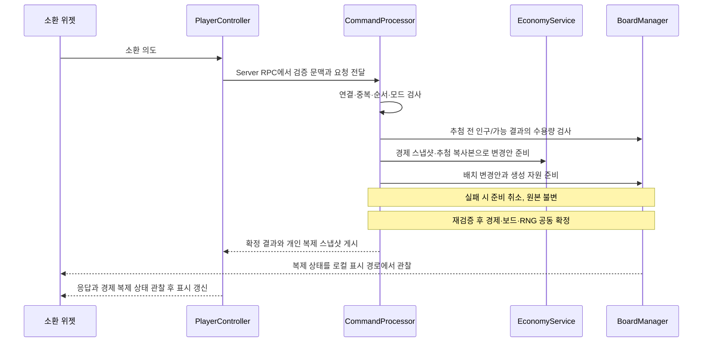

# UE5 구현·데이터·성능

[기획 허브](../README.md) · [작업 보드](../production/BOARD.md) · [검수 기준](../BACKLOG_QA.md)

문서 상태와 담당자는 위 메타데이터를 기준으로 한다. 사용자 확정 조건은 결정 기록을 따른다. 나머지 내용은 프로토타입용 설계안이다. 기획 작성 상태와 실제 구현 상태는 별도로 관리한다.

DEC-026으로 15.2의 책임 보완과 15.5~15.7의 구현 설계 규약을 신규·수정 디펜스 코드의 기준으로 채택했다. 문서 전체의 Draft 상태는 미확인 게임 규칙·성능 가정까지 확정하지 않기 위해 유지한다. 아래 클래스·API와 테스트 사례는 구현할 계약이며, 현재 게임 코드나 테스트의 완성을 뜻하지 않는다.

이 파일이 해당 기능의 편집 원본이다. 기존 GDD 장 번호를 유지해 이전 기획과 대응시킨다. 수치·데이터 타입은 허브의 원본 구분표를 따라 함께 변경한다.

## 15. UE5 프로젝트 구조

### 15.1 프로젝트 설정 방향

DEC-008에 따라 현재 `Mobile_defense_clone.uproject`와 C++ 모듈 `Mobile_defense_clone`을 유지하고 디펜스 전용 구조를 추가한다. 기존 TopDown·Strategy·TwinStick 템플릿은 초기 참고용으로 보존하고 사용 여부와 참조를 확인하며 정리한다. TASK-CORE-01은 현재 프로젝트의 기반 확인과 빌드 경로 검증으로 시작한다.

설치 환경과 프로젝트 시작 절차의 원본은 [개발 환경과 프로젝트 시작 안내](DEVELOPMENT_SETUP.md)다. 엔진 후보·고정 조건은 DEC-009, Windows 개발 도구의 공식 권장 기반 조합은 DEC-010, Android 도구의 검증 조합은 DEC-011을 따른다. 설치 확인과 기준 선택, PC·Android 빌드 성공을 구분한다.

DEC-012의 [PowerShell 빌드·실행 절차](BUILD_RUN.md)에 프로젝트 파일 생성, Editor·PC·Android 빌드 명령과 산출물·로그·검증 조건을 둔다. 실제 실행과 엔진 기준 고정은 해당 실행 증거로 확인한다.

기본 이동 캐릭터가 필요하지 않은 디펜스 전장에는 별도의 CameraPawn을 사용한다. 콘텐츠 제작은 Blueprint로, 소환·전투·재화·웨이브·네트워크 검증은 C++로 둔다. 핵심 규칙을 Level Blueprint에 넣지 않는다.

초기 플러그인은 Enhanced Input, Niagara, 프로젝트에서 쓰는 온라인 연결 모듈만 사용한다. GAS는 이 규모에서 필수가 아니며, 스킬 실행기와 상태 컴포넌트로 시작한다. 복잡한 조합형 능력 요구가 늘면 별도 검토한다.

### 15.2 클래스 책임

C++·Blueprint 작성 방식은 [코드 작성 규약](CODING_STANDARD.md), 새 클래스·파일·에셋 이름과 배치는 [이름·폴더·데이터 규칙](NAMING_AND_STRUCTURE.md)을 따른다. 아래 표는 기능 책임의 원본이며, 포맷 설치·검사는 [코드 스타일 안내](CODE_STYLE.md)에 둔다.

DEC-027의 개발 역할은 A 전투·웨이브 / B 경제·보드다. 클래스·에셋 편집 주담당과 두 사람의 C++·Blueprint·UI·복제·빌드 범위는 [2인 개발 역할](../production/TEAM_ROLES.md)에 둔다. 인력 배분은 아래 런타임 권한·상태 소유·공동 확정 계약을 바꾸지 않는다. 같은 담당자가 EconomyService와 BoardManager를 작성해도 두 상태를 함께 바꾸는 처리는 CommandProcessor를 통한다.

| 클래스·에셋 | 책임 | 권한 |
|---|---|---|
| ALDGameMode : AGameModeBase | 매치 상태, 참가자 등록, 승패 확정, 결과 생성 | 서버만 |
| ALDGameState : AGameStateBase | WaveIndex, Phase, WaveEndTime, ActiveEnemyCount, Result, 보스 요약 | 서버 작성·모두 복제 |
| ALDPlayerState : APlayerState | PlayerIndex, 표시 이름, 공개 자원 요약, 연결/봇 상태 | 서버 작성·모두 복제 |
| ALDPlayerController | 입력·서버 명령 RPC 진입, 확정된 개인 경제 상태의 복제 창구, 로컬 UI 연결 | 서버+소유 클라이언트 |
| ALDCameraPawn | 카메라 프레이밍, 화면 좌표 변환 | 로컬 표시 |
| ALDBoardManager | 타일·개체 배치 상태, 원자적 배치 트랜잭션, 보드 버전 | 서버 작성·모두 복제 |
| ALDWaveDirector | 웨이브 데이터 해석, 스폰 예약, 마감 처리 | 서버만 |
| ULDBattleSubsystem : UWorldSubsystem | 전투 참가자 등록·스텝 진행·결과 반영. 피해·효과·표적 계산은 별도 함수/값 타입으로 분리 | 서버 로직; 클라이언트 표시 데이터는 복제 액터 사용 |
| ALDUnitActor | InstanceId, UnitId, CellId와 시각 상태 | 서버 생성·모두 복제 |
| ALDEnemyActor | EnemyId, HP, 경로 상태, 효과 요약 | 서버 생성·모두 복제 |
| ULDCommandProcessor | 명령 검증·참가자별 직렬 처리·중복 결과 관리, 경제·보드 변경의 공동 확정 | GameMode 소유 서버 객체, RPC 없음 |
| ULDEconomyService | 참가자별 재화·소환 횟수·강화·소환 확률 단계·경제 Revision과 추첨 스트림 보관, 명시적 입력으로 비용·변경안 계산 | GameMode 소유 서버 객체, RPC 없음 |
| ULDResultSaveService | 로컬 결과 중복 방지 또는 계정 서비스 연동 | 모드별 구현 |
| WBP_HUD 등 | 상태 표시, 명령 의도 전송 | 로컬만 |

UWorldSubsystem/UObject 서비스가 자동 복제된다고 가정하지 않는다. 복제할 상태는 GameState·PlayerController·BoardManager·전투 액터에 게시한다. 개인 경제 원본은 EconomyService에 두고 PlayerController의 소유자용 복제 값과 PlayerState의 공개 요약은 그 원본에서 만든다. GameMode는 서버에만 존재하고 공유 상태는 GameState로 전달하는 UE 구조를 따른다. [Game Mode and Game State](https://dev.epicgames.com/documentation/en-us/unreal-engine/game-mode-and-game-state-in-unreal-engine)

### 15.3 폴더

```text
Content/LD/
  Core/            BP_GameMode, BP_GameState, BP_PlayerController
  Maps/            L_Boot, L_Lobby, L_Workshop, L_TestCombat
  Data/            DataTables, DA_GameRules, DA_UnitVisuals
  Units/           Base, Common, Rare, Epic, Legendary, Mythic
  Enemies/         Base, Normal, Boss
  Board/           Tiles, Spline, Decorations
  UI/              Lobby, Battle, Panels, Result, Common
  Input/           IA_*, IMC_Battle, IMC_Menu
  Art/             Meshes, Materials, Textures, Animations
  FX/              Niagara, Decals
  Audio/           SFX, Music, Mix
  Tests/           TestMaps, FunctionalTests
Source/Mobile_defense_clone/
  Core/  Battle/  Board/  Economy/  Network/  Data/  Save/
```

위 구조는 기존 프로젝트에 추가할 디펜스 전용 구성이며 아직 구현 완료를 뜻하지 않는다. 기존 런타임 모듈과 Game/Editor 타깃 이름은 `Mobile_defense_clone`을 유지한다. 표의 `ALD*`·`ULD*` 클래스 접두사는 디펜스 코드의 이름 규칙으로 사용하며 별도의 `LuckyWorkshop` 모듈 생성이나 이름 변경을 요구하지 않는다.

프로젝트 저장소는 코드·설정·콘텐츠 원본을 버전 관리하고, Binaries·Intermediate·Saved·DerivedDataCache는 생성물로 분리한다. 큰 바이너리는 팀에서 사용하는 LFS 또는 Perforce 정책을 첫날 정한다.

### 15.4 Blueprint 구현 순서

1. `BP_Board`에서 DEC-039의 플레이어당 6열×3행 18칸(전체 36칸) 위치와 중앙을 공유하는 두 닫힌 Spline을 노출한다. CellId는 Rows·Columns 기반 단일 함수로 생성·검증한다.
2. `BP_EnemyBase`는 EnemyActor의 데이터·시각만 연결한다.
3. `BP_UnitBase`는 UnitId에 맞는 Visual DataAsset을 읽는다.
4. `WBP_SummonButton.OnClicked`는 PC의 요청 함수만 호출한다.
5. PC가 전달한 명령을 CommandProcessor가 확정한 뒤 보드와 자원 RepNotify가 로컬 표시 상태를 갱신한다.
6. 획득 이벤트는 EventId를 포함해 VFX를 1회만 재생한다.
7. UnitVisual DataAsset으로 메시·AnimBP·VFX·아이콘을 교체한다.

단순 UI 이벤트는 Event Dispatcher로 연결하고, 매 프레임 바인딩으로 전체 DataTable을 검색하지 않는다. 개발 편의를 위한 임시 Blueprint 계산도 서버 권한 함수 안에 두어 멀티플레이로 바꾸면서 규칙을 다시 작성하지 않게 한다.

<a id="implementation-rules"></a>

### 15.5 구현 설계 규약

이 절은 서식과 별도로 작성·리뷰에 적용한다. 첫 적용 대상은 필요한 원작 규칙을 확인한 P0 기능이다. 기존 TopDown·Strategy·TwinStick 템플릿은 참고용이며 새 디펜스 코드가 해당 Controller를 상속하거나 직접 참조하여 게임 규칙을 확장하지 않는다. 템플릿 변경이 꼭 필요하면 사용 맵·Blueprint 자식·참조와 이행 범위를 PR에 기록한다.

#### ARCH-01 · 책임과 분리 기준

- Controller는 입력을 의도로 바꾸고 명령을 전달한다. 가격·소환 확률·배치 가능 여부·피해량을 직접 계산하지 않는다. 로컬 선택과 카메라 조작은 서버의 배치 상태와 구분한다.
- CommandProcessor는 16.2의 명령 처리 순서와 여러 상태의 공동 확정을 조정한다. 가격 공식·표적 탐색·저장 형식은 각 기능에 위임한다. 참가자별 중복 결과와 처리 중 명령도 여기서 관리한다.
- EconomyService는 경제 원본과 계산을, BoardManager는 배치 원본과 유효성 검사를 맡는다. 서로의 상태를 직접 수정하거나 서로를 호출하지 않는다. 두 기능을 함께 바꾸는 처리는 CommandProcessor를 통한다.
- BattleSubsystem은 전투 스텝을 진행한다. 피해 공식·표적 선택·효과 계산은 명시적 입력과 결과가 있는 함수/값 타입으로 분리한다. 계산 함수 안에서 위젯·Controller·전역 조회·에셋 로딩을 호출하지 않는다.
- 위젯은 표시·입력·로컬 연출을 담당한다. 화면용 데이터 조합이 복잡해지면 로컬 표시 객체로 분리하고, 단순 표시에는 바로 조회·이벤트를 사용한다.

줄 수를 기준으로 무조건 나누지 않는다. 한 클래스가 화면·규칙·저장 등 서로 다른 변경 이유를 가지거나, 같은 규칙이 여러 곳에 중복되거나, 계산을 검증하는 데 무관한 화면/월드가 필요해지면 분리한다. 실제 교체 지점에만 interface를 도입하며, 초기 단일 런타임 모듈을 유지한다. 사용할 곳이 없는 Manager·기본 클래스·빈 폴더를 미리 만들지 않는다.

#### ARCH-02 · 허용 의존 관계와 연결

| 호출하는 역할 | 허용하는 의존·호출 | 금지하는 결합 |
|---|---|---|
| 위젯·로컬 표시 객체 | 로컬 조회 상태, Controller의 명령 진입점, 표시용 데이터 | EconomyService·BoardManager 원본 변경, 서버 GameMode 조회로 화면 갱신 |
| Controller의 입력/RPC 경로 | 요청 계약, 서버 CommandProcessor의 제출 API, 로컬 카메라·선택 처리 | 경제·전투 계산, 명령별 트랜잭션 직접 구현 |
| CommandProcessor | EconomyService·BoardManager의 명시적 조회/준비/확정 API, 읽기 전용 데이터 | 구체적 위젯·HUD·입력 장치 접근 |
| EconomyService·BoardManager | 값 타입·읽기 전용 규칙 데이터·각자 소유 상태 | 서로 직접 호출, Controller·CommandProcessor·위젯 구체 타입 참조 |
| BattleSubsystem·WaveDirector | 필요한 액터의 전투 API·읽기 전용 데이터, 결과 알림 | 위젯 호출, 개인 재화 직접 변경 |
| 순수 계산·데이터 계약 | 명시적으로 받은 값·규칙·추첨 입력 | GetWorld/GetSubsystem으로 의존성 탐색, 런타임 상태 변경·I/O |

GameMode는 서버 객체를 생성·연결하고 참가자 등록 시 Controller에 명령 제출 대상을 연결한다. 로컬 화면의 생성·구독 연결은 소유 클라이언트의 Controller 초기화 경로가 맡는다. 이 생성·연결 코드만 필요한 양쪽 구체 타입을 알고, 하위 기능이 상위 호출자를 다시 찾지 않게 한다. 헤더 순환 include는 전방 선언만으로 설계가 해결됐다고 판단하지 않는다.

상태·전투 결과 알림은 소유 기능의 타입이 정해진 delegate로 내보낸다. 구독 연결부가 이를 받아 복제 창구를 갱신하거나 새 처리를 요청한다. delegate를 사용하는 코드도 위 표의 책임을 지킨다. 모든 기능을 묶는 전역 이벤트 버스는 도입하지 않는다. World/Subsystem 조회는 생성·연결 또는 엔진 진입 경계에서 수행하고, 내부 계산에서는 전달받은 의존성을 사용한다.

#### ARCH-03 · 상태 원본과 변경 경로

| 상태 | 권한 있는 원본 보관 위치 | 변경 경로 | 조회·복제·파생 값 |
|---|---|---|---|
| 매치 Phase·웨이브·결과 | 서버 GameState | GameMode가 WaveDirector/전투 결과를 받아 전이 | 클라이언트 GameState 복제본 |
| 재화·소환 횟수·강화·소환 확률 단계·EconomyRevision·참가자별 RNG | 서버 EconomyService | CommandProcessor가 승인한 변경안을 경제 API로 확정 | PC의 개인 복제 스냅샷, PlayerState 공개 요약. RNG는 복제하지 않음 |
| 유닛 존재·칸·소유·BoardRevision | 서버 BoardManager | CommandProcessor의 배치 트랜잭션 | BoardManager 복제본, UnitActor의 ID·표시 정보 |
| 적 HP·효과·경로 상태 | 서버 EnemyActor | BattleSubsystem의 전투 처리 API | 복제된 액터 상태와 클라이언트 보간 값 |
| 처리 중 명령·캐시·연결 세대 | 서버 CommandProcessor | 16.2의 접수·확정·연결 변경 처리 | 요청 키/결과 응답. 클라이언트가 세대를 발급하지 않음 |
| 명령 번호·미확정 요청의 키/내용 | 로컬 Controller의 연결 범위 요청 추적부 | 요청 제출·응답·세대 변경, 16.2의 동시 변경 요청 1개 제한 | UI의 대기 표시. 위젯 재생성으로 초기화하지 않음 |
| 선택·드래그·열린 창 | 로컬 Controller 또는 그 소유 표시/입력 객체 중 기능별 한 곳 | 로컬 입력·상태 변경 처리 | 위젯 표시. 게임 재화·배치의 권한 있는 원본이 아님 |
| 밸런스·콘텐츠 정의 | 로드한 규칙 데이터 | 매치 시작 시 버전과 함께 고정 | 런타임은 읽기 전용 사용, 세이브·플레이 상태와 분리 |

원본 상태는 private으로 유지하고 조회는 const 접근 또는 값 스냅샷을 제공한다. 외부가 수정할 수 있는 컨테이너 참조나 범용 SetGold/SetBoard를 공개하지 않는다. 네트워크·QA·자동 보상도 정해진 변경 경로를 사용한다. 전투 보상은 서버 내부 명령으로 같은 참가자 처리 순서에 들어가며, 클라이언트가 요청할 수 있는 보상 RPC를 추가하지 않는다. 같은 처치/보상을 두 번 적용하지 않을 식별 기준을 구현 시 함께 둔다.

조회 함수는 상태·RNG를 진행시키지 않는다. 매치 Phase나 요청 처리 단계처럼 상호 배타적인 상태는 enum과 전이 함수로 표현하고 허용 전이를 한곳에서 검사한다. 독립적인 속성은 bool을 사용할 수 있지만, 여러 bool 조합으로 불가능한 진행 상태를 만들지 않는다. 실제 전이 조건은 기능 명세와 16.2를 따른다.

스냅샷·UI 캐시는 원본에서 다시 만들 수 있어야 한다. PC 재생성이나 재접속 시 복제 스냅샷에서 서버 경제 원본을 역으로 복원하지 않는다. UnitActor의 칸 정보도 BoardManager 확정값에서 파생하며 별도 배치 원본으로 쓰지 않는다. HP·보드·매치 상태를 바꾸는 타이머와 자동 처리도 담당 기능의 동일 API를 거친다.

#### ARCH-04 · 요청·확정·알림의 순서

동작을 시키는 명령과 완료된 사실을 알리는 이벤트를 구분한다. 명령은 결과/실패 이유를 돌려주고, 상태 변경 이벤트는 확정 후 발생시킨다. 이벤트 수신 중 같은 트랜잭션을 재진입하여 상태를 수정하지 않는다. 추가 명령은 현재 처리가 끝난 뒤 큐에 넣는다. 서로 다른 참가자도 공유 상태를 만지는 구간은 서버 게임 스레드에서 겹치지 않게 처리한다.

경제·보드·RNG를 함께 바꾸는 명령은 준비 → 재검증 → 공동 확정 → 복제 스냅샷/응답/알림 게시 순서로 처리한다. 준비 중에는 원본 RNG 복사본과 임시 변경안을 쓰고, 실패하면 원본 재화·배치·RNG·Revision을 모두 유지한다. 거절 응답 캐시는 16.2에 따라 별도로 기록할 수 있다.

공동 확정 구간에는 latent/await·에셋 로딩·외부 I/O·Blueprint 이벤트·외부 delegate 호출을 넣지 않는다. 액터 생성 등 실패할 수 있는 작업은 먼저 준비하며, 준비된 액터는 전투 등록·충돌·복제·연출에 참여하지 않아야 한다. 준비 취소 시 정리하고, 액터의 초기화/종료 콜백에서도 보상·알림을 발생시키지 않는다. 마지막 재검증 뒤 확정은 미리 검증한 값 대입/등록으로 끝나게 구성한다. 실패 가능 단계를 남겨야 한다면 노출 전 전체 복구 절차와 실패 주입 테스트를 함께 구현한다. 성공 이벤트는 준비 완료만으로 보내지 않는다.

여러 액터의 복제는 클라이언트에서 한 번에 도착하지 않는다. 성공 응답으로 골드를 다시 차감하거나 유닛을 직접 생성하지 않는다. 소환 표시의 확정 완료는 해당 응답의 BoardRevision과 EconomyRevision 이상을 각각 관찰한 뒤 판단한다. 실패·재전송·응답 유실·오래된 결과 처리는 16.2의 기존 계약을 따른다.

#### ARCH-05 · 생성·종료와 비동기 작업

| 대상 | 생성·연결 주체와 수명 | 종료·재연결 규칙 |
|---|---|---|
| CommandProcessor·EconomyService | GameMode가 NewObject로 생성하고 UPROPERTY 참조로 보관. 매치 범위 | 데이터·보드·명령 연결 완료 후 접수 시작. 종료 시 접수 중지·준비 작업 취소·구독 해제. 새 매치는 상태 초기화 |
| BoardManager·WaveDirector·게임 액터 | 서버 매치 초기화/스폰 경로. World 범위 | EndPlay에서 예약·등록·타이머 해제. 풀 재사용은 16.5 기준 적용 |
| BattleSubsystem | 엔진의 World 수명에 연결. 서버 권한일 때 전투 진행 | 초기화 전 호출 거절, 종료 시 스텝·액터 등록·delegate 정리 |
| 로컬 UI·선택·입력 객체 | 소유 클라이언트 Controller가 생성/연결. 로컬 플레이어·화면/매치 범위를 각각 지정 | 제거 시 구독 해제·입력 모드 복구. 재생성 시 현재 복제 상태와 Controller의 미확정 요청으로 표시 재구성 |
| 결과 저장 작업 | 결과 확정 후 저장 담당 객체. 저장 방식은 SPEC-COOP의 모드별 계약 | 매치 객체보다 오래 살면 결과 값의 복사본과 결과 ID 사용. 종료된 World/Actor를 장기 참조하지 않음 |

NewObject의 Outer 지정만으로 GC 수명 보관을 대신하지 않는다. 재접속으로 같은 매치의 Controller가 바뀌면 참가자 식별자로 기존 경제 원본에 연결하고 새 스냅샷을 게시한다. 연결 세대는 16.2에 따라 바꾸되 재화를 초기화하지 않는다. World 이동을 넘는 보존이 필요해지면 보존 객체와 이전 절차를 별도로 설계하고 기존 UObject/Actor 참조를 그대로 넘기지 않는다.

비동기 완료는 약한 소유자 참조와 매치/요청 또는 대상 세대를 함께 확인한 뒤 게임 스레드에서 반영한다. 종료된 화면/매치 객체를 대상으로 하는 콜백은 무효화한다. UI가 닫혀도 이미 제출한 서버 명령이 취소·환불되었다고 간주하지 않는다. Controller가 요청을 계속 추적하며, 재연결 시에는 16.2에 따라 새 초기 동기화가 끝날 때까지 변경 입력을 막고 이전 요청을 자동 재실행하지 않는다. 중복 구독을 막고 등록한 delegate handle과 타이머의 해제 책임을 등록 지점에 함께 둔다. 구독 해제만으로 이미 큐에 들어간 완료 작업까지 취소됐다고 가정하지 않는다.

<a id="summon-example"></a>

### 15.6 첫 기능 적용 예시 · 소환

이 예시는 DEC-020의 기술 계약을 코드 책임에 연결한다. 비용·확률·수용량 검사는 DEC-043~046과 경제 명세를 따른다. 예시를 근거로 수치를 고정하거나 P0에 새 조작을 추가하지 않는다. 클래스는 해당 기능 구현 시 만들며 이번 문서 변경에서 생성하지 않는다.



화살표는 실행/데이터 흐름이며 구체 클래스의 include 관계가 아니다. Econ·Board가 PC/UI를 직접 찾는 구현은 ARCH-02 위반이다. PC 스냅샷 게시와 화면 갱신은 초기화 때 연결한 수신 경로에서 수행한다.

구현 시 CommandProcessor의 소환 처리 함수가 변경안 전체를 보유한다. EconomyService는 비용·차감·소환 확률 단계·RNG의 다음 값을 계산하고, BoardManager는 배치·개체 생성 준비와 다음 보드 값을 계산한다. 둘 중 하나라도 준비에 실패하면 준비물을 정리하고 거절 결과만 남긴다. 위젯은 실패 이유와 재시도 가능 상태를 표시한다. 확정 후의 알림 순서와 같은 RequestId 재전송은 ARCH-04 및 16.2를 따른다.

<a id="implementation-review"></a>

### 15.7 ARCH-06 · 첫 구현의 검수와 규약 보완

변경한 기능의 원본 상태, 변경 담당, 호출 경계, 실패/종료 경로를 [개발 작업 양식](../TEMPLATES.md)에 짧게 적고 [PR 양식](../../.github/pull_request_template.md)에 연결한다. 단순 서식·문구 변경은 설계 항목을 생략할 수 있다. 기존 설계를 따르면 해당 절과 실제 코드 경로만 적고 중복 문서를 만들지 않는다.

| 검증 위치 | 소환 구현 시 확인할 사례 | 기대 결과 |
|---|---|---|
| 월드 없는 계산 테스트 | 확인된 비용/확률 입력, 재화 부족·허용 범위 경계 | 같은 입력과 RNG 복사본에 같은 결과, 원본 불변, 명시적 실패 이유 |
| 서버 명령 통합 테스트 | 같은 키·같은 내용 재전송, 같은 키·다른 내용 | 소비·배치·RNG 진행 1회, 원래 결과 재사용 또는 RequestIdConflict |
| 서버 실패 주입 테스트 | 경제 준비 후 배치/액터 준비 실패, 최종 재검증 실패 | 재화·보드·RNG·Revision 모두 불변, 임시 자원/예약/전투 등록 누수 없음, 성공 알림 없음 |
| 서버 처리 순서 테스트 | 소환과 자동 처치 보상이 같은 참가자를 변경 | 직렬 순서대로 각각 한 번 반영, 잔액/Revision 덮어쓰기 없음 |
| PC 2인 실행 검수 | 상대 소유 요청, 응답보다 늦거나 역순인 상태 복제 | 권한 위반 거절, 양쪽 최종 보드 일치, 오래된 응답이 최신 상태를 되돌리지 않음 |
| UI·수명 실행 검수 | 대기 중 UI 재생성·Controller 재연결·매치 종료, 늦은 콜백 | 중복 구독/소환/연출 없음, 원본에서 표시 복구, 종료 객체 접근 없음 |

이 표는 앞으로 구현할 검증 기준이며 현재 테스트 통과 기록이 아니다. 비용·데이터 계약은 계산 테스트로, UObject/복제/종료 동작은 UE 통합·PIE/패키지 검수로 나누고 Android 터치 검수는 기존 P0 완료 조건을 따른다.

첫 기능 리뷰에서 Controller·CommandProcessor·Subsystem에 계산이 다시 모이지 않았는지, 다른 기능 내부 상태를 직접 변경하지 않는지, 실패·종료 시 상태가 남지 않는지 확인한다. 정한 경계로 구현이 어려웠다면 이유·변경한 경계·검증을 기록하고 이 원본을 함께 보완한다. 현재 CI는 이 의존 관계나 Blueprint 의미를 자동 판정하지 않으며, 위 검수와 핵심 동작 테스트를 포맷 검사로 대체하지 않는다.

## 16. 서버 권한·복제·명령 처리

### 16.1 서버가 결정하는 것

RNG·소환 결과·재화·합성 소비·스킬 발동·HP·사망·웨이브·승패·보상은 서버가 결정한다. 클라이언트는 선택 강조·드래그 미리보기·카메라·소리·VFX를 처리한다. 확정 전 결과 모델이나 재화를 예측 확정하지 않는다. UE의 서버 권한 구조와 초기부터 멀티플레이를 고려하는 권고를 따른다. [Networking Overview](https://dev.epicgames.com/documentation/en-us/unreal-engine/networking-overview-for-unreal-engine)

### 16.2 명령 계약

DEC-043~047로 이동은 Stack만 허용하고 Single은 제거한다. Lock/Target/Swap 예약 기능은 명시적으로 활성화하기 전까지 비활성이다. 신화/제작은 컨셉 대기이며 아래 예약 필드만으로 구현을 확정하지 않는다.

DEC-020에 따라 공통 요청 정보와 명령별 payload를 분리한다. 아래는 구현할 논리 계약이며 실제 RPC/직렬화 코드를 생성한 것은 아니다. 명령 타입과 일치하는 payload 하나만 허용하고 필수값 누락·다른 타입의 필드·알 수 없는 enum은 거절한다.

```text
FLDCommand
  ConnectionEpoch: uint64        // 서버가 부여한 현재 연결 세대
  RequestId: uint32              // 세대 내 1부터 증가, 재시도에는 같은 번호
  CommandType: enum              // Summon, Merge, Sell, Upgrade, Move, DungeonEnter, DungeonReturnCell, DungeonReturnAll; Craft/Swap/Lock/Target reserved
  ExpectedBoardRevision: int32   // Upgrade는 -1, 나머지는 현재 자기 보드 버전
  Payload: CommandType별 구조    // 아래 표의 필수 항목만

FLDCommandResult
  ConnectionEpoch: uint64        // 응답 대상 요청의 세대, 새 세대 발급과 구분
  RequestId: uint32
  ResultCode: enum
  NewBoardRevision: int32        // 이 응답을 확정한 시점의 자기 보드 버전
  EconomyRevision: int32         // 이 응답을 확정한 시점의 개인 경제 버전
  CreatedInstanceIds: uint64[]
  MovedInstanceIds: uint64[]     // 판매 보충·던전 전송 등 기존 개체 이동
  RemovedInstanceIds: uint64[]
  EventId: uint64                // 재전달 시 동일, 연출 없으면 0
```

#### 명령별 필수 정보

| 명령 | Payload | 서버가 확인·결정할 내용 |
|---|---|---|
| Summon | Source: enum Gold/Star, RouletteGrade: None/Rare/Epic/Legendary | Gold는 RouletteGrade=None. Star는 P1 등급별 표 선택. 추첨 전 인구·가능한 모든 결과의 수용량 검사, 비용·확률·결과·배치 서버 결정 |
| Merge | SelectedInstanceId: uint64, ConsumedInstanceIds: uint64[3] | 같은 소유자/UnitId/선택 칸의 서로 다른 3개인지 검사. 결과는 동종 여유 뭉치→화면 첫 빈칸, 선택 칸 우선권 없음 |
| Craft | RecipeId: FName, ConsumedInstanceIds: uint64[3] | 컨셉/레시피 확정 전 비활성. 활성화 시 재료와 결과 배치 계약을 함께 작성 |
| Sell | InstanceId: uint64 | 1개체 판매·시점별 가격 환급. 다른 여유 뭉치에서 실제 개체 보충까지 하나의 확정 |
| Swap | InstanceId: uint64, TargetUnitId: FName | 미채택 예약 명령, FeatureDisabled. 뭉치 위치 교환은 Move에서 처리 |
| DungeonEnter | InstanceId: uint64 | P1 어려움만, 1마리 전송·출발 뭉치 보충·인구 보존·던전 수용량 검사 |
| DungeonReturnCell | DungeonCellId: int32 | 한 칸 전원이 필드에 배치되는지 사전 검사 후 전원 복귀 |
| DungeonReturnAll | 비어 있는 구조체 | 모든 던전 개체 사전 검사·안정된 칸/개체 순서로 전원 복귀. 부분 성공 없음 |
| Upgrade | UpgradeId: FName | 허용된 강화 항목·현재 레벨·비용·상한 검사 후 한 단계 구매. 목표 레벨·가격을 클라이언트가 지정하지 않음. P1 |
| Move | MoveMode: enum Stack, SourceInstanceId: uint64, DestinationCellId: int32 | 출발 칸 뭉치 전체 이동·점유 칸과 교환. Single 거절, 자기 필드 범위와 보드 버전 검증 |
| Lock | InstanceId: uint64, DesiredLocked: bool | 해당 1개체의 원하는 잠금 상태 설정. 잠긴 개체에도 소유자의 해제 요청 허용 |
| Target | InstanceId: uint64, DesiredPriority: enum Nearest/BossFirst | 해당 1개체의 원하는 표적 우선순위 설정. 실제 적 ID·피해는 클라이언트가 결정하지 않음 |

InstanceId는 0이 아닌 서버 발급 논리 ID다. 합성·제작 목록은 정확히 3개이며 중복을 제거해 받아들이지 않는다. 목록 순서는 의미가 없고 서버는 RequestId 내용 비교 시 오름차순으로 정규화한다. 합성의 기준은 목록 첫 원소가 아니라 SelectedInstanceId다. 소비 대상이 바뀌면 다른 개체로 자동 대체하지 않고 거절·재선택한다. 데이터 ID는 UTF-8 기준 최대 64바이트, 공통 필드와 payload의 직렬화 크기는 전송 헤더를 제외하고 최대 1,024바이트를 초기 상한으로 사용한다. 디코딩 시 길이를 먼저 제한하고 FName은 해당 명령의 서버 허용 데이터 목록에서만 해석한다. 소환/합성의 새 유닛은 최대1개, 합성 소비는3개다. 던전 복귀의 이동 목록은 최대9개(3칸×3), 생성/소비 목록에 중복 기입하지 않는다.

클라이언트는 플레이어 소유 PlayerController의 Server RPC로 보낸다. 소유권이 없는 BoardManager에 직접 서버 RPC를 호출하지 않는다. 발신자·플레이어 인덱스·현재 MatchId는 서버의 연결·참가자 문맥에서 얻는다. ConnectionEpoch는 그 문맥과 일치하는지 검사하는 값이며 클라이언트가 새 세대를 발급하지 않는다. 가격·RNG·결과 유닛·소유권을 payload로 지정할 수 없다.

던전 왕복·판매 보충은 새 개체 생성이 아닌 기존 InstanceId 이전이며 타이머/마나를 보존한다. 모든 변경은 현재 상태에서 직렬 재검증한다. 명령 결과의 위치 변경 목록으로 여러 개체를 표현하고 입장/복귀 전체가 실패하면 보드·RNG·자원을 유지한다.

#### 처리 순서·버전

| 검증 순서 | 검사 |
|---|---|
| 1 | 연결·참가자·ConnectionEpoch 일치, payload 크기·타입·필수값·목록 길이 검사 |
| 2 | 요청 키와 정규화한 내용 비교. 캐시/처리 중 요청은 재실행 없이 응답, 오래된 번호는 거절 |
| 3 | 새 요청을 참가자별 직렬 처리에 등록. 명령 수 제한과 Preparing/Running·모드별 기능 허용 검사 |
| 4 | Upgrade 외에는 ExpectedBoardRevision 일치 검사. 각 DataId·CellId의 허용 범위 검사 |
| 5 | 정확한 개체의 존재·소유·명령별 잠금/예약 상태, 목적지 수용 가능 여부 검사 |
| 6 | 골드·별조각·강화 레벨·구매/교환 한도 검사 |
| 7 | 가상 적용으로 변경 후 보드 유효성 확인. 거절 시 게임 상태·RNG 변화 없음 |
| 8 | 자원·개체·RNG·변경된 Revision과 확정 응답을 함께 반영한 뒤 결과 전송 |

보드의 배치·구성·Locked·TargetPriority가 바뀐 트랜잭션은 자기 BoardRevision을 한 번 증가시킨다. 경제 상태가 바뀌면 EconomyRevision도 한 번 증가시킨다. 변경이 없는 거절·중복 응답·이미 같은 값인 Lock/Target은 버전을 증가시키거나 새 EventId를 만들지 않는다. 잠금·우선순위 요청도 버전 검사를 먼저 통과해야 한다. Upgrade는 보드 버전 비교를 하지 않고 서버의 현재 경제 상태로 구매 가능 여부를 검사한다. 자동 처치 보상으로 경제 버전이 바뀌는 것만으로 보드 명령을 거절하지 않는다.

#### 중복·응답 유실

개인별 동시 변경 요청은 클라이언트에서 1개로 제한하고 서버도 참가자별 명령 적용을 직렬화한다. 서버는 초당 8명령·순간 버스트 12명령의 기존 제한을 유지하며 재확인 트래픽에도 전송 제한을 적용한다. 핑은 별도 제한이다. 재전송은 같은 연결 세대·번호·내용을 보존하고 중복 클릭으로 새 요청을 생성하지 않는다.

요청 키는 서버 문맥의 `(MatchId, 참가자, ConnectionEpoch, RequestId)`다. 내용 비교에는 CommandType·ExpectedBoardRevision·명령별 모든 필수값을 포함한다. 최근 **확정 결과 256개**는 성공·거절 모두 내용과 응답을 캐시한다. 처리 중 요청은 별도로 보관하며 확정 전에 기록을 퇴출하지 않는다. 같은 키·같은 내용이 처리 중이면 Pending, 완료됐으면 원래 응답을 반환한다. 같은 키·다른 내용은 RequestIdConflict로 거절하고 원래 요청·응답을 보존한다. 결과 캐시 조회는 현재 Phase·보드 버전 검사보다 먼저이므로 성공 뒤 Result 전환이나 보드 변경이 있어도 원래 결과를 재전달한다.

캐시에서 빠진 요청의 실행을 막기 위해 세대별 HighestAdmittedRequestId를 별도로 보관한다. 유효한 형식의 새 번호를 등록할 때 최댓값을 갱신하고, 등록 후의 RateLimited·게임 규칙 거절도 확정 결과로 남긴다. 캐시·처리 중 목록에 없고 최댓값 이하인 번호는 RequestExpired로 거절한다. 이 거절은 과거 실행 여부가 미확인이라는 뜻이며 다시 실행하지 않는다. 새 번호는 최댓값보다 커야 한다. uint32를 순환 재사용하지 않고 소진 전 처리 중 요청을 정리한 뒤 서버가 새 세대를 발급한다.

응답이 불명확할 때 클라이언트는 같은 요청만 재확인한다. RequestExpired이면 응답 시점의 보드·경제 Revision 이상인 복제 상태를 각각 받은 후 사용자가 다시 선택하도록 안내한다. ConnectionEpoch가 바뀐 경우에도 이전 요청을 새 번호로 자동 재실행하지 않는다. 새 연결의 초기 상태 동기화가 끝나기 전에는 새 변경 입력을 막는다. 별도 결과 조회 명령은 추가하지 않고 기존 상태 복제를 사용한다. Pending이나 타임아웃을 실패·환불로 단정하지 않는다. 서버 재시작 등으로 캐시·번호 상한을 잃으면 동일 세대를 계속 사용하지 않는다. 이 계약은 프로세스 장애를 넘는 영속 명령 복구를 제공하지 않는다.

캐시 응답의 Revision·생성/소비 목록은 과거 결과 식별용이다. UI는 더 오래된 응답으로 최신 복제 상태를 덮어쓰거나 유닛을 다시 생성/제거하지 않는다. EventId는 매치 내에서 중복 재생을 막는다. 새 거절에는 생성/소비 목록을 비우고 EventId=0을 사용한다.

#### 결과 코드와 UI 대응

| 코드 | 의미·대응 |
|---|---|
| Success / NoChange | 정상 확정 / 원하는 Lock·Target 값과 이미 동일. 복제 상태를 반영하고 요청 종료 |
| Pending | 동일 요청 처리 중. 새 명령을 만들지 않고 대기 |
| RequestIdConflict | 같은 번호에 다른 내용. 실행·원래 캐시 변경 없이 거절, 클라이언트 요청 생성 오류 기록 |
| RequestExpired / InvalidEpoch | 기록이 없는 오래된 번호 / 연결 세대 불일치. 최신 상태 반영 후 재선택 |
| InvalidPayload / InvalidData / InvalidCell | 구조·필수값·enum 또는 데이터/칸 범위 오류. 요청 구성 오류 기록 |
| PhaseNotAllowed / FeatureDisabled | 현재 매치 단계 또는 P0/P1 모드에서 불허 |
| StaleBoard | 보드 버전 불일치. 최신 보드 반영 후 다시 선택 |
| MissingInstance / NotOwner / Locked / Busy | 개체 없음·소유권·소비 잠금·예약/이동 제한에 따른 거절 |
| NoSpace / InsufficientResource / LimitReached | 배치 공간·재화·구매/교환 상한 사유 표시 |
| RateLimited | 등록된 요청은 실행하지 않음. 대기 후 사용자 새 입력만 새 번호로 처리 |

별조각 도전의 추첨 실패는 명령 거절이 아니다. 비용·카운터를 정상 반영한 Success이며 생성 목록이 비어 있을 수 있다. 결과 연출로 실패를 표시하더라도 비용을 환불하거나 같은 요청을 새 추첨으로 처리하지 않는다.

### 16.3 복제 데이터

| 대상 | 빈도 목표 | 데이터 |
|---|---|---|
| 매치 상태 | 변경 시, 시간은 종료 시각만 | Phase, WaveIndex, WaveEndTime, 결과 |
| 공용 적 수·보스 HP | 5~10Hz 또는 의미 있는 변화 | 카운트, 두 보스 체력 |
| 보드 | 변경 시 | 슬롯의 InstanceIds, UnitId, 개체별 Locked·TargetPriority, BoardRevision |
| 개인 자원 | 변경 시 소유자 | Gold, Stars, 업그레이드, 소환 확률 단계, EconomyRevision |
| 아군 자원 요약 | 2Hz | Gold, Stars, 역할 태그 |
| 적 이동 | 초기 10Hz 기준 | 경로 거리, 속도, 서버 시각, 이동 상태 |
| 공격 연출 | 묶음 또는 낮은 빈도의 비신뢰 이벤트 | EventId, 공격자, 표적, VFX 종류 |

신뢰 RPC는 구매처럼 낮은 빈도의 명령과 응답에 사용한다. 모든 일반 공격을 Reliable Multicast로 보내지 않는다. 영속 상태가 진실이며 연출 패킷이 누락돼도 HP·유닛·승패는 맞아야 한다. 복제 도착 순서를 가정하지 않고 Revision을 비교하며, 연출 대상 액터가 아직 없으면 짧게 보류하거나 생략한다.

### 16.4 적 이동 동기화

서버가 이동 상태를 20Hz로 계산하고 클라이언트는 받은 경로 거리·시각·속도로 보간 표시한다. 일시 둔화·스턴·속도 변경은 새 기준점을 복제한다. 일반 위치 ReplicateMovement와 자체 경로 보간을 동시에 사용하여 두 체계가 위치를 덮어쓰지 않게 한다.

경로를 여러 바퀴 돌 수 있으므로 적마다 RouteIndex(0=Lower, 1=Upper)와 누적 이동 거리를 유지하고, 표시 위치만 `distance mod Routes[RouteIndex].LengthCm`으로 변환한다. DEC-030의 두 경로는 중앙 구간을 같은 방향으로 지난다. 6열 보드에 맞춘 현재 임시 길이는 각각 3,260cm이며 길이 L의 L-10→10 구간은 누적 거리 기준으로 보간한다. DEC-031의 좌우 보정은 로컬 뷰에 적용하며 서버 경로·논리 위치·CellId를 바꾸지 않는다.

### 16.5 액터 풀링

첫 구현에서는 서버 권한 Spawn/Destroy로 정확성을 검증한다. 모바일 성능에서 생성 스파이크가 확인되면 적 최대 128개 및 VFX 풀을 도입한다. 풀링 시 HP, 효과, 타이머, TargetId, SpawnSerial, NetDormancy, 가시성, 충돌, GenerationId를 재초기화한다. 재사용된 액터에 이전 세대의 연출/피해 이벤트가 도착하면 버린다.

### 16.6 전용 서버 전환

리슨 서버는 제작 검증에 쓰고, 온라인 프로필 보상과 안정적 재접속이 필요한 P2에서 전용 서버로 전환한다. Epic의 전용 서버 튜토리얼은 엔진 소스 빌드와 C++ 멀티플레이 프로젝트를 요구하므로 이 준비를 P2 일정에 포함한다. [Dedicated Server 설정](https://dev.epicgames.com/documentation/en-us/unreal-engine/setting-up-dedicated-servers-in-unreal-engine)

전용 서버는 배틀 상태만 유지한다. 계정 서비스·방 관리·서버 프로세스 배정·결과 저장은 별도 책임이다. 서비스 선택과 실제 운영 비용은 CCU 목표와 배포 지역이 정해진 뒤 산정한다. 이 문서에는 확인하지 않은 고정 서버 요금을 넣지 않는다.

## 17. 데이터·디버그·운영

### 17.1 데이터 원본

`data/DT_Units.json`, `DT_Skills.json`, `DT_Recipes.json`, `DT_EnemyTypes.json`, `DT_Waves.json`, `DT_SpawnProfiles.json`, `DT_SummonProfiles.json`, `DT_Upgrades.json`을 동봉한다. 행 이름은 Name이며, 문자열 ID는 FName으로 읽는다. 타입과 단위는 DATA_SCHEMA 문서가 정의한다.

DataTable을 가져오기 전에 대응 Row Struct가 필요하고 필드 이름을 맞춰야 한다. 기본 데이터 가져오기 방식은 Epic의 Data Driven Gameplay 문서를 참고한다. 시각 에셋은 별도 DataAsset에 연결하여 밸런스 표가 무거운 에셋을 직접 로딩하지 않게 한다. [Data Driven Gameplay](https://dev.epicgames.com/documentation/en-us/unreal-engine/data-driven-gameplay-elements-in-unreal-engine)

### 17.2 재현성·버전

각 매치는 MatchId, BuildVersion, RulesVersion, DataHash, 서버 전용 MatchSeed를 기록한다. 플레이어별로 골드 소환·합성·별조각 도전 RNG 스트림을 분리해 상대의 입력 순서나 VFX·스폰 순서가 개인 추첨 결과를 바꾸지 않게 한다. 실서비스 추첨 결과는 서버에서 로그를 남기고 시드를 클라이언트에 배포하지 않는다.

동일 seed만으로 전체 3D 전투가 비트 단위로 재현된다고 약속하지 않는다. 재현 테스트에는 입력 명령 순서·서버 스텝·버전·스냅샷을 함께 사용한다. 테스트 시드는 Development 빌드에서만 직접 입력할 수 있다.

### 17.3 필수 디버그 화면

현재 웨이브, 적 수, 서버 스텝 시간, 골드·별조각, 소환 횟수, 소환 확률 단계, 유닛 수, 보드 버전, 선택 대상, 적 상태이상, 추첨 로그를 한 화면에서 확인한다. QA 명령은 특정 웨이브 진입, 자원 지급, 유닛 지급, 적 99/100/101개, 보스 HP 1, 패킷 지연 시나리오를 포함한다. Shipping에서 명령 진입점을 제거한다.

### 17.4 분석 이벤트

| 이벤트 | 필수 필드 |
|---|---|
| MatchStart | MatchId, BuildVersion, Mode, DeviceProfile, BotPresent |
| SummonResolved | PlayerIndex, Source, OutcomeTier, UnitId, PityBefore/After, Cost |
| MergeResolved | 입력 UnitId/3개, OutputId, Wave, Time |
| CraftResolved | RecipeId, Wave, Time |
| UpgradePurchased | UpgradeId, NewLevel, Wave |
| WaveEnded | Wave, AliveCount, TeamDamageByType, PlayerGold |
| MatchEnded | Result, Reason, CompletedWaves, Duration, 보스 잔여HP, BotSeconds |
| PerformanceSample | GameThreadMs, RenderThreadMs, GPUms, Memory, DeviceProfile |

로그는 디버깅에 필요한 최소 계정 식별자를 사용하고, 채팅 내용이나 장치의 불필요한 개인정보를 수집하지 않는다. 분석 이벤트가 실패해도 전투를 막지 않는다. 보상 기록은 일반 분석 로그와 별도의 신뢰 가능한 저장 경로로 처리한다.

### 17.5 초기 플레이 테스트 지표

튜토리얼을 완료한 신규 플레이어의 첫 일반 모드 승률 목표는 40~60%, 숙련된 고정 듀오는 70~90%로 가정한다. 아직 측정된 수치가 아니다. 신규 20팀 이상·숙련 10팀 이상의 반복 세션을 우선 모으고 표본이 작다는 점을 기록한다.

첫 합성 시간, 10웨이브 보스 실패율, 전설·신화 최초 시각, 재료 교환 사용률, 가득 찬 보드 체류 시간, 두 플레이어 피해 비중, 이탈 원인을 함께 본다. 높은 피해량만으로 지원 유닛의 기여를 평가하지 않는다. 평균 외에 최악·최선 시드와 하위 10% 결과를 따로 확인한다.

## 18. 성능 예산·검증

### 18.1 모바일 렌더링 기준

DEC-013에 따라 **Mobile Forward와 사전 계산한 조명 중심의 단순 라이팅**을 모바일 렌더링 기준으로 확정한다. 작은 고정 전장의 배경 조명을 베이크하고 실시간 광원·그림자 비용을 제한하는 제작 방향이다. 기존 Lumen·Nanite·Virtual Shadow Maps 비활성 제작안을 유지하며, 모바일 머티리얼과 일반 메시·LOD로 표현한다.

Directional Light 1개와 단순 환경광을 중심으로 구성한다. 정적 배경의 조명은 베이크하고 움직이는 수호자·적의 밝기와 바닥 그림자는 별도로 확인한다. 캐릭터 바닥 그림자 또는 제한된 동적 그림자를 사용하며, 기본 공격마다 Point Light를 생성하지 않는 기존 제작 기준을 유지한다. 베이크 조명만으로 움직이는 액터의 조명·그림자가 완성됐다고 판단하지 않는다.

Epic은 사전 계산 조명을 사용하는 프로젝트에 Mobile Forward를 권장하며, 복잡한 동적 조명에는 Mobile Deferred가 유리할 수 있다고 설명한다. 이번 선택은 현재 전장·조명 설계에 따른 판단이며 모든 기기에서 Forward가 더 빠르다는 의미는 아니다. 동적 광원 중심으로 아트 방향이 바뀌거나 기기 실측에서 병목이 확인되면 같은 장면·기기 조건으로 비교하고 결정을 갱신한다. [Epic 모바일 렌더링 비교](https://dev.epicgames.com/documentation/en-us/unreal-engine/mobile-rendering-and-shading-modes-for-unreal-engine)

현재 프로젝트는 `r.Mobile.ShadingPath=1`, `r.AllowStaticLighting=False`이므로 결정된 방향을 적용하기 위한 설정·맵 작업이 남아 있다. 적용할 키·현재값·후속 검증은 [개발 환경 안내](DEVELOPMENT_SETUP.md)에 기록한다. `r.ForwardShading`은 데스크톱 렌더러 설정이므로 Mobile Forward 선택과 구분한다. 이 결정 반영에서 Config·맵·머티리얼을 변경하거나 조명을 베이크하지 않았다. DEC-018로 초기 OpenGL ES 3.2·Mobile HDR On·MSAA 2x를 확정했으며 실제 적용·표시·기기 성능 검증은 남아 있다.

### 18.2 초기 예산

| 항목 | 목표·상한 |
|---|---|
| 일반 모바일 | 30FPS, 장시간 p95 프레임 33.3ms 이내 목표 |
| 상위 모바일 | 선택 60FPS, p95 16.7ms 이내 목표 |
| 서버 논리 | 20Hz, 스텝 50ms; 전투 처리 p95 10ms 이내 목표 |
| 테스트 액터 | 수호자 72 + 적 128 + 핵심 VFX 동시 부하 |
| GPU/스레드 | 30FPS 목표에서 각 병목 경로 p95 약 25ms 이하, 여유 포함 |
| 메모리 | 모바일 총 프로세스 1.2GB 이내를 첫 측정 목표로 설정 |
| Draw Call | 모바일 전투 화면 약 200 이하부터 시작, 실측 후 프로파일별 조정 |
| 네트워크 | 클라이언트당 평균 다운로드 40KB/s 이하를 초기 목표로 측정 |
| 로딩 | 전장 첫 로딩 10초 이하 목표, 캐시된 재진입 5초 이하 |

이 값들은 보증치가 아니다. 최소 지원 기기는 첫 실기기 빌드 결과를 바탕으로 확정한다. 기준 기기 제안은 Galaxy A54급 Android 6GB, 상위 비교 기기는 Galaxy S23급, iOS 후속은 iPhone 12급으로 둔다. 구매 권고나 성능 보장 의미는 없다.

### 18.3 측정 방법

에디터 FPS가 아닌 패키징한 Development 빌드에서 Unreal Insights, stat unit, stat gpu, 메모리·네트워크 프로파일을 기록한다. GPU와 게임 스레드 시간을 단순 합산해 프레임 시간으로 오해하지 않고 병목 경로를 판단한다.

최악 부하 장면에서 20분 연속 실행하고 평균·p95·최대 프레임, 메모리 증감, 열로 인한 성능 저하를 기록한다. 낮은 VFX 모드에서도 경고·상태·피해 판정이 동일해야 한다. 풀링·LOD·VFX 절감은 한 번에 한 항목씩 적용해 효과를 측정한다.

### 18.4 핵심 기능 검수

확률 합계·레시피 ID·데이터 타입 같은 정적 검증과 실제 UE 플레이 검증을 구분한다. 동봉 스크립트는 정적 데이터 및 경제 계산만 검사한다. 전투 밸런스, 모델 애니메이션, 서버 동기화, 모바일 성능 검증은 프로젝트 구현 후 수행해야 한다.

실행해야 할 상세 사례는 BACKLOG_QA에 제공한다. 특히 동일 개체 동시 합성, 가득 찬 보드 소환, 보장 직전 실패, 99↔100 적 수 경계, 보스 마감 시각 타격, 경로 한 바퀴 보간, 재접속 보상 중복을 필수로 둔다.
